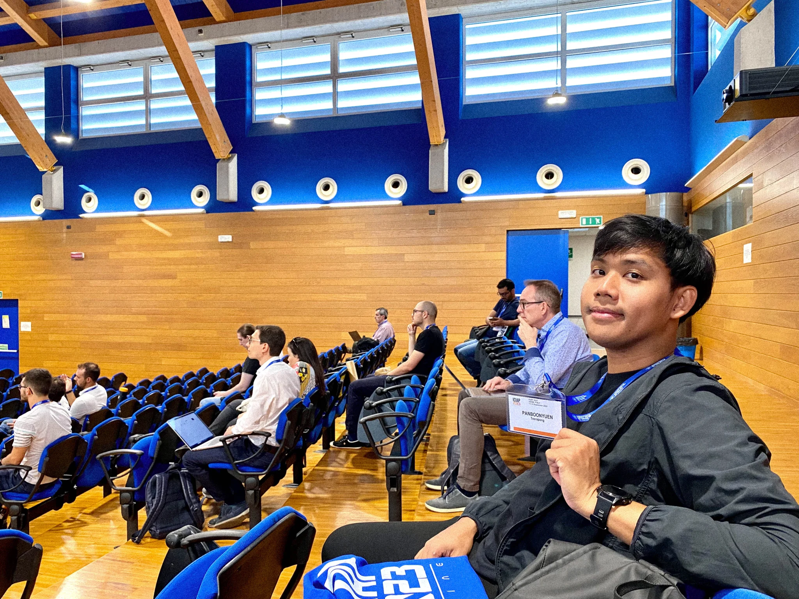
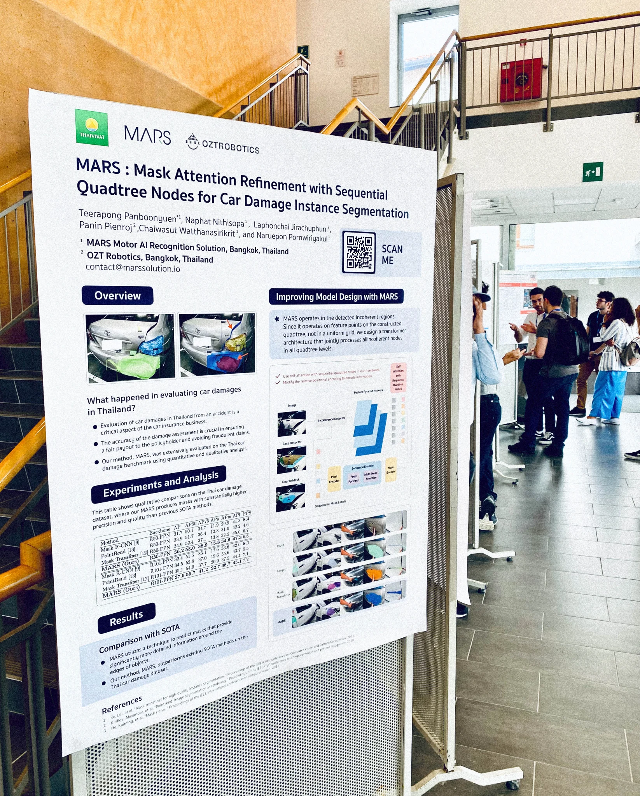
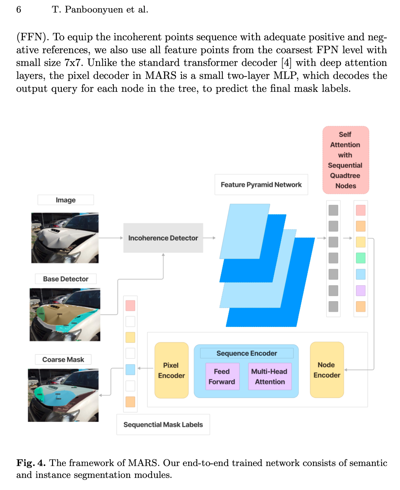
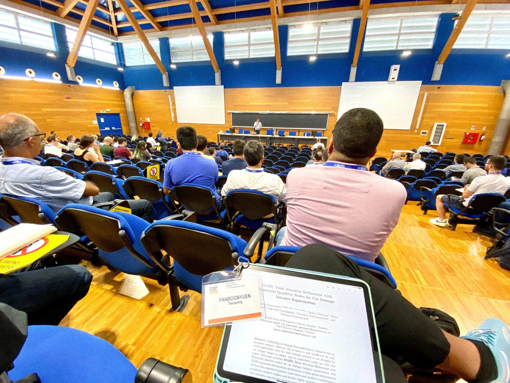
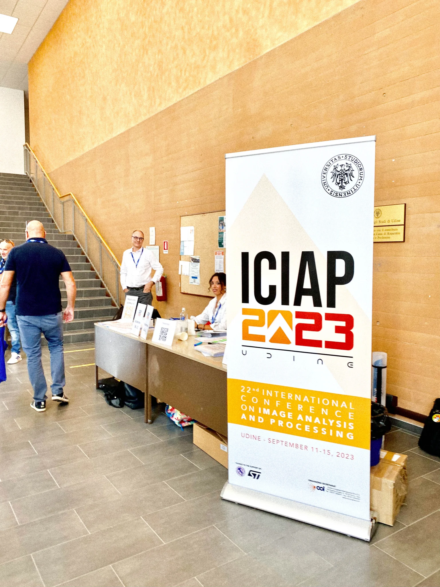

---

title: 'Showcasing MARS in Italy: Next-Gen AI for Car Insurance and Garage Solutions at ICIAP 2023'  
subtitle: ''  
summary: Presenting MARS, a cutting-edge AI model for car damage instance segmentation, at ICIAP 2023 in Udine, Italy, and exploring Italy’s iconic landmarks.  
authors:  
- admin  
tags:  
- AI-research  
- computer-vision  
- deep-learning  
- ICIAP2023  
- Italy  
image:
  caption: 'Scientist: ดร.ธีรพงศ์ ปานบุญยืน (Teerapong Panboonyuen, Ph.D.) – He is at the Leaning Tower of Pisa, Italy.'
  placement: 2  
  focal_point: "Smart"  
  preview_only: false

categories:  
- research  
- conferences  
- computer-vision  
date: "2024-09-12T18:00:00Z"  
lastmod: "2024-09-12T18:00:00Z"  
featured: true  
draft: false  
math: true  

---

{}  
You can read our full paper on Springer here: [MARS at ICIAP 2023](https://link.springer.com/chapter/10.1007/978-3-031-51023-6_3)  
{}

---

## Presenting MARS: Mask Attention Refinement with Sequential Quadtree Nodes at ICIAP 2023

---

In **September 2023**, I had the privilege of presenting my latest AI research, **MARS** (Mask Attention Refinement with Sequential Quadtree Nodes), at the **International Conference on Image Analysis and Processing (ICIAP 2023)**, held in **Udine, Italy**, from **September 11–15**. MARS is a specialized deep learning model developed for **car damage instance segmentation**, a vital application in the automotive insurance and garage service sectors.



Our model leverages **Self-Attention Mechanisms** combined with **Sequential Quadtree Nodes**, which together enable MARS to achieve significantly higher accuracy than state-of-the-art baselines such as Mask R-CNN (ICCV 2017), PointRend (CVPR 2020), and Mask Transfiner (CVPR 2022). These improvements were validated across multiple benchmark datasets, including a large Thai car-damage dataset.

> MARS was accepted at ICIAP 2023 with a competitive **acceptance rate of 0.64**, and our work is published in the Springer Lecture Notes in Computer Science series. This international recognition affirms the impact and novelty of our approach.

<div style="text-align: center;">
  
  <p style="font-style: italic; margin-top: 0px;">
    Figure 1: Presenting <strong>MARS: Mask Attention Refinement with Sequential Quadtree Nodes</strong> at ICIAP 2023 in Udine, Italy. MARS introduces an innovative self-attention mechanism combined with a quadtree transformer to achieve highly accurate car damage instance segmentation, significantly outperforming current state-of-the-art methods on multiple benchmark datasets. This advancement addresses critical challenges in the car insurance industry. (Source: <a href="https://link.springer.com/chapter/10.1007/978-3-031-51023-6_3" target="_blank" rel="noopener noreferrer">ICIAP 2023 - LNCS 14365</a>)
  </p>
</div>

<div style="text-align: center;">
  
  <p style="font-style: italic; margin-top: 0px;">
    Figure 2: Showcasing the MARS project through an engaging poster presentation at ICIAP 2023, highlighting the innovative mask attention refinement techniques and sequential quadtree nodes that drive our state-of-the-art approach to car damage instance segmentation. This presentation sparked insightful discussions with experts and attendees, further emphasizing the potential real-world impact of our research in advancing intelligent vision systems.
  </p>
</div>

---

## Why MARS Matters: From Thailand to Italy, Building the Future of Automotive AI

---

The journey of **MARS** began not in a conference hall in Europe but in the bustling cities and garages of **Thailand**, where the real-world challenges of the automotive industry sparked a vision. Every day, countless car owners and insurance agents face delays, inconsistencies, and even disputes when assessing vehicle damage. Manual inspections often rely on human judgment — which can be slow, subjective, or prone to error. In garages, mechanics struggle with non-standardized repair cost estimates. Insurers grapple with fraudulent claims, inflated repairs, and time-consuming paperwork. These challenges aren’t unique to Thailand — they’re global. But we decided to start solving them at home.

> At **MARSAIL** — the *Motor AI Recognition Solution Artificial Intelligence Laboratory* — we asked ourselves: *Can we create a deep learning system that sees, understands, and evaluates vehicle damage better than a human?* Could we develop an AI model smart enough to assist insurers, fast enough for real-time applications, and precise enough to help garage operators deliver fair, standardized repairs?

We believe the answer is yes — and our vision for this transformation is detailed in our MARSAIL blog:
👉 [**MARSAIL: The Smart Engine Behind the Future of Car Insurance and Intelligent Garages**](https://kaopanboonyuen.github.io/blog/2025-07-01-marsail-the-smart-engine-behind-the-future-of-car-insurance/)

The answer was **MARS** — *Mask Attention Refinement with Sequential Quadtree Nodes* — our flagship AI architecture built from the ground up for **car damage instance segmentation**. Unlike traditional models like Mask R-CNN or PointRend, which were designed for general-purpose segmentation tasks, MARS is laser-focused. It leverages **quadtree spatial hierarchies**, **self-attention refinement**, and a custom transformer-based backbone to identify scratches, dents, cracks, and broken parts — even in complex lighting, occlusion, or varied car surface conditions.

> What sets MARS apart is its *precision*. It doesn’t just draw rough outlines — it *understands* the contours of the damage. Whether it’s a shallow scratch on a bumper or a crumpled fender after a collision, MARS detects it with clarity, outperforming state-of-the-art models with a significant margin in our Thai car damage benchmarks. And this isn’t just academic — this is AI *for the real world*, trained with real damage cases, tuned for high-stakes applications like insurance claims and repair verification.

So when **ICIAP 2023** announced their international conference in **Udine, Italy**, we knew it was time to take our Thai-born innovation global. From Bangkok to Udine, we carried not just a poster and a paper — but a vision. A vision that **AI can transform the automotive industry**, not by replacing people, but by empowering them: giving insurers confidence, garages clarity, and drivers trust in the system.

Presenting MARS in Italy wasn’t just a research milestone — it was a symbol of what’s possible when bold ideas are met with rigorous engineering and a passion for solving real-world problems. Our work was selected for publication in the **Lecture Notes in Computer Science** by **Springer**, a recognition that underscores the technical excellence and practical value of our research.

{}
At **MARSAIL**, our mission continues. We are building an end-to-end ecosystem of automotive AI: from car damage detection to **automated cost estimation**, from **OCR document parsing** to **insurance fraud detection**, all powered by AI models trained with diverse Thai datasets and built to serve global standards.

{}

Because in the future we see, **a single smartphone photo** is enough to initiate a car claim, verify vehicle condition, and provide a fair quote — all in seconds. This is the **Digital Insurance Twin** we’re crafting. And we believe it starts with intelligence, integrity, and innovation — the core values of MARS and everything we do at MARSAIL.

---

<div style="text-align: center;">
  
  <p style="font-style: italic; margin-top: 0px;">
    Figure 3: Detailed illustration of the MARS deep learning architecture, emphasizing the novel integration of sequential quadtree nodes with mask attention refinement mechanisms. This design enables precise, efficient instance segmentation of car damage by capturing both global context and fine-grained details, setting a new benchmark in intelligent vision models.
  </p>
</div>

---

## MARS: A Quadtree-Driven Deep Learning Architecture for Precision Car Damage Segmentation

---

Central to the design of **MARS** (Mask Attention Refinement with Sequential Quadtree Nodes) lies a novel AI architecture designed to push the boundaries of **instance segmentation**—specifically, for car damage detection. Traditional models like Mask R-CNN rely heavily on coarse ROI alignments and fixed spatial grids, which often result in poor mask quality for irregular or fine-grained structures like scratches, dents, or cracks. MARS overcomes this limitation through a unique **quadtree-based spatial hierarchy**, allowing the network to adaptively decompose images into finer patches only where needed, focusing computational attention on high-detail regions.

Technically, our method integrates a **Self-Attention Refinement Module (SARM)** with **Sequential Quadtree Node Encoding** to build hierarchical context from coarse-to-fine levels. Instead of treating spatial locations uniformly, we recursively subdivide image regions using quadtree decomposition, capturing fine structural features with higher resolution where necessary. Let $Q = \{q_1, q_2, \dots, q_n\}$ denote the set of quadtree nodes generated per instance mask. Each node $q_i$ is embedded and passed through a transformer encoder, which models long-range dependencies via multi-head self-attention:

$$
\text{Attention}(Q) = \text{softmax}\left(\frac{QW_Q (QW_K)^T}{\sqrt{d_k}}\right)QW_V
$$

These representations are aggregated to recalibrate channel-wise features dynamically, enabling MARS to predict high-fidelity instance masks with pixel-level accuracy.

In practice, **MARS outperforms Mask R-CNN, PointRend, and Mask Transfiner by +1.3 to +2.3 maskAP** on a Thai car damage dataset—demonstrating that our approach is not only theoretically elegant but also empirically superior. Our model operates on top of the **FPN backbone (ResNet-50 and ResNet-101 variants)**, and benefits from a cascaded refinement pipeline that improves mask boundaries at every stage. The full details, ablation studies, and demo results are available in our [GitHub](https://github.com/kaopanboonyuen/MARS).

---

## International Recognition and Impact

---

The ICIAP conference was a vibrant gathering of leading researchers and industry experts. I also had the honor to deliver a guest talk on **modern AI advances in Large Language Models (LLMs)**, engaging with an international audience about cutting-edge AI trends beyond computer vision.

<div style="text-align: center;">
  
  <p style="font-style: italic; margin-top: 0px;">
    Figure 4: Immersed in a dynamic exchange of groundbreaking ideas at ICIAP 2023, where Professor Tomas Pajdla unraveled the complexities of Algebraic Vision, Andrew Fitzgibbon pushed the boundaries of AI hardware and real-world AI applications, and Danijel Skočaj showcased pioneering advances in data-driven surface anomaly detection—each lecture illuminating the future of intelligent vision systems.
  </p>
</div>

The atmosphere at **ICIAP 2023** in Udine, Italy, was truly invigorating—filled with intellectual energy, meaningful discussions, and a deep sense of community among researchers pushing the boundaries of computer vision and AI.

<div style="text-align: center;">
  
  <p style="font-style: italic; margin-top: 0px;">
    Figure 5: Capturing the vibrant and electric atmosphere at ICIAP 2023 in Udine, where leading minds from around the globe converged to share cutting-edge research, spark innovative collaborations, and shape the future of intelligent systems and computer vision.
  </p>
</div>


---

## Exploring Italy: From Udine to Rome

---

After the conference wrapped up, I took the chance to travel to Rome and experience Italy’s timeless heritage. Walking through the magnificent **St. Peter’s Basilica** and the **Vatican Museums** was a breathtaking journey into art and spirituality.

The **Colosseum**, standing proudly as an icon of ancient Roman engineering and history, was truly awe-inspiring. And of course, tossing a coin into the **Trevi Fountain** was a magical moment steeped in legend — a wish for continued success in research and life.

> For the full story of my unforgettable journey — from academic presentation to wandering the timeless streets of Rome — feel free to read my detailed travel and research blog here: [**Showcasing My AI Research in Italy: A Memorable September Work Trip**](https://kaopanboonyuen.wordpress.com/2023/09/27/showcasing-my-ai-research-in-italy-a-memorable-september-work-trip/). In that post, I share not only the highlights of presenting our MARS model at ICIAP 2023, but also the personal moments that made the trip truly special — from the intellectual exchanges at the conference to standing in awe before the Colosseum and Vatican. It was a journey that beautifully merged science, culture, and inspiration.

Presenting **MARS** at ICIAP 2023 was not just a research highlight—it embodied the core mission of our lab, **MARSAIL** (*Motor AI Recognition Solution Artificial Intelligence Laboratory*). MARSAIL is a leading research hub in Thailand, dedicated to developing intelligent technologies for **automotive insurance, damage assessment, and garage automation**. Guided by **Dr. Teerapong Panboonyuen**, the lab combines academic depth with industry-driven goals, fostering impactful innovations like MARS that bridge research and real-world application.

<div style="text-align: center;">
  
  <p style="font-style: italic; margin-top: 0px;">
    Figure 6: MARSAIL — the Motor AI Recognition Solution Artificial Intelligence Laboratory, a cutting-edge research lab in Thailand pioneering smart technologies for car insurance and garage systems.
  </p>
</div>

---

## 🚀 Dive Deeper into MARSAIL

---

Curious how **MARS** redefines car damage segmentation with intelligent attention and quadtree refinement?
Explore our full paper on [arXiv](https://arxiv.org/abs/2305.04743), browse code and benchmarks on [GitHub](https://github.com/kaopanboonyuen/MARS), or experience the project in action on the [official MARS project page](https://kaopanboonyuen.github.io/MARS/).

Unlock the tech that’s shaping the future of automotive AI.

---

{}
Attending and presenting at **ICIAP 2023** in **Udine** was an incredible opportunity to engage with a **vibrant community** of leading researchers and innovators in **image analysis and processing**. The event offered a **dynamic platform** to showcase our pioneering work on **MARS** — a breakthrough in **car damage instance segmentation** that combines advanced **self-attention** and **quadtree architectures** to push the boundaries of what **intelligent vision systems** can achieve. Beyond presenting our research, the chance to exchange ideas with experts like **Professor Tomas Pajdla**, **Andrew Fitzgibbon**, and **Danijel Skočaj** enriched our perspective and fueled new inspiration. **ICIAP 2023** not only highlighted **cutting-edge advancements** but also fostered **collaborations** that will undoubtedly shape the future of **AI-driven image understanding**. This experience has strengthened our commitment to advancing **impactful, real-world AI solutions** and deepened our excitement for the rapidly evolving field of **computer vision**.
{}

---

Thank you for joining me on this incredible journey where **cutting-edge AI research meets the timeless charm of Italy**. Presenting MARS at ICIAP 2023 was more than a milestone—it was a moment of inspiration, surrounded by global minds and unforgettable landscapes. Here's to pushing boundaries, one breakthrough at a time.

**–  Kao Panboonyuen**

---

## Citation

> Panboonyuen, Teerapong. (Sep 2023). *Showcasing MARS in Italy: Next-Gen AI for Car Insurance and Garage Solutions at ICIAP 2023*. Blog post on Kao Panboonyuen. [https://kaopanboonyuen.github.io/blog/2023-09-12-showcasing-mars-in-italy-next-gen-ai/](https://kaopanboonyuen.github.io/blog/2023-09-12-showcasing-mars-in-italy-next-gen-ai/)

**For a BibTeX citation:**

```bibtex
@article{panboonyuen2023mars,
  title   = "Showcasing MARS in Italy: Next-Gen AI for Car Insurance and Garage Solutions at ICIAP 2023",
  author  = "Panboonyuen, Teerapong",
  journal = "kaopanboonyuen.github.io",
  year    = "2023",
  month   = "Sep",
  url     = "https://kaopanboonyuen.github.io/blog/2023-09-12-showcasing-mars-in-italy-next-gen-ai/"
}
```

{}
Did you find this page helpful? Consider sharing it 🙌
{}