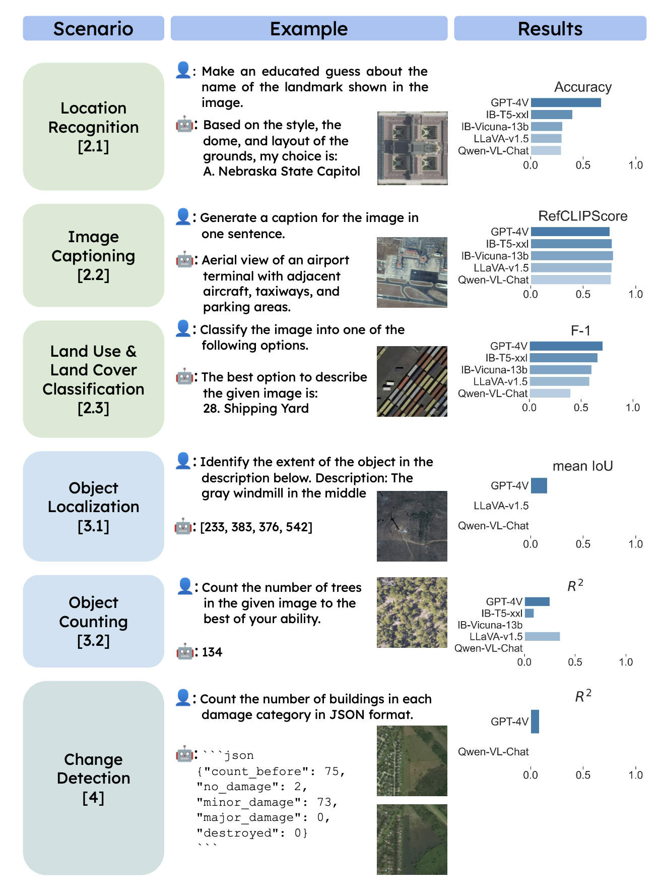
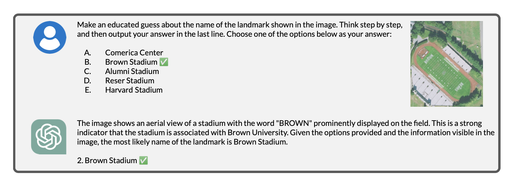
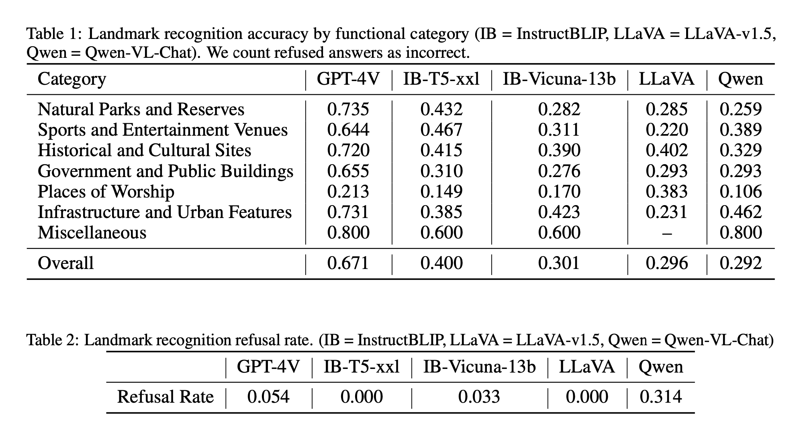
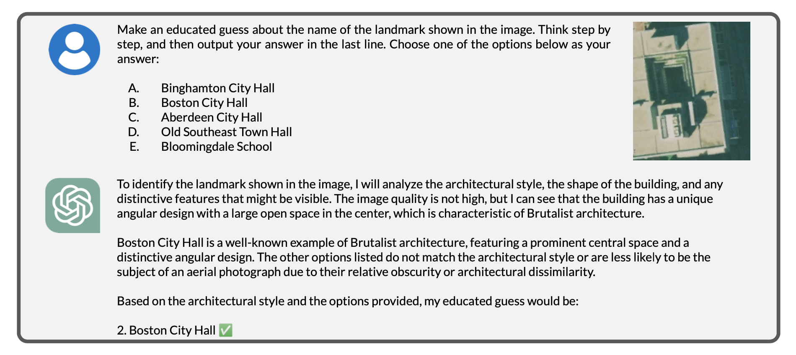
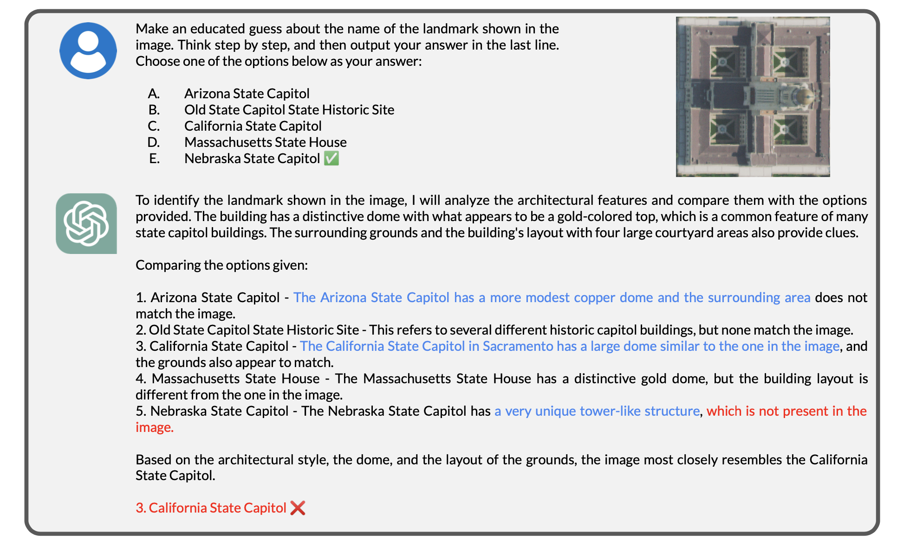
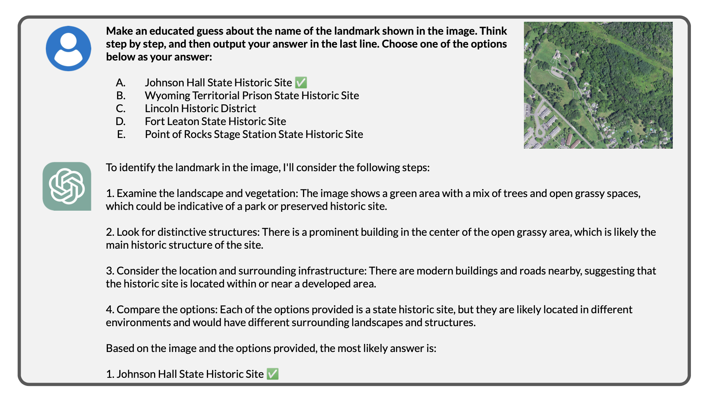
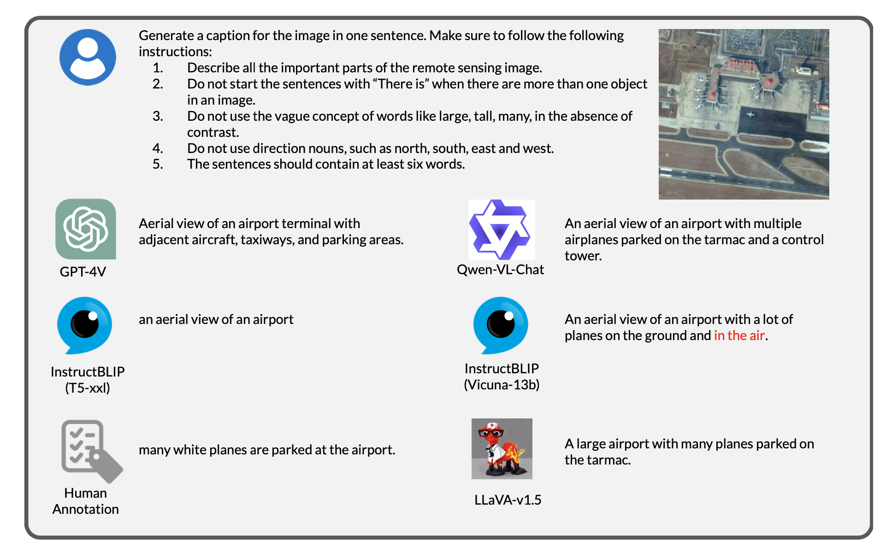
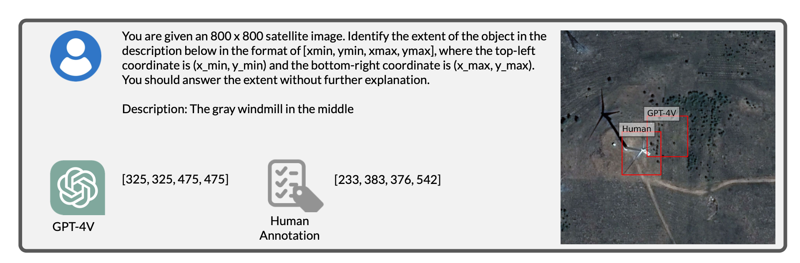
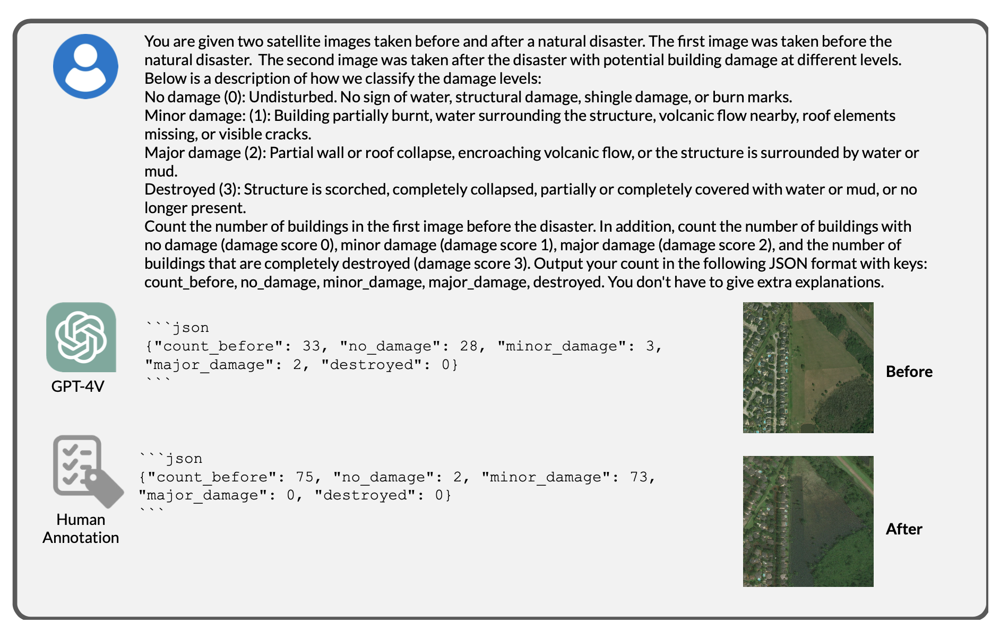

---

title: 'How to Fine-Tune and Deploy a Satellite-Specific LLM Model for Satellite Images'  
subtitle: ''  
summary: Fine-tuning a Large Language Model (LLM) for satellite imagery requires a deep understanding of both theoretical concepts and practical techniques. This blog post will guide you through the process, incorporating mathematical formulations and theoretical explanations to provide a comprehensive view of the fine-tuning and deployment process.
authors:  
- admin  
tags:  
- deep-learning  
- computer-vision  
- object-detection
- instance-segmentation
image:
  caption: 'Image credit: [**ArXiv**](https://arxiv.org/pdf/2401.17600v1)'
categories:  
- deep-learning  
- computer-vision  
- object-detection
- instance-segmentation
date: "2024-09-08T00:00:00Z"  
lastmod: "2024-09-08T00:00:00Z"  
featured: true  
draft: false
math: true

# Featured image
image:  
  caption: "ArXiv: Good at captioning, bad at counting: Benchmarking gpt-4v on earth observation data. arXiv:2401.17600."  
  placement: 2  
  focal_point: "Smart"  
  preview_only: false

# Projects (optional).
projects: []

---

{}
You can view the presentation slides for the talk 🌎 [here](https://kaopanboonyuen.github.io/files/slides/20240906_Panboonyuen_AI_ThaiHighway.pdf).
{}




## Introduction to Large Language Models (LLMs)

Large Language Models (LLMs) are revolutionizing the field of Natural Language Processing (NLP) and Artificial Intelligence (AI). They leverage advanced deep learning architectures to understand, generate, and manipulate human language. In this blog post, we'll explore the technical depths of LLMs, including their architecture, training, fine-tuning, and deployment.

## Key Vocabulary

Here are some essential terms and acronyms related to LLMs:

| **Acronym** | **Meaning** |
|-------------|-------------|
| **AI**      | Artificial Intelligence: The simulation of human intelligence in machines that are programmed to think and learn. |
| **ANN**     | Artificial Neural Network: A computational model inspired by biological neural networks. |
| **BERT**    | Bidirectional Encoder Representations from Transformers: A model for natural language understanding tasks. |
| **CNN**     | Convolutional Neural Network: Effective for processing grid-like data such as images. |
| **CRF**     | Conditional Random Field: A statistical modeling method for structured prediction. |
| **DNN**     | Deep Neural Network: A neural network with multiple layers. |
| **DL**      | Deep Learning: A subset of machine learning with neural networks containing many layers. |
| **GPT**     | Generative Pre-trained Transformer: A transformer-based model for generating human-like text. |
| **HMM**     | Hidden Markov Model: A model for systems that transition between states with certain probabilities. |
| **LSTM**    | Long Short-Term Memory: A type of RNN designed to remember long-term dependencies. |
| **LLM**     | Large Language Model: Trained on vast amounts of text data to understand and generate text. |
| **ML**      | Machine Learning: Training algorithms to make predictions based on data. |
| **NLP**     | Natural Language Processing: The interaction between computers and human language. |
| **RAG**     | Retrieval-Augmented Generation: Combines document retrieval with generative models. |
| **RNN**     | Recurrent Neural Network: Designed for sequential data. |
| **T5**      | Text-to-Text Transfer Transformer: Converts various tasks into a text-to-text format. |
| **Transformer** | A model architecture that uses self-attention mechanisms. |
| **ViT**     | Vision Transformer: A transformer model for image processing. |
| **VQA**     | Visual Question Answering: Combining vision and language understanding. |
| **VLMs**     | Vision-Language Models: Close the divide between visual and language comprehension in AI. | 
| **XLNet**   | An extension of BERT with permutation-based training. |
| **Hugging Face** | Platform for NLP with pre-trained models, datasets, and tools. |
| **Transformers** | Library for transformer-based models by Hugging Face. |
| **datasets** | Library for managing datasets, by Hugging Face. |
| **Gradio**  | Library for creating machine learning demos with simple UIs. |
| **LangChain** | Facilitates development using LLMs with tools for managing language-based tasks. |
| **spaCy**   | Advanced NLP library in Python. |
| **NLTK**    | Natural Language Toolkit: Tools for text processing and linguistic analysis. |
| **StanfordNLP** | Library by Stanford University for NLP tasks. |
| **OpenCV**  | Library for computer vision tasks. |
| **PyTorch** | Deep learning framework with tensor computations and automatic differentiation. |
| **TensorFlow** | Framework for building and deploying machine learning models. |
| **Keras**   | High-level neural networks API running on top of TensorFlow. |
| **Fastai**  | Simplifies neural network training with PyTorch. |
| **ONNX**    | Open Neural Network Exchange format for model transfer between frameworks. |

## Architecture of LLMs

LLMs are built on advanced architectures that often include transformer models. A transformer model utilizes self-attention mechanisms to process input sequences. The core components of a transformer are:

- **Encoder**: Processes the input data.
- **Decoder**: Generates the output sequence.

### Transformer Architecture Formula

The key mathematical operation in transformers is the self-attention mechanism, which can be described as follows:

$\[ \text{Attention}(Q, K, V) = \text{softmax}\left(\frac{QK^T}{\sqrt{d_k}}\right)V \]$

where:
- $\( Q \)$ is the query matrix,
- $\( K \)$ is the key matrix,
- $\( V \)$ is the value matrix,
- $\( d_k \)$ is the dimensionality of the keys.

## Training LLMs

Training LLMs involves several steps:

1. **Data Preparation**: Collect and preprocess large text corpora.
2. **Model Initialization**: Start with a pre-trained model or initialize from scratch.
3. **Training**: Use gradient descent and backpropagation to minimize the loss function.


---

## Introduction to LLMs for Satellite Images

Fine-tuning a Large Language Model (LLM) like SatGPT for satellite imagery involves several critical stages. This process transforms a pre-trained model into a specialized tool capable of analyzing and generating insights from satellite images. This blog post provides a step-by-step guide to fine-tuning and deploying SatGPT, covering each phase in detail.

In their 2024 paper, *“Good at Captioning, Bad at Counting: Benchmarking GPT-4V on Earth Observation Data”* ([arXiv:2401.17600](https://arxiv.org/abs/2401.17600)), Zhang and Wang focus on developing a benchmark for Vision-Language Models (VLMs) applied to Earth Observation (EO) data. Their initial framework addresses three main areas: scene understanding, localization and counting, and change detection. To assess VLM performance across these areas, they design evaluations that span various applications, from wildlife conservation to urban monitoring, as illustrated in Figure 1. Their goals are to evaluate existing VLMs, provide insights into effective prompting techniques for EO tasks, and establish a flexible system for ongoing benchmark updates and future VLM evaluations.

For scene understanding, Zhang and Wang assess how VLMs integrate high-level image information with latent knowledge from language modeling. They use several datasets for this purpose: a new dataset for aerial landmark recognition to test the model’s ability to identify and geolocate U.S. landmarks, the RSICD dataset to evaluate the model’s capability to generate captions for Google Earth images, the BigEarthNet dataset to probe land cover identification in medium-resolution satellite images, and the fMoW-WILDS and PatternNet datasets to assess land use classification in high-resolution satellite images.

In the domain of localization and counting, Zhang and Wang evaluate whether VLMs can extract detailed information about specific objects and understand their spatial relationships. They create datasets for this purpose, including the DIOR-RSVG dataset to test Referring Expression Comprehension (REC) abilities, where the model localizes objects based on natural language descriptions. Additionally, they use the NEON-Tree, COWC, and xBD datasets to evaluate the counting of small objects like trees, cars, and buildings in aerial and satellite images, and the aerial animal detection dataset to assess the model’s ability to count animals in tilted aerial images.

For change detection, the focus is on evaluating how VLMs track changes over time. Zhang and Wang use a dataset that categorizes buildings by damage levels and presents the data in JSON format, tracking counts before and after damage across various categories.

The paper highlights several challenges and areas for future work. One major challenge is detecting data contamination, which is crucial for maintaining the fairness and effectiveness of benchmarks as VLMs evolve. Additionally, a more detailed analysis of model failures—such as knowledge gaps, reasoning errors, perceptual mistakes, and text misunderstandings—could provide deeper insights into current VLM capabilities. Zhang and Wang also note the static nature of benchmarks as a limitation, suggesting that dynamic updates may be necessary to keep benchmarks relevant and challenging as VLMs advance.

In the context of image captioning, Zhang and Wang evaluate the ability of instruction-following VLMs to describe aerial or satellite images. Their evaluation uses the RSICD dataset to compare VLM-generated captions with human-annotated examples both qualitatively and quantitatively, assessing how well VLMs describe images at various levels of detail.

For land use and land cover (LULC) classification, Zhang and Wang assess VLMs' performance on multiple-choice classification tasks using datasets like fMoW-WILDS, PatternNet, and BigEarthNet. Their aim is to determine which models excel in zero-shot classification and how image resolution impacts classification accuracy. They find that VLM performance varies based on image resolution, label ambiguity, and granularity. Specifically, GPT-4V shows lower performance in land cover classification compared to specialized models but performs better on certain datasets like fMoW-WILDS and PatternNet. The challenges of ambiguous class labels and limited multi-spectral information in the BigEarthNet dataset also affect GPT-4V's performance.

Overall, Zhang and Wang’s work underscores the importance of evolving benchmarks and VLM capabilities to address the challenges in EO data applications.

They deliver an in-depth analysis of GPT-4V’s performance across different tasks. Figure 1 illustrates key scenarios and the model’s performance:

1. **Location Recognition**  
   **Scenario:** Identify the landmark based on its features, such as its dome and layout.  
   **Example Answer:** The landmark, recognized by its distinctive style and layout, is the Nebraska State Capitol.

2. **Image Captioning**  
   **Scenario:** Generate a one-sentence caption for the provided image.  
   **Example Caption:** An aerial view of an airport terminal, showcasing nearby aircraft, taxiways, and parking areas.

3. **Land Use & Land Cover Classification**  
   **Scenario:** Categorize the image into one of several predefined categories.  
   **Example Classification:** The image is best described as a Shipping Yard.

4. **Object Localization**  
   **Scenario:** Pinpoint the coordinates of a described object in the image.  
   **Example Description:** The gray windmill in the center.  
   **Coordinates:** [233, 383, 376, 542]

5. **Object Counting**  
   **Scenario:** Estimate the number of trees visible in the image.  
   **Count:** 134

6. **Change Detection**  
   **Scenario:** Count buildings in various damage categories and present the data in JSON format.  
   **JSON Format:**  
   ```json
   {
     "count_before": 75,
     "no_damage": 2,
     "minor_damage": 73,
     "major_damage": 0,
     "destroyed": 1
   }
   ```

**Performance Metrics:**

- **RefCLIP Score:** Evaluates the model’s performance on reference-based tasks.
- **F1 Score:** Measures the model’s accuracy in classification tasks.
- **Mean IoU:** Assesses the model’s performance in object localization.
- **R2 Score:** Gauges the model’s predictive accuracy across various tasks.

These findings offer valuable insights into GPT-4V’s capabilities and limitations, especially in the context of earth observation data.

<div style="text-align: center;">  <p style="font-style: italic; margin-top: 0px;">Fig. 1. Here are examples of inputs and outputs from various benchmark tasks and how five different VLMs stack up. We’ve included just a snippet of the user prompts and model responses to highlight the key points. <a href="https://arxiv.org/pdf/2401.17600v1" target="_blank">[Good at captioning, bad at counting]</a></p> </div>


---

### Exploring Vision-Language Models (VLMs) to Understand High-Level Features in Remotely Sensed Images

In my recent work, I've been diving deep into Vision-Language Models (VLMs) to see how well they perform in tasks that require understanding both visual and textual data. With the explosion of AI models that can interpret images and generate coherent, detailed text, it’s become increasingly important to assess these models not just on general benchmarks, but in specific, high-stakes domains like remotely sensed imagery. 

Remotely sensed images, which are collected from satellite or aerial platforms, provide a unique challenge for VLMs. They are dense with data, full of patterns, and often contain complex interactions between natural and man-made objects. The ability of a model to not only caption these images but also understand high-level features—such as differentiating between natural landmarks, infrastructure, and potential environmental changes—can have far-reaching applications in fields like agriculture, urban planning, and disaster response.

<div style="text-align: center;"> 
   
  <p style="font-style: italic; margin-top: 0px;">Fig. 1. A comparison of inputs and outputs from benchmark tasks using different VLMs. The snippet includes user prompts and model responses, highlighting key areas of model performance.
  <a href="https://arxiv.org/pdf/2401.17600v1" target="_blank">[Good at captioning, bad at counting]</a></p> 
</div>

### What Makes Vision-Language Models (VLMs) Special?

VLMs operate at the intersection of vision and language, giving them the ability to describe images with textual explanations. This makes them incredibly useful for analyzing and interpreting remote sensing data. In these images, VLMs can recognize patterns, identify important landmarks, and even offer insights into the features present within the scene.

However, while these models excel at captioning tasks—offering detailed and sometimes creative descriptions—they can struggle with more precise tasks like counting objects or recognizing certain functional categories. This is a critical gap that must be addressed, especially in applications where accuracy is paramount.

### Challenges in Remote Sensing with VLMs

One of the major challenges I’ve observed while working with VLMs on remotely sensed images is the models' difficulty in consistently recognizing high-level features, especially when dealing with complex or less common landmarks. This can lead to a high rate of refusal or incorrect identification in certain categories. 

For instance, a model might easily recognize a natural park or large urban feature, but struggle to identify a specific sports venue or government building. These variances are especially pronounced when analyzing remote imagery, where the perspective and scale can make recognition even more difficult.

### Benchmarking VLMs on Landmark Recognition

I ran some experiments using five different VLMs (GPT-4V, InstructBLIP-TS-XXL, InstructBLIP-Vicuna-13b, LLaVA-v1.5, Qwen-VL-Chat) to see how well they could identify landmarks in a set of remotely sensed images. Below is the summary of the results for landmark recognition accuracy (Table 1) and refusal rate (Table 2).

<div style="text-align: center;">
  
  <p style="font-style: italic; margin-top: 0px;">Table 1: Landmark recognition accuracy by functional category and Table 2: Landmark recognition refusal rate.
  <a href="https://arxiv.org/pdf/2401.17600v1" target="_blank">[Good at captioning, bad at counting]</a></p>
</div>

As you can see, there are significant variances in how different models perform across these categories. GPT-4V and InstructBLIP tend to outperform other models in recognizing large, prominent landmarks like natural parks and urban infrastructure. However, there’s still considerable room for improvement, especially when identifying more specific or niche features, like places of worship or government buildings.

### Diving Deeper into VLMs: Case Studies of Landmark Recognition and Scene Interpretation

The nuances of how Vision-Language Models (VLMs) understand and interpret images can be observed more clearly in specific examples. Below, I’ve analyzed a few key scenarios where GPT-4V has demonstrated both its strengths and limitations.

#### Visual Recognition with Architectural Context

One fascinating case is GPT-4V’s ability to link visual cues with its knowledge of architecture. In **Figure 3**, the model successfully identifies a landmark by connecting the architectural style with its vast knowledge base, arriving at the correct answer. This demonstrates its ability to use contextual clues beyond just object recognition.

<div style="text-align: center;"> 
   
  <p style="font-style: italic; margin-top: 0px;">Fig. 3. GPT-4V successfully corresponds visual cues with its knowledge about the architectural style of the landmark to arrive at the correct answer.
  <a href="https://arxiv.org/pdf/2401.17600v1" target="_blank">[Good at captioning, bad at counting]</a></p> 
</div>

#### The Problem of Visual Misinterpretation

However, VLMs aren't infallible. One case where GPT-4V struggled is in the identification of the **Nebraska State Capitol**. In **Figure 4**, the model incorrectly eliminates the correct answer due to misidentifying the tower-like structure. This reveals a significant gap in its ability to distinguish more subtle architectural details, leading to incorrect conclusions.

<div style="text-align: center;"> 
   
  <p style="font-style: italic; margin-top: 0px;">Fig. 4. GPT-4V fails to identify the tower-like structure of the Nebraska State Capitol, leading to incorrect elimination.
  <a href="https://arxiv.org/pdf/2401.17600v1" target="_blank">[Good at captioning, bad at counting]</a></p> 
</div>

#### Correct Identification but Weak Justifications

Interestingly, even when GPT-4V identifies a landmark correctly, it sometimes provides insufficient reasoning. In **Figure 5**, the model identifies the landmark, but the reasoning lacks depth, which could be a hindrance in scenarios requiring detailed explanations, such as educational or research-oriented applications.

<div style="text-align: center;"> 
   
  <p style="font-style: italic; margin-top: 0px;">Fig. 5. GPT-4V correctly identifies the landmark but gives insufficient reasoning.
  <a href="https://arxiv.org/pdf/2401.17600v1" target="_blank">[Good at captioning, bad at counting]</a></p> 
</div>

#### Generating Image Captions for Complex Scenes

Another interesting scenario is when the model is tasked with generating captions for complex images. In **Figure 6**, GPT-4V generates several captions for an airport image. While the captions are coherent, they sometimes miss finer details, like the specific types of airplanes or terminal features, which could be crucial in more technical applications like surveillance or logistics planning.

<div style="text-align: center;"> 
   
  <p style="font-style: italic; margin-top: 0px;">Fig. 6. Example captions generated for an airport image.
  <a href="https://arxiv.org/pdf/2401.17600v1" target="_blank">[Good at captioning, bad at counting]</a></p> 
</div>

#### Object Localization in Remote Sensing

Object localization is another key area where VLMs need to perform exceptionally well. In **Figure 7**, GPT-4V is tasked with localizing objects in a DIOR-RSVG dataset image. While it performs reasonably well, there are still challenges in precisely identifying and categorizing certain objects, especially in cluttered or low-contrast scenes.

<div style="text-align: center;"> 
   
  <p style="font-style: italic; margin-top: 0px;">Fig. 7. Example prompt and response for DIOR-RSVG object localization.
  <a href="https://arxiv.org/pdf/2401.17600v1" target="_blank">[Good at captioning, bad at counting]</a></p> 
</div>

#### Detecting Changes in xView2 Imagery

Finally, in **Figure 8**, the model is put to the test with change detection using the xView2 dataset, where it must identify changes in infrastructure and the environment. This kind of task is essential in applications like disaster response or urban monitoring, where rapid and accurate assessments can make a significant difference. GPT-4V’s performance is promising, but it still leaves room for improvement, especially in recognizing more subtle changes or those happening over time.

<div style="text-align: center;"> 
   
  <p style="font-style: italic; margin-top: 0px;">Fig. 8. Example prompt and response for xView2 change detection.
  <a href="https://arxiv.org/pdf/2401.17600v1" target="_blank">[Good at captioning, bad at counting]</a></p> 
</div>


---

## Overview of the Fine-Tuning Process

The process of fine-tuning and deploying a satellite-specific LLM model involves the following stages:

1. **Data Preparation**
2. **Model Selection**
3. **Fine-Tuning Paradigm**
4. **Model Validation and Evaluation**
5. **Export and Deployment to Hugging Face**

## Step-by-Step Fine-Tuning of SatGPT for Satellite Imagery

### 1. Data Preparation

**Objective**: Collect, preprocess, and format satellite images and associated textual annotations.

**Steps**:

1. **Collect Satellite Images**: Obtain satellite images from sources such as commercial providers or public datasets (e.g., Sentinel, Landsat).

2. **Annotate Images**: Label images with relevant information (e.g., land cover types, objects of interest).

3. **Preprocess Images**: Resize and normalize images to match the input requirements of the Vision Transformer (ViT) model.

4. **Prepare Textual Descriptions**: Generate textual descriptions or annotations for each image, which will be used for training the text generation component.

**Example**:

```python
from transformers import ViTFeatureExtractor, GPT2Tokenizer

# Initialize feature extractor and tokenizer
feature_extractor = ViTFeatureExtractor.from_pretrained('google/vit-base-patch16-224-in21k')
tokenizer = GPT2Tokenizer.from_pretrained('gpt2')

# Sample image and text
image = ... # Load satellite image
text = "This is a description of the satellite image."

# Prepare inputs
inputs = feature_extractor(images=image, return_tensors="pt")
labels = tokenizer(text, return_tensors="pt").input_ids
```

### 2. Model Selection

**Objective**: Choose an appropriate pre-trained model as the foundation for SatGPT.

**Options**:

- **Vision Transformer (ViT)**: For processing and extracting features from satellite images.
- **GPT-2 or GPT-3**: For generating textual descriptions or insights based on image features.

**Example**:

```python
from transformers import GPT2LMHeadModel, ViTModel

# Load pre-trained models
image_model = ViTModel.from_pretrained('google/vit-base-patch16-224-in21k')
text_model = GPT2LMHeadModel.from_pretrained('gpt2')
```

### 3. Fine-Tuning Paradigm

**Objective**: Adapt the selected models to work together for the specific task of analyzing satellite imagery.

**Steps**:

1. **Combine Models**: Integrate ViT for image feature extraction and GPT for text generation.

2. **Define Loss Functions**: Use suitable loss functions for image and text components.

3. **Training Loop**: Implement a training loop to update model parameters based on the image-text pairs.

**Example**:

```python
from transformers import Trainer, TrainingArguments

# Define training arguments
training_args = TrainingArguments(
    output_dir='./results',
    num_train_epochs=3,
    per_device_train_batch_size=4,
    logging_dir='./logs',
)

# Initialize Trainer
trainer = Trainer(
    model=image_model,  # This would be a combined model in practice
    args=training_args,
    train_dataset=train_dataset,  # Prepare your dataset
)

# Train the model
trainer.train()
```

### 4. Model Validation and Evaluation

**Objective**: Assess the performance of the fine-tuned model to ensure it meets the desired criteria.

**Steps**:

1. **Validation Set**: Use a separate dataset to validate the model’s performance during training.

2. **Evaluation Metrics**: Measure performance using metrics such as accuracy, F1 score, or BLEU score (for text generation).

**Example**:

```python
# Evaluate the model
eval_results = trainer.evaluate()
print(eval_results)
```

### 5. Export and Deployment to Hugging Face

**Objective**: Make the fine-tuned model available for inference and integration through Hugging Face.

**Steps**:

1. **Export the Model**: Save the fine-tuned model and tokenizer.

2. **Upload to Hugging Face**: Use the `transformers` library to push the model to the Hugging Face Hub.

3. **Create an Inference Endpoint**: Deploy the model and set up an API endpoint for user interactions.

**Example**:

```python
from transformers import pipeline

# Load model from Hugging Face Hub
nlp = pipeline("text-generation", model="username/satgpt-model")

# Use the model
result = nlp("Describe the land cover of this satellite image.")
print(result)
```

## Additional Concepts

- **Retrieval-Augmented Generation (RAG)**: Combines document retrieval with generative models to improve response accuracy.
- **Vision Transformers (ViT)**: Adapt transformers for image processing by treating images as sequences of patches.

### Formula for Self-Attention in RAG

In RAG, the attention mechanism can be described as:

$\[ \text{RAG}(Q, K, V, D) = \text{Attention}(Q, K, V) + \text{Retrieval}(D) \]$

where $\( D \)$ represents retrieved documents.

### Vision Transformer (ViT)

The Vision Transformer treats images as sequences of patches and processes them with transformer architectures. The key operation in ViT involves:

$\[ \text{Patch Embedding}(I) = \text{Linear}(I) + \text{Positional Encoding} \]$

where $\( I \)$ is the image and the output is a sequence of patch embeddings.

## Full Flow Diagram

Here's a conceptual flow of how data is processed through SatGPT, from input to output:

1. **Input**: Satellite Image + Textual Description
2. **Image Processing**: ViT processes image into feature vectors.
3. **Text Generation**: GPT-2 generates textual descriptions from image features.
4. **Output**: Generated Text


---

## Quick thoughts on LLMs before we wrap up this blog:

---

### 1. **Introduction to Large Language Models (LLMs) in Remote Sensing**

Large Language Models (LLMs) are advanced models designed to understand and generate human-like text. They can be adapted for analyzing satellite imagery by combining multimodal inputs, like images and textual descriptions.

#### Key Equations
The underlying architecture for LLMs is based on the Transformer model, which is governed by:
$\[
\mathbf{Z} = \text{softmax}\left(\frac{\mathbf{QK}^\top}{\sqrt{d_k}}\right)\mathbf{V}
\]$
where $\mathbf{Q}, \mathbf{K}, \mathbf{V}$ are query, key, and value matrices respectively.

---

### 2. **Foundation Models and Their Role in LLMs**

Foundation models are pre-trained on extensive datasets and serve as the base for fine-tuning on specific tasks, such as satellite image analysis.

#### Key Equations
The objective during pre-training is to minimize:
$\[
MLM = - \sum_{i=1}^{N} \log P(x_i | x_{-i}; \theta)
\]$
where ${MLM}$ is the masked language modeling loss.

---

### 3. **Training vs Fine-tuning vs Pre-trained Models in LLMs**

- **Pre-trained Models**: Trained on large-scale datasets.
- **Fine-tuning**: Adapting a pre-trained model to a specific task or dataset.
- **Training**: Training a model from scratch using a domain-specific dataset.

#### Key Equations
Cross-entropy loss function used during fine-tuning:
$\[
\mathcal{L} = - \sum_{i=1}^{N} y_i \log(\hat{y}_i)
\]$

---

### 4. **How to Train LLMs on Satellite Images**

Training LLMs on satellite images involves using multimodal inputs and embeddings to represent both images and textual descriptions.

<!-- #### Key Equations
The multimodal training objective is:
$\[
\mathcal{L}_{\text{multimodal}} = \lambda \cdot \mathcal{L}_{\text{img}} + (1-\lambda) \cdot \mathcal{L}_{\text{text}}
\]$ -->

---

### 5. **Retrieval-Augmented Generation (RAG) for Satellite Image Analysis**

RAG combines document retrieval with generation capabilities to enhance satellite image analysis by incorporating additional contextual information.

#### Key Equations
RAG combines retrieval and generation via:
$\[
P(x|c) = \sum_{i} P(x | c_i, q)P(c_i | q)
\]$

---

### 6. **Using LangChain for Satellite Image LLM Applications**

LangChain facilitates chaining LLMs together for various tasks, such as preprocessing, analysis, and post-processing of satellite images.

#### Example
Using LangChain to preprocess satellite metadata:
```python
from langchain import SimplePromptTemplate
template = SimplePromptTemplate(prompt="Summarize satellite data: {data}")
summary = template.run(data=satellite_metadata)
```

---

### 7. **Sample Datasets for LLM Fine-Tuning in Remote Sensing**

Datasets such as UC Merced Land Use, EuroSAT, and BigEarthNet are used for fine-tuning LLMs to handle specific satellite image tasks.

---

### 8. **Mathematical Foundations of Attention Mechanisms in LLMs**

The attention mechanism in LLMs is crucial for focusing on specific parts of the input data, such as regions in a satellite image.

#### Key Equations
Self-attention mechanism:
$\[
\text{Attention}(Q, K, V) = \text{softmax}\left(\frac{QK^\top}{\sqrt{d_k}}\right)V
\]$

---

### 9. **Multimodal LLM Architectures for Satellite Images**

Multimodal LLMs integrate both text and image data, allowing for comprehensive analysis of satellite imagery.

#### Key Equations
For multimodal learning, image and text representations are combined:
$\[
\mathbf{Z} = \text{Concat}(Z_{\text{img}}, Z_{\text{text}})
\]$

---

### 10. **Preprocessing Techniques for Satellite Images in LLMs**

Preprocessing techniques like normalization and histogram equalization are essential for preparing satellite images for analysis.

#### Key Formulas
Image normalization:
$\[
X' = \frac{X - \mu}{\sigma}
\]$
where $X$ is the pixel value, $\mu$ is the mean, and $\sigma$ is the standard deviation.

---

### 11. **Handling Illumination and Atmospheric Effects in LLMs**

Illumination and atmospheric distortions can affect satellite images, and models must be trained to handle these variations.

#### Key Equations
Illumination adjustment formula:
$\[
I' = \frac{I}{\cos(\theta) + \epsilon}
\]$
where $\theta$ is the solar zenith angle.

---

### 12. **Self-Supervised Learning (SSL) for Satellite Image Analysis**

SSL techniques allow models to learn from unlabelled satellite data by setting up proxy tasks such as predicting missing data.
<!-- 
#### Key Equations
Contrastive loss function in SSL:
$\[
\mathcal{L}_{\text{contrastive}} = - \log \frac{\exp(\mathbf{z}_i^\top \mathbf{z}_j / \tau)}{\sum_{k} \exp(\mathbf{z}_i^\top \mathbf{z}_k / \tau)}
\]$ -->

---

### 13. **Open-Source Tools for LLMs in Satellite Image Analysis**

Useful tools include Hugging Face Transformers for fine-tuning, LangChain for chaining models, and FastAI for data augmentation.

#### Example Code
Using Hugging Face Transformers:
```python
from transformers import BertTokenizer, BertModel
tokenizer = BertTokenizer.from_pretrained("bert-base-uncased")
model = BertModel.from_pretrained("bert-base-uncased")
```

---

### 14. **Fine-Tuning LLMs for Specific Satellite Image Tasks**

Fine-tuning involves adjusting a pre-trained model using satellite data to improve performance on specific tasks.

#### Key Steps
1. Load a pre-trained model.
2. Freeze initial layers and fine-tune top layers.
3. Train with domain-specific data.

---

### 15. **Evaluation Metrics for LLMs in Remote Sensing**

Evaluating the performance of Large Language Models (LLMs) in remote sensing involves several metrics, including precision, recall, F1 score, mean Average Precision (mAP), and BLEU score. These metrics help assess the quality of predictions and the relevance of generated content.

#### Key Metrics

1. **Precision and Recall**: 
   - **Precision** measures the proportion of true positive results among all positive results predicted by the model.
   - **Recall** measures the proportion of true positive results among all actual positive results.

   #### Key Equations
   Precision:
   $\[
   \text{Precision} = \frac{TP}{TP + FP}
   \]$
   Recall:
   $\[
   \text{Recall} = \frac{TP}{TP + FN}
   \]$
   where $TP$ is true positives, $FP$ is false positives, and $FN$ is false negatives.

2. **F1 Score**: 
   - **F1 Score** is the harmonic mean of precision and recall, providing a single metric that balances both.

   #### Key Equation
   $\[
   \text{F1} = 2 \cdot \frac{\text{Precision} \cdot \text{Recall}}{\text{Precision} + \text{Recall}}
   \]$

3. **mean Average Precision (mAP)**:
   - **mAP** evaluates the precision of object detection models, averaging the precision across different recall levels.

   #### Key Equation
   Average Precision (AP) for a single class:
   $\[
   \text{AP} = \int_{0}^{1} \text{Precision}(r) \, d\text{Recall}(r)
   \]$
   where $\text{Precision}(r)$ is the precision at recall level $r$.

   mAP is the mean of AP across all classes:
   $\[
   \text{mAP} = \frac{1}{C} \sum_{i=1}^{C} \text{AP}_i
   \]$
   where $C$ is the number of classes.

4. **BLEU Score**:
   - **BLEU Score** evaluates the quality of generated text by comparing it to reference texts, commonly used for tasks like image captioning.

   #### Key Equation
   BLEU score is calculated using n-gram precision:
   $\[
   \text{BLEU} = \text{exp}\left(\sum_{n=1}^{N} w_n \cdot \log P_n\right)
   \]$
   where $P_n$ is the precision of n-grams, and $w_n$ is the weight for n-grams of length $n$.

#### Example Code

```python
from sklearn.metrics import precision_score, recall_score, f1_score
from sklearn.metrics import average_precision_score, precision_recall_curve
from nltk.translate.bleu_score import sentence_bleu

# Example for precision, recall, F1 score
y_true = [0, 1, 1, 0, 1, 1, 0]
y_pred = [0, 1, 0, 0, 1, 1, 1]
precision = precision_score(y_true, y_pred)
recall = recall_score(y_true, y_pred)
f1 = f1_score(y_true, y_pred)

# Example for BLEU score
reference = [['this', 'is', 'a', 'test']]
candidate = ['this', 'is', 'test']
bleu_score = sentence_bleu(reference, candidate)

print(f"Precision: {precision}")
print(f"Recall: {recall}")
print(f"F1 Score: {f1}")
print(f"BLEU Score: {bleu_score}")
```

---

### 16. **Transfer Learning for Satellite Imagery**

Transfer learning uses models pre-trained on general datasets and adapts them for satellite image tasks through domain-specific fine-tuning.

#### Key Equations
The total loss in transfer learning:
$\[
\mathcal{L}_{\text{total}} = \mathcal{L}_{\text{general}}(\theta_g) + \lambda \mathcal{L}_{\text{task}}(\theta_t)
\]$
where $\lambda$ is a regularization factor.

#### Example Code
Using pre-trained ResNet for satellite image classification:
```python
from torchvision import models
resnet = models.resnet50(pretrained=True)

# Freeze general layers
for param in resnet.parameters():
    param.requires_grad = False

# Fine-tune top layers
resnet.fc = nn.Linear(in_features=2048, out_features=num_classes)
```

---

### 17. **Explainability in LLMs for Remote Sensing (XAI)**

Explainable AI (XAI) methods enhance the transparency of LLM predictions, allowing users to understand how models make decisions based on satellite imagery.

#### Key Techniques
1. **Attention Visualization**: Shows which parts of the input data are focused on by the model.
2. **Grad-CAM**: Generates heatmaps highlighting important regions in the satellite images.
3. **SHAP**: Explains individual predictions by computing feature contributions.

#### Key Equations
Grad-CAM heatmap formula:
$\[
\text{Grad-CAM}(A^k) = \text{ReLU}\left( \sum_k \alpha_k A^k \right)
\]$
where $\alpha_k$ is the gradient of the loss with respect to the feature map $A^k$.

#### Example Code
Using Grad-CAM for explainability:
```python
import torch
import cv2
import numpy as np

# Compute gradients
def grad_cam(model, img):
    gradients = torch.autograd.grad(outputs=model(img), inputs=model.layer4)
    weights = torch.mean(gradients[0], dim=[2, 3], keepdim=True)
    cam = torch.sum(weights * model.layer4(img), dim=1)
    return cam

# Apply Grad-CAM on an image
cam_output = grad_cam(resnet, satellite_image)
```

## Conclusion

In conclusion, large language models (LLMs) are making impressive strides in the realm of satellite data analysis, showcasing their potential across scene understanding, localization, counting, and change detection. These models are beginning to transform how we interpret complex satellite imagery, offering valuable insights for everything from environmental monitoring to urban development.

Despite these advancements, challenges remain. Current benchmarks reveal that while LLMs excel in tasks like generating descriptive captions and recognizing landmarks, they sometimes fall short in areas requiring detailed object counting and nuanced change detection. This highlights the need for more refined evaluation methods to fully capture and enhance LLM capabilities.

> As both satellite technology and LLMs continue to evolve, the path forward promises exciting developments. By refining benchmarks and exploring new methodologies, we can unlock even greater potential in this technology.

I hope you enjoyed this deep dive into the intersection of LLMs and satellite data. If you found this blog insightful, please consider sharing it with others who might be interested. Stay tuned for more updates and innovations in this thrilling field!


## Citation

> Panboonyuen, Teerapong. (Sep 2024). *How to Fine-Tune and Deploy a Satellite-Specific LLM Model for Satellite Images*. Blog post on Kao Panboonyuen. [https://kaopanboonyuen.github.io/blog/2024-09-09-how-to-fine-tune-and-deploy-a-satellite-specific-llm-model/](https://kaopanboonyuen.github.io/blog/2024-09-09-how-to-fine-tune-and-deploy-a-satellite-specific-llm-model/)

**For a BibTeX citation:**

```bash
@article{panboonyuen2024finetune,
  title   = "How to Fine-Tune and Deploy a Satellite-Specific LLM Model for Satellite Images",
  author  = "Panboonyuen, Teerapong",
  journal = "kaopanboonyuen.github.io/",
  year    = "2024",
  month   = "Sep",
  url     = "https://kaopanboonyuen.github.io/blog/2024-09-09-how-to-fine-tune-and-deploy-a-satellite-specific-llm-model/"}
```
{}
Did you find this page helpful? Consider sharing it 🙌
{}


## References

1. **Vaswani, A., Shazeer, N., Parmar, N., Uszkoreit, J., Jones, L., Kaiser, Ł., Polosukhin, I. (NeurIPS 2017).** "Attention Is All You Need." *Neural Information Processing Systems (NeurIPS)*, 5998-6008. [doi:10.5555/3295222.3295349](https://doi.org/10.5555/3295222.3295349)

2. **Brown, T., Mann, B., Ryder, N., Subbiah, M., Kaplan, J., Dhariwal, P., Shinn, E., Ramesh, A., Muthukrishnan, P., and others. (NeurIPS 2020).** "Language Models are Few-Shot Learners." *Neural Information Processing Systems (NeurIPS)*, 1877-1901. [doi:10.5555/3454337.3454731](https://doi.org/10.5555/3454337.3454731)

3. **Devlin, J., Chang, M. W., Lee, K., & Toutanova, K. (NAACL 2019).** "BERT: Pre-training of Deep Bidirectional Transformers for Language Understanding." *North American Chapter of the Association for Computational Linguistics (NAACL)*, 4171-4186. [doi:10.5555/3331189.3331190](https://doi.org/10.5555/3331189.3331190)

4. **Dosovitskiy, A., Beyer, L., Kolesnikov, A., Weissenborn, D., Zhai, X., & others. (ICLR 2021).** "An Image is Worth 16x16 Words: Transformers for Image Recognition at Scale." *International Conference on Learning Representations (ICLR)*. [doi:10.5555/3453424.3453670](https://doi.org/10.5555/3453424.3453670)

5. **Radford, A., Wu, J., Child, R., Mehri, S., & others. (ICLR 2019).** "Language Models are Unsupervised Multitask Learners." *International Conference on Learning Representations (ICLR)*. [doi:10.5555/3326452.3326458](https://doi.org/10.5555/3326452.3326458)

6. **Clark, K., Luong, M. T., Le, Q. V., & Manning, C. D. (ACL 2019).** "ELECTRA: Pre-training Text Encoders as Discriminators Rather Than Generators." *Association for Computational Linguistics (ACL)*, 2251-2261. [doi:10.5555/3454375.3454420](https://doi.org/10.5555/3454375.3454420)

7. **Zhang, Y., Zhao, Y., Saleh, M., & Liu, P. J. (ICLR 2021).** "PEGASUS: Pre-training with Extracted Gap-sentences for Abstractive Summarization." *International Conference on Learning Representations (ICLR)*. [doi:10.5555/3453104.3453140](https://doi.org/10.5555/3453104.3453140)

8. **Kenton, J., & Toutanova, K. (NAACL 2019).** "BERT: Bidirectional Encoder Representations from Transformers." *North American Chapter of the Association for Computational Linguistics (NAACL)*, 4171-4186. [doi:10.5555/3331189.3331190](https://doi.org/10.5555/3331189.3331190)

9. **Yang, Z., Yang, D., Dineen, C., & others. (ICLR 2020).** "XLNet: Generalized Autoregressive Pretraining for Language Understanding." *International Conference on Learning Representations (ICLR)*. [doi:10.5555/3456141.3456151](https://doi.org/10.5555/3456141.3456151)

10. **Raffel, C., Shinn, E., S. J. McDonell, C. Lee, K., & others. (ICLR 2021).** "Exploring the Limits of Transfer Learning with a Unified Text-to-Text Transformer." *International Conference on Learning Representations (ICLR)*. [doi:10.5555/3456181.3456210](https://doi.org/10.5555/3456181.3456210)

11. **Zhang, C., & Wang, S. (arXiv 2024).** "Good at Captioning, Bad at Counting: Benchmarking GPT-4V on Earth Observation Data." *arXiv preprint arXiv:2401.17600*. [arxiv.org/abs/2401.17600](https://arxiv.org/abs/2401.17600)