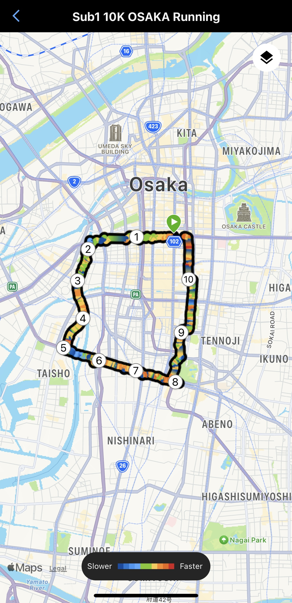

---

title: 'Sub1 Urban Running Experience: Crushing Times and Exploring Osaka, Kyoto, and Tokyo'
date: 2024-09-25'  
subtitle: ''  
summary: An incredible running experience across Japan's vibrant cities—Osaka, Kyoto, and Tokyo. I managed to hit sub-1-hour times while soaking in the unique vibes of each place. It was the perfect mix of pushing my pace and enjoying the sights along the way!
authors:  
- admin  
tags:  
- Running
- Swimming
- Japan
- Tokyo
- Osaka
- Kyoto
image:
  caption: 'Athlete: Kao Panboonyuen'
categories:  
- Running
- Swimming
- Japan
- Tokyo
- Osaka
- Kyoto
image:
date: "2024-09-25T00:00:00Z"  
lastmod: "2024-09-25T00:00:00Z"  
featured: true  
draft: false
math: true

# Featured image
image:  
  caption: "Athlete: Kao Panboonyuen"  
  placement: 2  
  focal_point: "Smart"  
  preview_only: false

# Projects (optional).
projects: []

---

<!--  -->

Hey guys! I just completed an incredible running experience across Japan's vibrant cities—Osaka, Kyoto, and Tokyo. I managed to hit sub-1-hour times while soaking in the unique vibes of each place. It was the perfect mix of pushing my pace and enjoying the sights along the way!

It was such a cool blend of testing my limits and discovering new places. Each run through those iconic spots felt like I was getting a real taste of Japan’s unique vibe and energy with every stride.



### Chapter 1: Osaka Running

This trip marks my third time in Japan, but this time I started in the Kansai region, kicking things off in Osaka. My main goal? To conquer a city run and aim for a sub-1-hour 10K.

Bright and early, after a good night’s rest, I hit the streets at 4:54 AM. The weather was just right, making the run super enjoyable. I ended up covering 10.59K at a pace of 4:42, finishing in 49 minutes. Here’s the route I took:

1. **Start at Awaza** [Explore the route here 🗺️](https://www.google.com/search?q=Awaza+Osaka)
2. **Matsushima Park** [Explore the route here 📍](https://www.google.com/search?q=Matsushima+Park+Osaka)
3. **Chiyoza** [Explore the route here 🗺️](https://www.google.com/search?q=Chiyoza+Osaka)
4. **Minamiizuo Park** [Explore the route here 📍](https://www.google.com/search?q=Minamiizuo+Park+Osaka)
5. **Kitatsumorinaka Park** [Explore the route here 🗺️](https://www.google.com/search?q=Kitatsumorinaka+Park+Osaka)
6. **Deshirohigashi Intersection** [Explore the route here 📍](https://www.google.com/search?q=Deshirohigashi+Intersection+Osaka)
7. **Machida Gastroenterology Hospital** [Explore the route here 🗺️](https://www.google.com/search?q=Machida+Gastroenterology+Hospital+Osaka)
8. **Tsutenkaku Tower** [Explore the route here 📍](https://www.google.com/search?q=Tsutenkaku+Tower+Osaka)
9. **Finish at Matsuyamachi** [Explore the route here 🗺️](https://www.google.com/search?q=Matsuyamachi+Osaka)
10. **Nipponbashi** [Explore the route here 📍](https://www.google.com/search?q=Nipponbashi+Osaka)




Osaka is truly a city that hooks you; it’s filled with hidden gems waiting to be explored. After three action-packed days, it was time to move on to Kyoto!

### Chapter 2: Kyoto Running

Next up was the challenge of a sub-1-hour city run in Kyoto. I only had two days here, and luck wasn’t on my side—rain greeted me in the morning. But nothing was going to stop my determination!

I crushed the city run in Kyoto, finishing 10.78K in 49 minutes (pace 4:38), which was even faster than my Osaka run! I think the rain actually helped; the air felt fresh and invigorating. Here’s my route:

1. **Start at Kiyomizu-Jojo Station** [Explore the route here 🗺️](https://www.google.com/search?q=Kiyomizu+Jojo+Station+Kyoto)
2. **Kyoto Pref. Yakuzaishikai** [Explore the route here 📍](https://www.google.com/search?q=Kyoto+Pref+Yakuzaishikai)
3. **Matsubaracho** [Explore the route here 🗺️](https://www.google.com/search?q=Matsubaracho+Kyoto)
4. **Kawebata Police Station** [Explore the route here 📍](https://www.google.com/search?q=Kawebata+Police+Station+Kyoto)
5. **Kyoto University (Yoshida Campus)** [Explore the route here 🗺️](https://www.google.com/search?q=Kyoto+University+Yoshida+Campus)
6. **Imadegawa Street** [Explore the route here 📍](https://www.google.com/search?q=Imadegawa+Street+Kyoto)
7. **Kyoto Imperial Palace (Kyoto Gyoen)** [Explore the route here 🗺️](https://www.google.com/search?q=Kyoto+Imperial+Palace+Kyoto+Gyoen)
8. **Naka-Dachiuri-Dori** [Explore the route here 📍](https://www.google.com/search?q=Naka+Dachiuri+Dori+Kyoto)
9. **Horikawa Sanjo** [Explore the route here 🗺️](https://www.google.com/search?q=Horikawa+Sanjo+Kyoto)
10. **Nishiki Market** [Explore the route here 📍](https://www.google.com/search?q=Nishiki+Market+Kyoto)


Wrapping up my run in Kyoto felt like a major win—2 out of 3 goals achieved! Before heading to my final destination, I hopped on the Shinkansen back to Tokyo. 

I took my first-ever Shinkansen ride from Kyoto to Tokyo, leaving at 9:39 AM and arriving at 11:54 AM. It was an absolute treat! I opted for the Green Car for that extra comfort and snagged a window seat to soak in the views. Here’s a glimpse of that journey:

- **Shinkansen from Kyoto to Tokyo** [Explore the route here 🚄](https://www.google.com/search?q=Shinkansen+from+Kyoto+to+Tokyo)




### Chapter 3: Tokyo Running

Finally, I’ve made it to Tokyo! There’s always a surprise waiting here. Before my city run, a professor from Todai treated me to a swim at the Olympic pool used during the Tokyo 2020 Games. What an experience! I swam 1.2K in just 28 minutes at a pace of 2:25 per 100m. The Olympic-standard pool was incredible, and swimming alongside serious athletes was an adrenaline rush.


Now, back to the final running mission. On my second day in Tokyo, I kicked off my run at 6:52 AM. The weather was perfect—18°C with a refreshing breeze—ideal for running.


I wrapped up the city run covering 10.17K in 44 minutes at a pace of 4:25, marking a personal best! Here’s my route in Tokyo:

1. **Start at Shiomi Dori Street** [Explore the route here 🗺️](https://www.google.com/search?q=Shiomi+Dori+Street+Tokyo)
2. **Tokyo Aquatics Centre** [Explore the route here 📍](https://www.google.com/search?q=Tokyo+Aquatics+Centre)
3. **Yumenoshima Stadium** [Explore the route here 🗺️](https://www.google.com/search?q=Yumenoshima+Stadium+Tokyo)
4. **Arakawawangan-kyo Bridge** [Explore the route here 📍](https://www.google.com/search?q=Arakawawangan+kyo+Bridge+Tokyo)
5. **Nakasakombashi** [Explore the route here 🗺️](https://www.google.com/search?q=Nakasakombashi+Tokyo)
6. **Seishin Itchu North** [Explore the route here 📍](https://www.google.com/search?q=Seishin+Itchu+North+Tokyo)
7. **Kiyosuna-Ohashi Bridge** [Explore the route here 🗺️](https://www.google.com/search?q=Kiyosuna+Ohashi+Bridge+Tokyo)
8. **Ojima Elementary School** [Explore the route here 📍](https://www.google.com/search?q=Ojima+Elementary+School+Tokyo)
9. **Finish at Ojima Komatsugawa Park** [Explore the route here 🗺️](https://www.google.com/search?q=Ojima+Komatsugawa+Park+Tokyo)
10. **Kiba Park** [Explore the route here 📍](https://www.google.com/search?q=Kiba+Park+Tokyo)


### Chapter 4: Tokyo Farewell Run

Before wrapping up my Tokyo adventure tomorrow, I took advantage of this morning’s cool weather, with a light drizzle setting the perfect scene for my final city run—a 5K to bid this trip a fond farewell. I covered 5.16 km in 23:54 minutes (Pace 4:38). The highlight? My VO2 Max hit a new high at 51, and Garmin labeled my training status as “Peaking.” It’s the ultimate runner’s high!


I started my run at Nihombashihakozakicho, crossed the Eitai Bashi bridge, and continued parallel to the scenic Sumida River. Passing through the vibrant Kiyosumi-Dori Avenue at kilometer 2, I found myself immersed in Tokyo’s unique urban rhythm. I reached the serene Kiyosumi Garden by kilometer 3, before heading to Gokenborui Park at kilometer 4. The run climaxed with a sprint up Shin-Ohashi bridge, finishing at the 5K mark on the dot.


This city run was the perfect way to close out my time in Tokyo. From the calm river views to the bustling cityscape, every step was a reminder of how much this place has to offer. Until next time, Tokyo!

### Summary of My Running Experience

1. **Osaka Running:** Sub1 10.59K City Run, 49:48min, Pace 4:42
2. **Kyoto Running:** Sub1 10.78K City Run, 49:57min, Pace 4:38
3. **Tokyo Running:** Sub1 10.17K City Run, 44:58min, Pace 4:25
4. **Tokyo Swimming:** 1,200m (1.2K), 28:58min, Pace 2:25
5. **Tokyo Running:** Sub24min 5.16K City Run, 23:54min, Pace 4:38

This trip to Japan was absolutely fantastic! Even though it was late summer and winter is just around the corner, running through these three major cities expanded my horizons. I encountered amazing insights into Japanese culture, met locals, and explored unseen places. 

I can’t wait for the next experience, hopefully tackling the Tokyo Marathon (42.195K) someday! Fingers crossed!

Until next time, happy running! 🏃‍♂️🇯🇵

## Citation

> Panboonyuen, Teerapong. (Sep 2024). *Sub1 Running Experience: Crushing Times and Exploring Osaka, Kyoto, and Tokyo*. Blog post on Kao Panboonyuen. [https://kaopanboonyuen.github.io/blog/2024-09-25-sub1-10k-running-osaka-kyoto-and-tokyo/](https://kaopanboonyuen.github.io/blog/2024-09-25-sub1-10k-running-osaka-kyoto-and-tokyo/)

**For a BibTeX citation:**

```bash
@article{panboonyuen2024running,
  title   = "Sub1 Urban Running Experience: Crushing Times and Exploring Osaka, Kyoto, and Tokyo",
  author  = "Panboonyuen, Teerapong",
  journal = "kaopanboonyuen.github.io/",
  year    = "2024",
  month   = "Sep",
  url     = "https://kaopanboonyuen.github.io/blog/2024-09-25-sub1-10k-running-osaka-kyoto-and-tokyo/"}
```

{}
Did you find this page helpful? Consider sharing it 🙌
{}