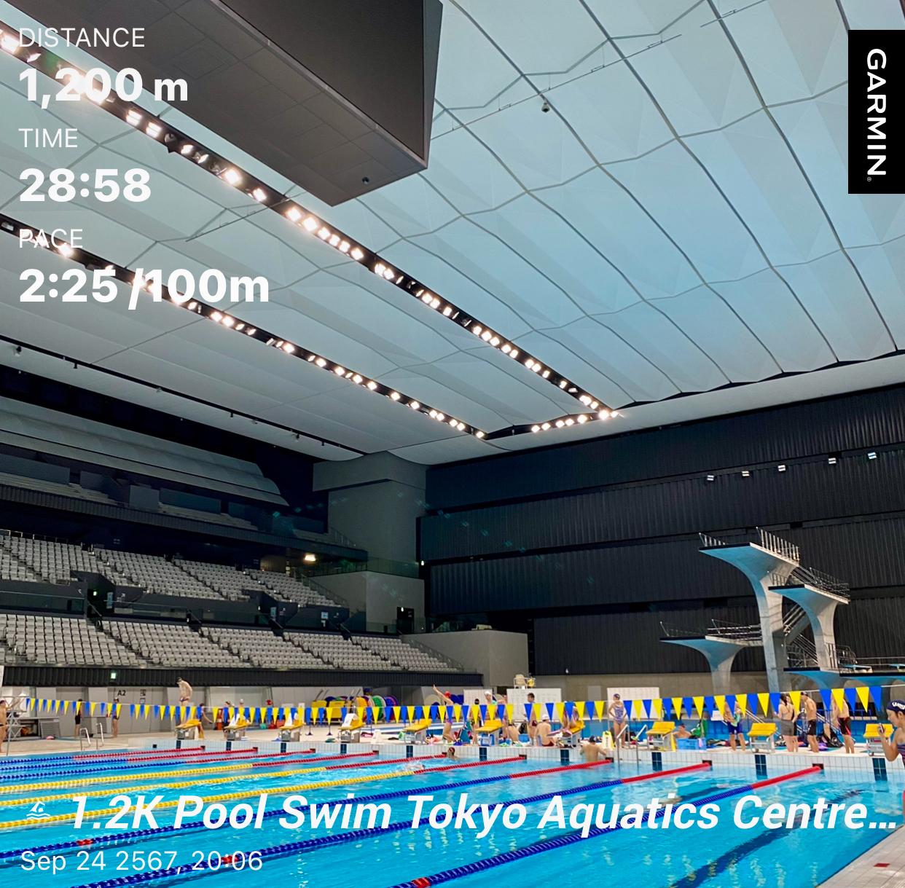

---

title: 'Sub1 Urban Running Experience: Crushing Times and Exploring Osaka, Kyoto, and Tokyo'
date: 2024-09-25'  
subtitle: ''  
summary: An incredible running experience across Japan's vibrant cities—Osaka, Kyoto, and Tokyo. I managed to hit sub-1-hour times while soaking in the unique vibes of each place. It was the perfect mix of pushing my pace and enjoying the sights along the way!
authors:  
- admin  
tags:  
- Running
- Swimming
- Japan
- Tokyo
- Osaka
- Kyoto
image:
  caption: 'Athlete: Kao Panboonyuen'
categories:  
- Running
- Swimming
- Japan
- Tokyo
- Osaka
- Kyoto
image:
date: "2024-09-25T00:00:00Z"  
lastmod: "2024-09-25T00:00:00Z"  
featured: true  
draft: false
math: true

# Featured image
image:  
  caption: "Athlete: Kao Panboonyuen"  
  placement: 2  
  focal_point: "Smart"  
  preview_only: false

# Projects (optional).
projects: []

---

<!--  -->


## Just finished an epic city run through Osaka, Kyoto, and Tokyo!

Hey everyone! I just wrapped up an incredible running experience across Japan's vibrant cities—Osaka, Kyoto, and Tokyo. I managed to hit sub-1-hour times while soaking in the unique vibes of each place. It was the perfect mix of pushing my pace and enjoying the sights along the way!

### Chapter 1: Osaka Running

This trip marks my third time in Japan, but this time I started in the Kansai region, kicking things off in Osaka. My main goal? To conquer a city run and aim for a sub-1-hour 10K.

Bright and early, after a good night’s rest, I hit the streets at 4:54 AM. The weather was just right, making the run super enjoyable. I ended up covering 10.59K at a pace of 4:42, finishing in 49 minutes. Here’s the route I took:

1. **Start at Awaza** [Google Map](https://goo.gl/maps/3m8xwS3Hb4y)
2. **Matsushima Park** [Google Map](https://goo.gl/maps/6uRRF2qjBrP2)
3. **Chiyoza** [Google Map](https://goo.gl/maps/yURFcSe5DVA2)
4. **Minamiizuo Park** [Google Map](https://goo.gl/maps/jHwnY9gT4Tt)
5. **Kitatsumorinaka Park** [Google Map](https://goo.gl/maps/jDq5YqPybE62)
6. **Deshirohigashi Intersection** [Google Map](https://goo.gl/maps/3d6PHf8HmtL2)
7. **Machida Gastroenterology Hospital** [Google Map](https://goo.gl/maps/4eAhYeuYhHS2)
8. **Tsutenkaku Tower** [Google Map](https://goo.gl/maps/8iAd1SBhEny)
9. **Finish at Matsuyamachi** [Google Map](https://goo.gl/maps/Zuy2JmCB4eQ2)


Osaka is truly a city that hooks you; it’s filled with hidden gems waiting to be explored. After three action-packed days, it was time to move on to Kyoto!

### Chapter 2: Kyoto Running

Next up was the challenge of a sub-1-hour city run in Kyoto. I only had two days here, and luck wasn’t on my side—rain greeted me in the morning. But nothing was going to stop my determination!

I crushed the city run in Kyoto, finishing 10.78K in 49 minutes (pace 4:38), which was even faster than my Osaka run! I think the rain actually helped; the air felt fresh and invigorating. Here’s my route:

1. **Start at Kiyomizu-Jojo Station** [Google Map](https://goo.gl/maps/NZ5c2J8U3u62)
2. **Kyoto Pref. Yakuzaishikai** [Google Map](https://goo.gl/maps/DvcAeMWd3iD2)
3. **Matsubaracho** [Google Map](https://goo.gl/maps/5XWqD6Nq6U72)
4. **Kawebata Police Station** [Google Map](https://goo.gl/maps/xMDgh18N7Qk)
5. **Kyoto University (Yoshida Campus)** [Google Map](https://goo.gl/maps/p2k8VkMPM6R2)
6. **Imadegawa Street** [Google Map](https://goo.gl/maps/YjMktz7AcH52)
7. **Kyoto Imperial Palace (Kyoto Gyoen)** [Google Map](https://goo.gl/maps/7DqkhSmU8Wz)
8. **Naka-Dachiuri-Dori** [Google Map](https://goo.gl/maps/vfC1nG5gX3R2)
9. **Horikawa Sanjo** [Google Map](https://goo.gl/maps/Np1WS55jMN32)


Wrapping up my run in Kyoto felt like a major win—2 out of 3 goals achieved! Before heading to my final destination, I hopped on the Shinkansen back to Tokyo. 

I took my first-ever Shinkansen ride from Kyoto to Tokyo, leaving at 9:39 AM and arriving at 11:54 AM. It was an absolute treat! I opted for the Green Car for that extra comfort and snagged a window seat to soak in the views. Here’s a glimpse of that journey:

- **Shinkansen from Kyoto to Tokyo** [Google Map](https://goo.gl/maps/e6Fqt36Xrr32)


### Chapter 3: Tokyo Running

Finally, I’ve made it to Tokyo! There’s always a surprise waiting here. Before my city run, a professor from Todai treated me to a swim at the Olympic pool used during the Tokyo 2020 Games. What an experience! I swam 1.2K in just 28 minutes at a pace of 2:25 per 100m. The Olympic-standard pool was incredible, and swimming alongside serious athletes was an adrenaline rush.




Now, back to the final running mission. On my second day in Tokyo, I kicked off my run at 6:52 AM. The weather was perfect—18°C with a refreshing breeze—ideal for running.


I wrapped up the city run covering 10.17K in 44 minutes at a pace of 4:25, marking a personal best! Here’s my route in Tokyo:

1. **Start at Shiomi Dori Street** [Google Map](https://goo.gl/maps/6B22R9moPpC2)
2. **Tokyo Aquatics Centre** [Google Map](https://goo.gl/maps/N4eUwHEH5yQ2)
3. **Yumenoshima Stadium** [Google Map](https://goo.gl/maps/L97tcZ1oGpH2)
4. **Arakawawangan-kyo Bridge** [Google Map](https://goo.gl/maps/6DWBpD2a1nD2)
5. **Nakasakombashi** [Google Map](https://goo.gl/maps/NEDz7d5zMsA2)
6. **Seishin Itchu North** [Google Map](https://goo.gl/maps/UVgc8Ffz4w52)
7. **Kiyosuna-Ohashi Bridge** [Google Map](https://goo.gl/maps/rbnptUADwK32)
8. **Meiji-Dori Avenue** [Google Map](https://goo.gl/maps/c3AFyU2wLkH2)
9. **Finish at Shiomi-Dori Street** [Google Map](https://goo.gl/maps/mDe9t69gMGs)


### Summary of My Running Experience

1. **Osaka Running:** Sub1 10.59K City Run, 49:48min, Pace 4:42
2. **Kyoto Running:** Sub1 10.78K City Run, 49:57min, Pace 4:38
3. **Tokyo Running:** Sub1 10.17K City Run, 44:58min, Pace 4:25
4. **Tokyo Swimming:** 1,200m (1.2K), 28:58min, Pace 2:25

This trip to Japan was absolutely fantastic! Even though it was late summer and winter is just around the corner, running through these three major cities expanded my horizons. I encountered amazing insights into Japanese culture, met locals, and explored unseen places. 

I can’t wait for the next experience, hopefully tackling the Tokyo Marathon (42.195K) someday! Fingers crossed!

Until next time, happy running! 🏃‍♂️🇯🇵

## Citation

> Panboonyuen, Teerapong. (Sep 2024). *Sub1 Running Experience: Crushing Times and Exploring Osaka, Kyoto, and Tokyo*. Blog post on Kao Panboonyuen. [https://kaopanboonyuen.github.io/blog/2024-09-25-sub1-10k-running-osaka-kyoto-and-tokyo/](https://kaopanboonyuen.github.io/blog/2024-09-25-sub1-10k-running-osaka-kyoto-and-tokyo/)

**For a BibTeX citation:**

```bash
@article{panboonyuen2024running,
  title   = "Sub1 Urban Running Experience: Crushing Times and Exploring Osaka, Kyoto, and Tokyo",
  author  = "Panboonyuen, Teerapong",
  journal = "kaopanboonyuen.github.io/",
  year    = "2024",
  month   = "Sep",
  url     = "https://kaopanboonyuen.github.io/blog/2024-09-25-sub1-10k-running-osaka-kyoto-and-tokyo/"}
```

{}
Did you find this page helpful? Consider sharing it 🙌
{}