---

title: 'Global Young Scientists Summit 2025: Where Science Meets Inspiration'
date: 2025-01-13
subtitle: ''
summary: Competing for a prestigious scholarship to attend GYSS 2025 in Singapore. The summit will be an excellent opportunity to connect with global experts and young scientists, fostering innovation and interdisciplinary collaboration.
authors:  
- admin  
tags:  
- GYSS
- Science
- Innovation
- Collaboration
- Scholarship
categories:  
- Science
- Innovation
- Scholarship
- Summit
image:
  caption: 'Scientist: ดร.ธีรพงศ์ ปานบุญยืน (Teerapong Panboonyuen, Ph.D.)'
date: "2025-01-13T00:00:00Z"  
lastmod: "2025-01-13T00:00:00Z"  
featured: true  
draft: false
math: true

# Featured image
image:  
  caption: "Scientist: ดร.ธีรพงศ์ ปานบุญยืน (Teerapong Panboonyuen, Ph.D.)"  
  placement: 2  
  focal_point: "Smart"  
  preview_only: false

# Projects (optional).
projects: []

---

<!--  -->

Attending **GYSS2025 (Global Young Scientists Summit)** is an incredibly exciting opportunity. This prestigious gathering brings together brilliant young minds from all over the world, providing a platform to engage with leading experts, share innovative ideas, and immerse ourselves in the latest advancements in science and technology. It’s a momentous occasion for any researcher or scientist, and I’m thrilled to be part of this year’s summit.

We’re living in an exciting era, where **Large Language Models (LLMs)** are reshaping the landscape of artificial intelligence. The rapid strides AI has made in recent years, fueled by powerful architectures like GPT, are nothing short of revolutionary. As we explore the depths of these models, we are witnessing the dawn of new possibilities in natural language processing, conversational agents, and machine learning. Attending GYSS2025 during this transformative period in AI’s evolution promises to be a truly enriching experience, as it will allow me to explore these advancements and exchange ideas with some of the brightest minds in the field.





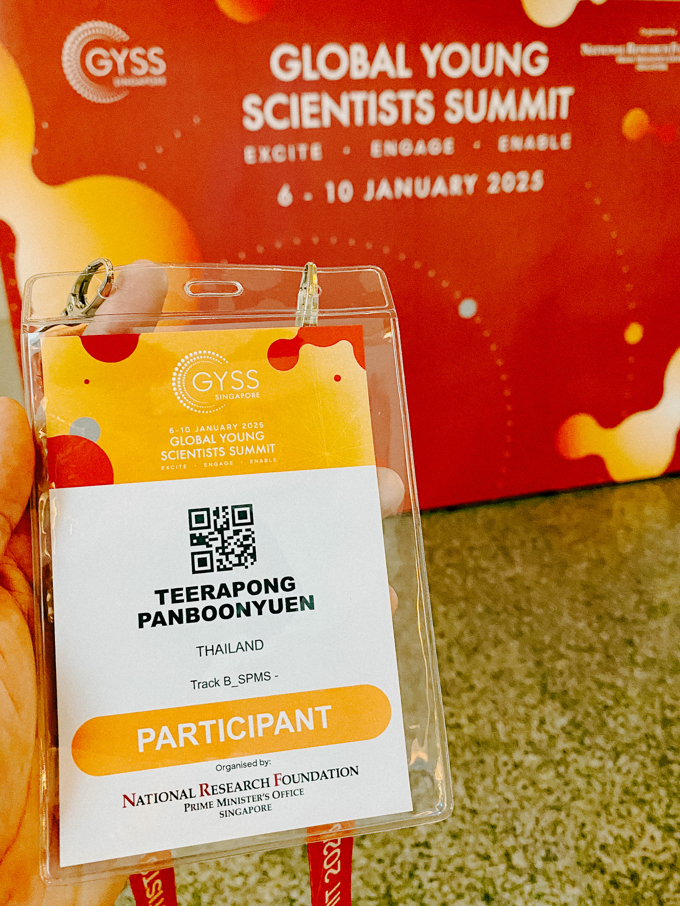

## Presenting My Work to Her Royal Highness Princess Maha Chakri Sirindhorn

The highlight of the summit was, without a doubt, the moment I had the incredible honor of presenting my work to Her Royal Highness Princess Maha Chakri Sirindhorn.

As a young scientist, I was deeply humbled to share my research titled *“MeViT: A Medium-Resolution Vision Transformer for Semantic Segmentation on Landsat Satellite Imagery for Agriculture in Thailand”* with Her Royal Highness. My work focuses on addressing challenges in agricultural monitoring and resource management by leveraging cutting-edge advancements in artificial intelligence. Specifically, MeViT is designed for semantic segmentation of Landsat satellite imagery, targeting key economic crops in Thailand such as para rubber, corn, and pineapple. By enhancing Vision Transformers (ViTs) with a medium-resolution multi-branch architecture and incorporating mixed-scale convolutional feedforward networks (MixCFN), MeViT excels at extracting multi-scale local information critical for precise segmentation.



Her Royal Highness listened with great interest, her graciousness reflecting her profound commitment to nurturing the next generation of scientists. She expressed encouragement for the practical applications of such research in addressing challenges critical to Thailand’s agricultural and environmental sustainability. Her unwavering support for young researchers is a testament to her dedication to fostering innovation for the betterment of society.


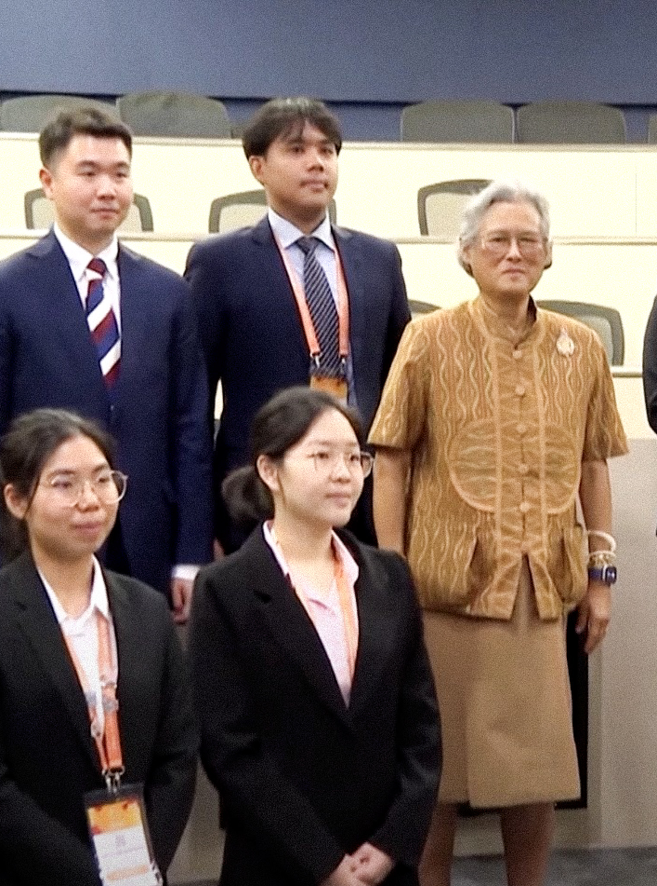
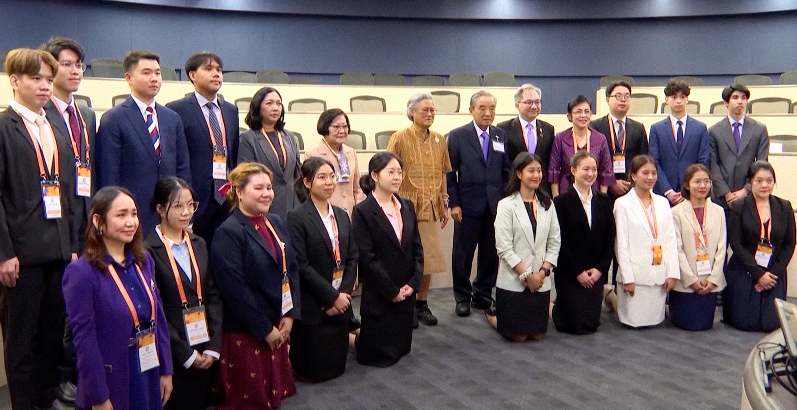
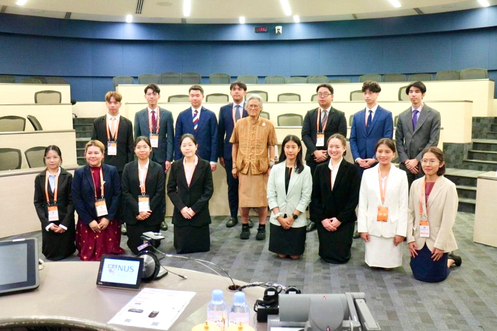
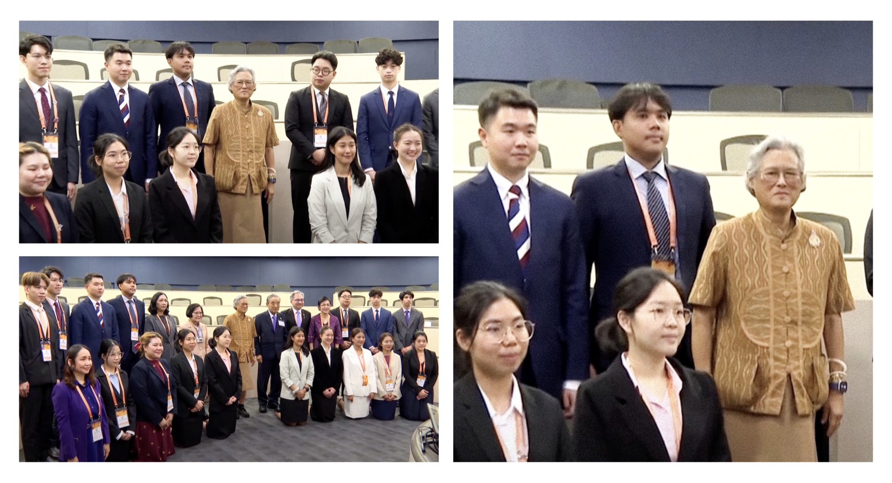

It was a truly humbling and inspiring moment—one that I will carry with me for the rest of my life. The opportunity to share my work with Her Royal Highness not only reaffirmed my passion for pushing the boundaries of science and technology but also strengthened my resolve to contribute to meaningful advancements that serve the nation and the global community.

<!--  -->

<!-- <div style="text-align: center;">
    <video controls width="800">
        <source src="/GYSS2025_withHRH/GYSS_with_Her_Royal_Highnes_v1.mp4" type="video/mp4">
        Your browser does not support the video tag.
    </video>
</div> -->

# Learning from Icons in the Field

The summit was filled with groundbreaking talks, and one of the most memorable was the Plenary Lecture by the renowned Professor Adi Shamir. As a Turing Award Laureate and an expert in cryptography and artificial intelligence, his lecture was truly thought-provoking. The topic, *“Can you recover a deep neural network from its answers?”*, delved into one of the most critical questions of our time—how deep learning models, which are at the forefront of AI, can be understood and potentially reverse-engineered.



The lecture began with a discussion on the architecture of modern neural networks, emphasizing their complexity and overparameterization. Professor Shamir explored concepts like model inversion, adversarial attacks, and the limitations of current AI systems, while raising questions about privacy-preserving AI and ethical AI frameworks. His insights on adversarial robustness and explainable AI deeply resonated with my research interests, motivating me to reflect on these critical challenges.

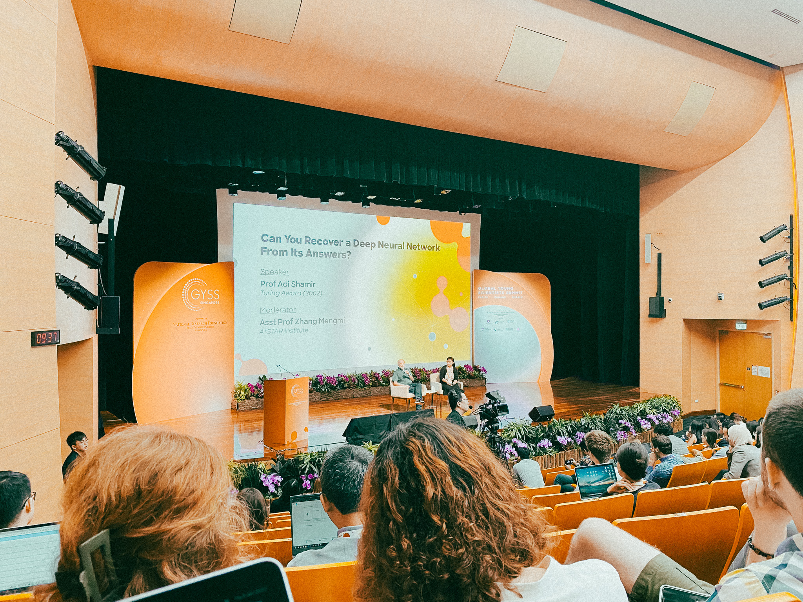
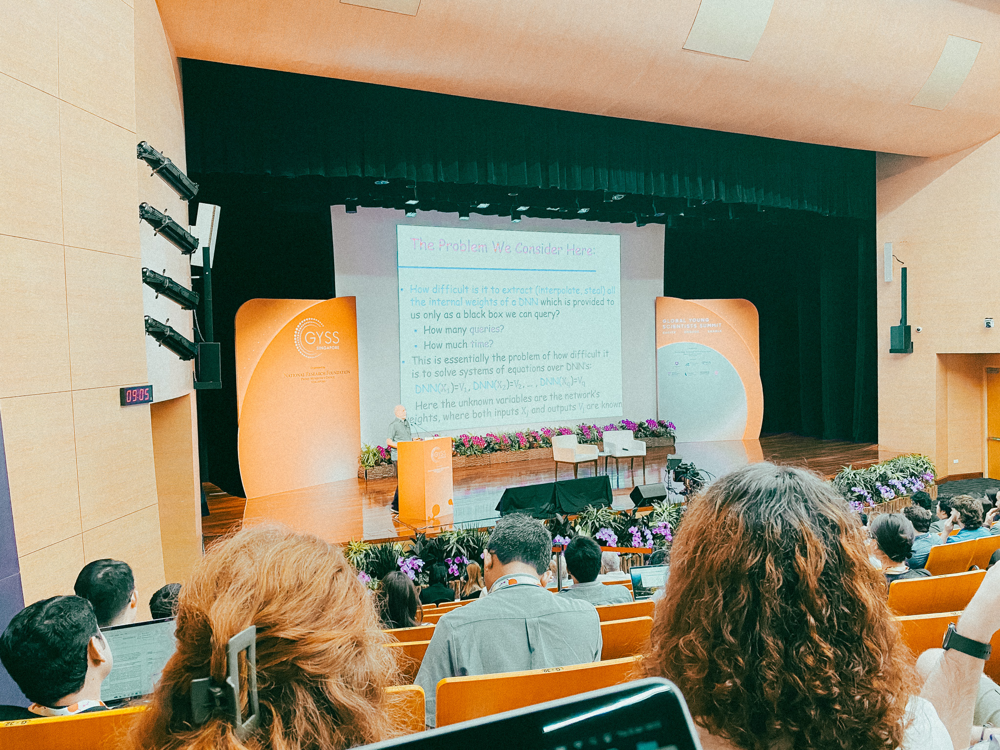

Deep Neural Networks (DNNs) have become indispensable in modern AI applications, with billions of dollars and countless GPU hours invested in their training. These models are often deployed as "black boxes," allowing users to interact with them without revealing their inner workings. However, this raises a critical question: *Can the parameters of a deep neural network be recovered using only its inputs and outputs?* In a groundbreaking plenary lecture, Turing Award recipient Prof. Adi Shamir demonstrated that for ReLU-based DNNs, it is indeed possible to recover all parameters in polynomial time relative to the number of neurons. His findings, supported by practical experiments, highlight both the potential vulnerabilities of these systems and the need for robust defenses.

## Understanding the Basics of DNN Operations

At the heart of Shamir's analysis lies a detailed understanding of how DNNs function. A DNN comprises multiple layers of neurons, each performing a series of linear transformations followed by non-linear activations. Among these, the Rectified Linear Unit (ReLU) is a widely used activation function defined as:

$$
\text{ReLU}(x) = \max(0, x).
$$

This piecewise linear function introduces non-linearity while maintaining computational simplicity. Shamir emphasized that ReLU's linear segments make it particularly susceptible to parameter extraction, as its outputs can be mathematically analyzed to reveal underlying weights and biases.

In mathematical terms, the operation of a single layer in a DNN can be expressed as:

$$
\mathbf{y} = \text{ReLU}(\mathbf{W}\mathbf{x} + \mathbf{b}),
$$

where:
- $\mathbf{x}$ represents the input vector,
- $\mathbf{W}$ is the weight matrix,
- $\mathbf{b}$ is the bias vector, and
- $\mathbf{y}$ is the output vector after applying ReLU.

Stacking multiple such layers creates a complex mapping from inputs to outputs, making the network appear opaque to external observers.

## Challenges in Parameter Recovery

Recovering the parameters of a DNN—its weights and biases—is inherently an NP-hard problem. This complexity arises from the high dimensionality of the parameter space and the limited observability of internal computations. Traditional approaches to this problem relied on exhaustive searches, which scale exponentially with the number of parameters, rendering them impractical for large networks.

Prof. Shamir highlighted that these challenges are exacerbated in scenarios where outputs are restricted to discrete or low-precision values. However, he proposed that by carefully designing input queries and analyzing output patterns, it is possible to significantly simplify the recovery process.

## Polynomial Time Parameter Extraction

Shamir's key contribution lies in demonstrating a polynomial-time attack for ReLU-based DNNs. His approach leverages the inherent linearity of ReLU segments to derive equations that describe the network's behavior. By identifying **critical points**—locations where ReLU outputs switch between active and inactive states—one can extract sufficient information to reconstruct the network's parameters.

### Critical Points and Linear Equations

Consider a single ReLU neuron with input $z$ and output $y = \text{ReLU}(z)$. The critical point for this neuron is $z = 0$, where the output transitions from 0 to a positive value. By probing the network with carefully chosen inputs that traverse these critical points, it becomes possible to:

1. Identify the active/inactive state of each neuron.
2. Extract linear equations relating the input, weights, and biases.

For an $n$-layer network, these equations can be combined to solve for all parameters using standard techniques from linear algebra.

### Practical Demonstration

In a practical demonstration, Shamir applied his method to an 8-layer DNN trained on the CIFAR-10 dataset. This network contained 1.2 million parameters, yet all were successfully recovered in polynomial time. The experiment underscores the real-world applicability of this attack and its implications for AI security.

## Comparison with Cryptographic Systems

Drawing parallels between DNNs and cryptographic systems, Shamir likened the structure of a neural network to a block cipher, where each layer performs a distinct transformation. In cryptography, security often hinges on the infeasibility of reversing these transformations without a key. Similarly, DNNs rely on the assumption that their internal parameters cannot be deduced from external interactions.

However, Shamir's work demonstrates that this assumption does not hold for ReLU-based networks. By exploiting the deterministic nature of their operations, an adversary can effectively "decrypt" the network to reveal its parameters.

## Implications of Randomness and Alternative Activations

To mitigate the risks posed by such attacks, Shamir explored potential defenses, including:

1. **Randomness in Training and Inference**: Introducing stochasticity into the network's operations, such as random noise or dropout, can obscure critical points and complicate parameter recovery.
2. **Alternative Activation Functions**: Functions like the sigmoid or hyperbolic tangent (tanh) introduce smoother transitions, reducing the linearity exploited in Shamir's attack. The sigmoid function, for example, is defined as:

   $$
   \sigma(x) = \frac{1}{1 + e^{-x}}.
   $$

   Unlike ReLU, sigmoid outputs are continuous and bounded, making it harder to identify critical points.

## Broader Implications and Future Directions

Shamir's findings have profound implications for the field of AI security. As DNNs become integral to applications ranging from healthcare to autonomous systems, ensuring their robustness against parameter extraction attacks is paramount. Future research may focus on:

- Designing architectures that are inherently resistant to such attacks.
- Developing formal metrics to quantify a network's susceptibility to parameter recovery.
- Exploring the trade-offs between interpretability and security.

In conclusion, Prof. Adi Shamir's lecture sheds light on a critical vulnerability in modern AI systems while providing a roadmap for addressing it. His innovative use of cryptographic techniques underscores the interdisciplinary nature of AI research and its potential to reshape our understanding of security in the digital age.

But what truly stood out was the in-depth discussion I had with Professor Shamir. His monumental impact on the field of AI and his perspectives on current and future challenges was both a privilege and a learning experience that I will treasure forever.

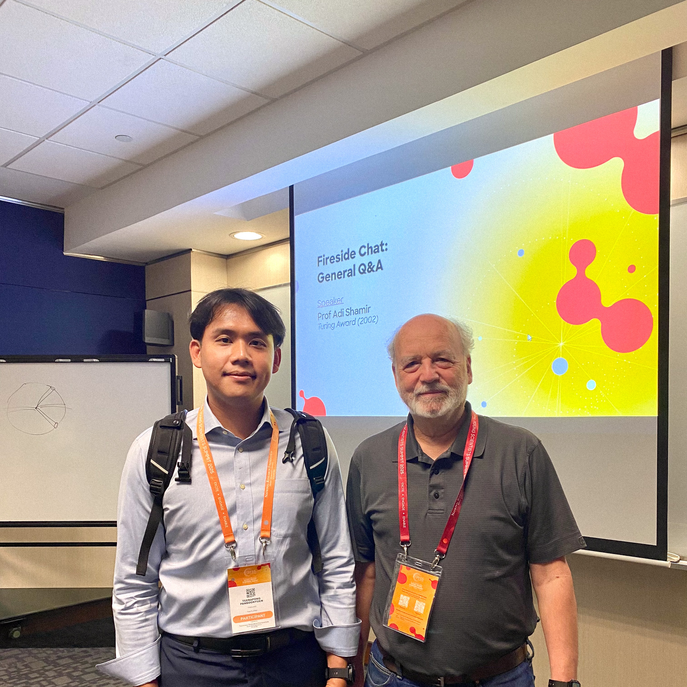

## Plenary Lecture: Educability (Prof Leslie Valiant)



In a captivating lecture, Prof. Leslie Valiant delved into the concept of educability, a framework that bridges the gap between human cognitive capabilities and machine learning. Drawing inspiration from Alan Turing’s groundbreaking insights, the discussion highlighted the interplay between intelligence, learning, and the ethical design of artificial intelligence systems.

## Historical Foundations of Intelligence and Educability

The quest to define human intelligence has long been fraught with challenges. Psychologists have struggled to agree on a single definition, revealing the complexity of human cognition. Prof. Valiant proposed that much of our understanding can be reframed through the lens of **educability**, which encompasses three primary facets:

1. **Learning from Experience** ($\mathcal{L}_{experience}$): The ability to generalize patterns and principles from observed phenomena.
2. **Reasoning with Acquired Knowledge** ($\mathcal{R}_{knowledge}$): Chaining learned concepts to make inferences.
3. **Absorbing Explicit Instruction** ($\mathcal{I}_{instruction}$): Gaining knowledge through direct teaching or guidance.

These components have enabled humanity to progress from rudimentary tools to advanced technological civilizations.

## Educability vs. Machine Learning

### The Church-Turing Thesis

A cornerstone of the lecture was the **Church-Turing Thesis**, which posits that all forms of computation—whether in human brains or machines—are fundamentally equivalent. This foundational idea underpins modern efforts to replicate human cognition in artificial intelligence.

### Comparing Human and Machine Learning

Current AI systems excel in pattern recognition and data-driven learning. However, they fall short in:

- **Contextual Reasoning:** Humans can apply learned knowledge across diverse scenarios. For example, recognizing that if $A \implies B$ and $B \implies C$, then $A \implies C$.
- **Learning from Minimal Examples:** Unlike humans, who can learn concepts from a few instances, AI often requires massive datasets.
- **Instruction-Based Learning:** Humans thrive in environments with structured instruction, a capability that AI systems struggle to emulate.

Prof. Valiant argued that replicating these nuanced aspects of educability in AI could unlock new levels of machine intelligence.

## Cognitive Capabilities as Civilization Enablers

Human educability is unique among species, enabling the creation of advanced civilizations. This capability hinges on the ability to:

- **Generalize Across Domains:** Applying principles learned in one context to solve problems in another.
- **Accumulate Knowledge:** Building on the work of previous generations through explicit instruction and documentation.
- **Collaborate:** Combining cognitive efforts to achieve collective goals.

## Ethical Implications of AI Development

Prof. Valiant emphasized the ethical considerations in designing AI systems that reflect positive human traits while avoiding the replication of human flaws. Key takeaways included:

- **Avoiding Bias:** Ensuring that AI systems do not inherit societal biases.
- **Transparent Decision-Making:** Designing AI that can explain its reasoning processes.
- **Augmenting Human Capabilities:** Building systems that complement rather than replace human intelligence.

### Addressing Concerns About AI

1. **Accountability:** Who is responsible for decisions made by AI systems?
2. **Safety:** How do we ensure AI systems act in the best interest of humanity?
3. **Global Standards:** The need for international cooperation to establish ethical guidelines.

## The Future of AI and Educability

Prof. Valiant concluded with a vision for the future:

- **Interdisciplinary Collaboration:** Bringing together technologists, ethicists, and cognitive scientists to advance AI responsibly.
- **Formalizing Educability:** Developing mathematical models to encode human-like learning in machines.
- **Human-Machine Collaboration:** Leveraging AI to enhance human cognitive abilities, leading to breakthroughs in science, medicine, and technology.

### A Call to Action

Understanding the parameters of educability is not just an academic pursuit; it is a moral imperative. By integrating insights from cognitive science, mathematics, and ethics, we can create AI systems that are not only intelligent but also aligned with human values.

---

This exploration of educability challenges us to rethink the foundations of intelligence and its implications for the future of artificial intelligence. As we navigate the complexities of AI development, let us be guided by the principles of transparency, accountability, and collaboration.

## Plenary Lecture: Compressing Proofs using Cryptography (Prof Yael Kalai)



Cryptography has always been the backbone of secure systems, enabling trust in decentralized and distributed environments. As computation scales, the demand for efficient proof systems that ensure both correctness and privacy becomes increasingly important. Succinct proofs represent a groundbreaking development in this domain, offering compact, verifiable proofs that maintain efficiency and security.

In a recent lecture, **Prof. Yael Tauman Kalai** presented her advancements in succinct proofs, detailing their cryptographic foundations, practical implications, and applications in areas like blockchain and artificial intelligence (AI). This blog unpacks her insights and explores how these proofs address modern computational challenges.

---

## What Are Succinct Proofs?

Succinct proofs are cryptographic constructs designed to reduce the size and verification complexity of traditional proof systems. Instead of requiring a verifier to redo the entire computation to confirm its validity, succinct proofs enable verification with minimal computational effort. This efficiency is achieved without sacrificing security or trust, making them a critical tool for systems where scalability and privacy are paramount.

Unlike traditional proof systems, which may involve large data sets and complex computations, succinct proofs achieve their compactness through advanced cryptographic techniques such as **homomorphic encryption**, **polynomial commitments**, and **elliptic curve cryptography**. These techniques enable a prover to encode the essential details of a computation into a small, verifiable proof.

---

## Key Cryptographic Techniques

### Zero-Knowledge Proofs

One of the core building blocks of succinct proofs is the concept of zero-knowledge proofs (ZKPs). A ZKP allows a prover to convince a verifier that a statement is true without revealing any information beyond its validity. This ensures privacy while maintaining trust. 

For example, in a blockchain transaction, a ZKP can prove the correctness of the transaction without disclosing the sender, receiver, or amount. This is particularly critical in privacy-preserving protocols like **zk-SNARKs (Zero-Knowledge Succinct Non-Interactive Arguments of Knowledge)** and **zk-STARKs (Zero-Knowledge Scalable Transparent Arguments of Knowledge)**.

- **zk-SNARKs** rely on a trusted setup to initialize the system. They use elliptic curve pairings and polynomial arithmetic to achieve their compactness. Despite their efficiency, the trusted setup requirement introduces potential vulnerabilities if compromised.
- **zk-STARKs**, on the other hand, eliminate the need for a trusted setup by relying on hash functions and polynomial interpolation. While this makes them more transparent and secure, they often result in larger proof sizes compared to zk-SNARKs.

### Polynomial Commitments

Another crucial technique in succinct proofs is the use of polynomial commitments. These commitments enable the prover to encode computations as polynomials, allowing the verifier to check their correctness without directly interacting with the underlying data. Polynomial commitments are a cornerstone of many cryptographic protocols, including zk-STARKs and modern succinct proof systems.

---

## Applications of Succinct Proofs

### Blockchain Scalability

One of the most impactful applications of succinct proofs is in blockchain technology. Blockchains, by design, require every participant to validate transactions to maintain trust. However, as the number of transactions grows, this validation becomes a bottleneck.

Succinct proofs offer a solution by enabling participants to verify the correctness of transactions without processing the full chain. Protocols like **Ethereum's Layer 2 solutions** and **Zcash** leverage succinct proofs to improve scalability and maintain privacy.

For instance:
- **Rollups** in Ethereum aggregate transactions off-chain and use succinct proofs to certify their correctness on-chain.
- Privacy-focused blockchains like Zcash use zk-SNARKs to enable shielded transactions, ensuring that details about the sender, receiver, and transaction amount remain confidential.

### AI Model Verification

In the realm of AI, succinct proofs are emerging as a tool to certify the correctness of model outputs. As AI systems grow more complex, the ability to verify their decisions becomes a challenge. Succinct proofs can be used to generate a compact, verifiable record of an AI model’s decision-making process.

For example, in image classification tasks, a succinct proof could certify that the model correctly identified an object without requiring the verifier to process the entire dataset or model. This has profound implications for AI applications in critical domains like healthcare, where trust and accountability are paramount.

### Decentralized Identity

Decentralized identity systems aim to give individuals control over their personal data while allowing them to prove certain attributes (e.g., age, citizenship) without revealing unnecessary details. Succinct proofs enable such systems by providing compact, privacy-preserving verifications.

Protocols like **Verifiable Credentials (VCs)** and **Decentralized Identifiers (DIDs)** rely on these cryptographic techniques to ensure that identity verification is both efficient and secure.

---

## Challenges and Future Directions

While succinct proofs offer significant advantages, they are not without challenges:

1. **Trusted Setup**: zk-SNARKs require a trusted setup, which, if compromised, could undermine the security of the entire system. Research into transparent setups (as in zk-STARKs) aims to address this limitation.
   
2. **Computation Overhead**: Although succinct proofs reduce verification complexity, the prover's computational requirements can be high. Optimizing the proving process is an active area of research.

3. **Interoperability**: For widespread adoption, succinct proof systems must integrate seamlessly with existing technologies. This involves developing standards and protocols that ensure compatibility across platforms.

4. **Quantum Resistance**: As quantum computing advances, many cryptographic systems, including those used in succinct proofs, face potential vulnerabilities. Developing quantum-resistant proof systems is a critical area of ongoing research.

---

## Insights from Prof. Yael Tauman Kalai’s Research

Prof. Kalai’s work pushes the boundaries of succinct proofs by exploring new cryptographic primitives and optimizing existing protocols. Her research emphasizes collaboration between academia and industry to address real-world challenges. Key areas of her focus include:

- **Enhancing Transparency**: Developing protocols that eliminate the need for trusted setups while maintaining efficiency and scalability.
- **Improving Scalability**: Optimizing proof generation to reduce computational overhead for the prover.
- **Expanding Applications**: Applying succinct proofs to emerging fields like decentralized finance (DeFi), secure voting systems, and federated learning.


Succinct proofs represent a paradigm shift in cryptography, enabling efficient, scalable, and privacy-preserving verification across various domains. From blockchain scalability to AI model verification, their potential applications are vast and transformative. However, realizing their full potential requires addressing challenges like computational overhead, interoperability, and quantum resistance.

As cryptographic research evolves, the collaboration between researchers, industry, and policymakers will be essential to unlock the full potential of succinct proofs. Prof. Kalai’s groundbreaking work serves as a testament to the importance of pushing the boundaries of what cryptography can achieve.

---

## Engaging in Dialogues on the Ethics of AI

The summit wasn’t just about science and innovation—it also provided a platform to engage in crucial discussions about the ethical implications of technological advancements. One such discussion was the Panel Huddle titled *“Ethics of Scientific Research in the Age of AI”*, featuring prominent professors like Adi Shamir, Shafi Goldwasser, and Kalai.



The panel explored topics such as algorithmic bias, dual-use AI technologies, privacy-preserving AI, and the responsibilities of researchers in educating the public and policymakers. These discussions offered profound insights into the complexities of conducting ethical research in a rapidly evolving technological landscape, reminding me of the broader purpose of scientific innovation: to create a more equitable future.

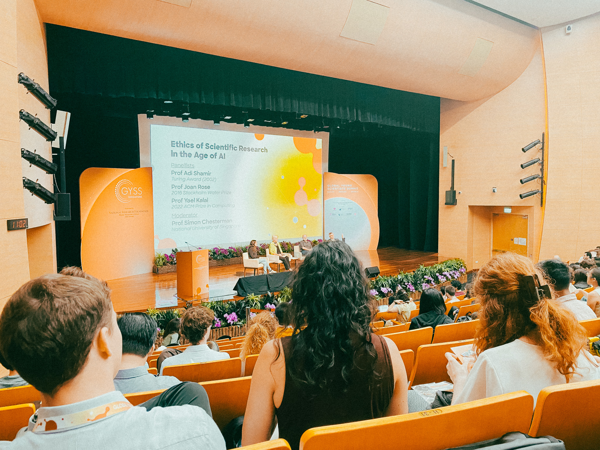


## Ethics of Scientific Research in the Age of AI

Artificial intelligence (AI) is revolutionizing scientific research, offering transformative tools to accelerate discovery, enhance accuracy, and expand the boundaries of human knowledge. However, these advancements also bring profound ethical challenges. At the recent panel moderated by **Prof. Simon Chesterman** from the National University of Singapore, renowned experts **Prof. Joan Rose** (2016 Stockholm Water Prize), **Prof. Yael Kalai** (2022 ACM Prize in Computing), and **Prof. Adi Shamir** (2002 Turing Award) delved into the critical ethical considerations of AI in scientific research.

### Client Concerns About AI

#### Ethical Dialogues
AI systems increasingly shape scientific discovery, yet their application necessitates robust ethical guidelines. Governance frameworks must:

- Define clear boundaries for AI use.
- Address biases inherent in data and algorithms.
- Ensure transparency and accountability in AI-driven research outcomes.

#### Human Interaction
The integration of AI into research workflows often alters the dynamic between human researchers and technology. Key considerations include:

- Preventing over-reliance on AI outputs, which could lead to critical oversights.
- Mitigating risks of misinterpretation of AI-generated results.
- Balancing human intuition with machine precision.

### Opportunities and Risks

#### Power of AI
AI holds immense potential to transform scientific methodologies:

$$ \text{Efficiency Gain} = \frac{T_{\text{manual}}}{T_{\text{AI-assisted}}} $$

Where $T_{\text{manual}}$ represents the time for traditional methods and $T_{\text{AI-assisted}}$ denotes AI-accelerated approaches. While this formula underscores AI’s ability to enhance efficiency, ethical concerns include:

- Misinformation propagation due to AI biases.
- Job displacement for researchers whose roles are increasingly automated.

#### Military Applications
AI’s role in military research raises acute ethical dilemmas, particularly in autonomous weapons systems. Questions of accountability and decision-making in lethal scenarios must be urgently addressed:

- Who is accountable for errors in autonomous systems?
- How can ethical principles such as proportionality and necessity be encoded into AI?

### Public Engagement

#### Communication Gaps
A significant gap exists between the scientific community and the public’s understanding of AI. To bridge this divide:

- Develop accessible communication strategies to explain AI technologies and their implications.
- Foster public trust through transparent disclosures of AI’s capabilities and limitations.

#### Proactive Education
Educating researchers and policymakers is vital to:

- Promote ethical awareness.
- Equip them to evaluate the societal impacts of their work.

### Accountability and Regulation

#### Need for Regulation
Regulating AI is a complex yet essential endeavor. Key areas of focus include:

1. **Warfare Applications:** Establishing international norms to prohibit unethical AI use.
2. **Public Safety:** Creating standards for AI deployment in sensitive domains such as healthcare and transportation.

#### Global Cooperation
International collaboration is critical to:

- Develop shared standards for AI ethics.
- Address cross-border challenges, such as data privacy and AI governance.

### Future Directions

#### Research and Policy
Investing in research on AI risks enables policymakers to adopt informed, proactive measures rather than reactive regulations post-crisis. Proposed funding distribution can be modeled as:

$$ \text{Allocation} = \frac{R_{\text{risk}}}{R_{\text{total}}} \times 100 \% $$

Where $R_{\text{risk}}$ represents research focused on AI risks, and $R_{\text{total}}$ is the total research budget.

#### Interdisciplinary Approach
Addressing AI’s ethical challenges requires collaboration among:

- **Technologists:** To refine AI systems.
- **Ethicists:** To integrate moral principles into AI development.
- **Policymakers:** To enact effective regulations and governance.

The panel underscored that while AI offers unparalleled opportunities for scientific progress, its ethical integration requires foresight, collaboration, and accountability. By fostering interdisciplinary dialogue and committing to transparent, responsible practices, the scientific community can ensure AI serves as a force for good.

---

### Visual Representation
A mind map summarizing these insights can help readers visualize the ethical considerations of AI in scientific research.

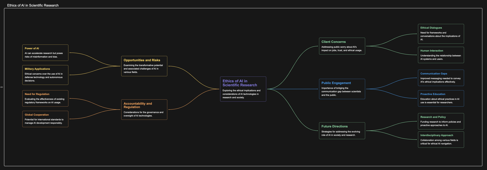


## Expanding My Network and Building New Collaborations

Beyond the lectures and discussions, GYSS 2025 was also a chance to meet fellow researchers from all over the globe. I had the pleasure of connecting with inspiring individuals from diverse fields of study, creating friendships that will last a lifetime. The exchange of ideas with these brilliant young scientists has already sparked new collaborations and research ideas that I can’t wait to explore further.

## A Day I’ll Never Forget

All in all, my experience at GYSS 2025 was beyond what I could have imagined. It was a perfect blend of research, networking, and fun. It gave me the chance to engage with some of the brightest minds in science, learn from Nobel Laureates and Turing Award winners, and discuss pressing issues in AI and ethics. It was an unforgettable experience, and I’m leaving with new ideas, fresh perspectives, and the motivation to continue pushing the boundaries of my own research.



---

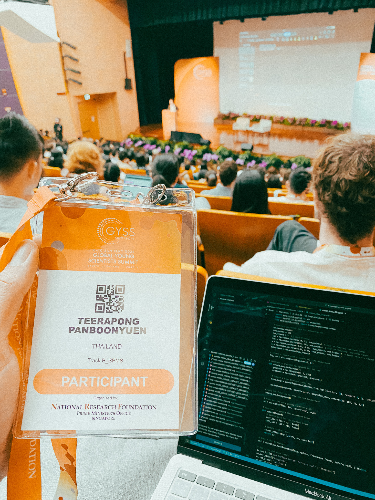
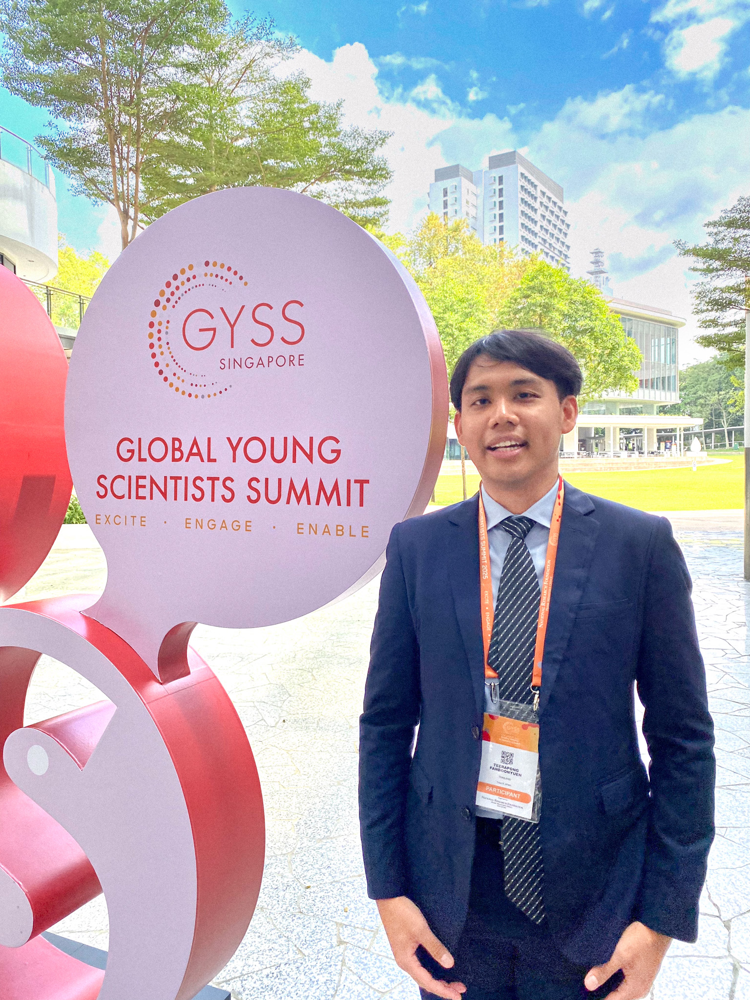


*PS. This year, GYSS 2025 was hosted at the beautiful campus of the National University of Singapore (NUS), and I absolutely fell in love with the environment. The vibrant atmosphere, lush greenery, and modern architecture made it the perfect blend of nature and innovation—a truly ideal space for creativity and learning.*

## Citation

> Panboonyuen, Teerapong. (Jan 2025). *Where Science Meets Inspiration: My Experience at GYSS2025 in Singapore*. Blog post on Kao Panboonyuen. [https://kaopanboonyuen.github.io/blog/2025-01-11-where-science-meets-inspiration/](https://kaopanboonyuen.github.io/blog/2025-01-11-where-science-meets-inspiration/)

**For a BibTeX citation:**

```bash
@article{panboonyuen2025gyss,
  title   = "Where Science Meets Inspiration: My Experience at GYSS2025 in Singapore",
  author  = "Panboonyuen, Teerapong",
  journal = "kaopanboonyuen.github.io/",
  year    = "2025",
  month   = "Jan",
  url     = "https://kaopanboonyuen.github.io/blog/2025-01-11-where-science-meets-inspiration/"}
```

{}
Did you find this page helpful? Consider sharing it 🙌
{}