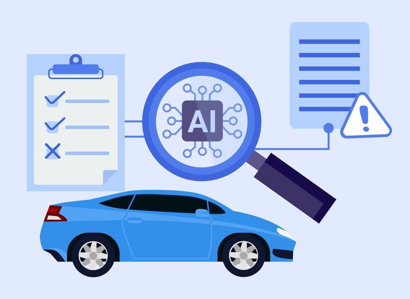
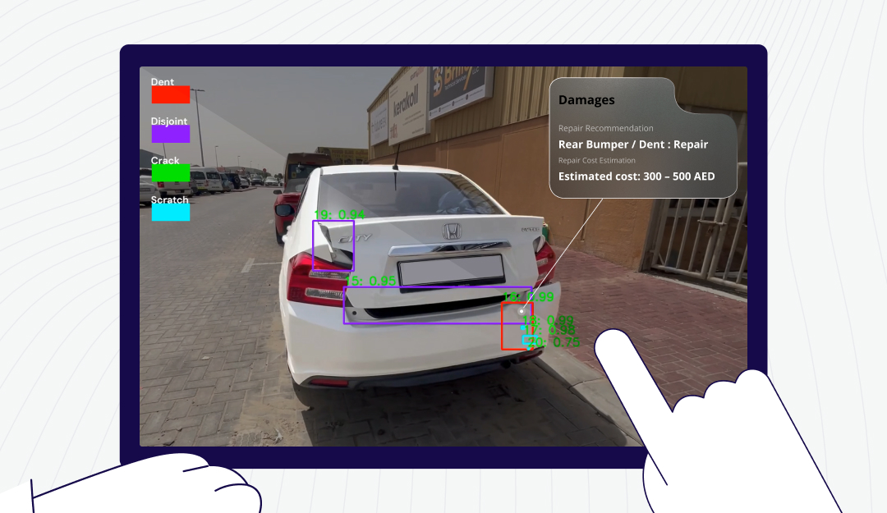
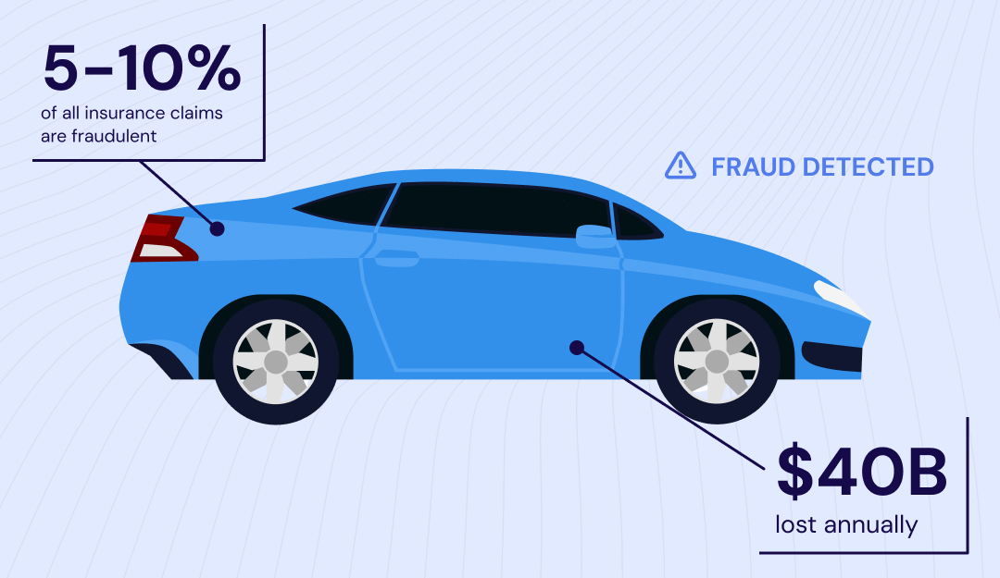
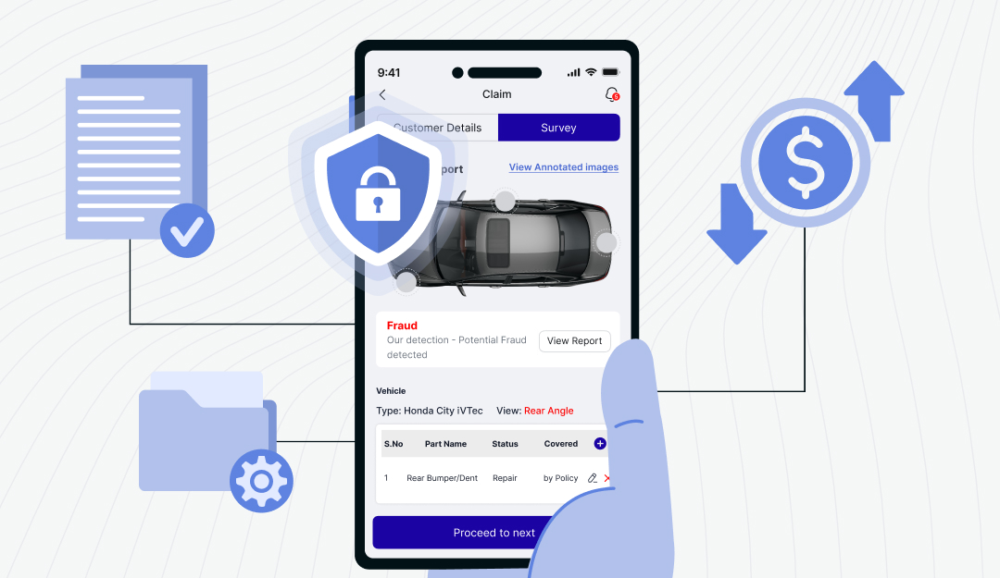
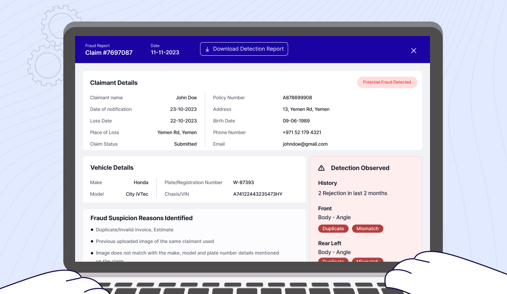

---

title: 'MARSAIL: The Smart Engine Powering the Future of Car Insurance and Intelligent Garages'  
subtitle: ''  
summary: Explore how MARSAIL, Thailand’s premier automotive AI lab, revolutionizes car insurance and vehicle repair with deep learning.  
authors:  
- admin  
tags:  
- automotive-ai  
- computer-vision  
- deep-learning  
- marsail  
- insurance-tech  
image:
  caption: 'Logo credit: [**GitHub**](https://github.com/kaopanboonyuen/kaopanboonyuen.github.io/raw/main/files/MARS/MARSAIL.png)'  
categories:  
- computer-vision  
- deep-learning  
- automotive-ai  
- marsail  
date: "2025-07-01T00:00:00Z"  
lastmod: "2025-07-01T00:00:00Z"  
featured: true  
draft: false  
math: true  

# Featured image  
image:  
  caption: "At MARSIL, we’re crafting and fine-tuning AI to transform car insurance in Thailand, making it a reality."  
  placement: 2  
  focal_point: "Smart"  
  preview_only: false  

# Projects (optional).  
projects: [] 

---


{}  
You can explore our GitHub project page 📦 [here](https://kaopanboonyuen.github.io/MARS/).  
{}

<!--  -->

MARSAIL, or the Motor AI Recognition Solution Artificial Intelligence Laboratory, is Thailand’s pioneering AI research hub dedicated to automotive insurance and repair. Under the direction of Dr. Teerapong Panboonyuen (Dr. Kao), the lab develops deep learning models to analyze car damage, estimate repair costs, and automate claim handling — empowering insurers and garages with intelligence, precision, and speed.

<div style="text-align: center;">
  
  <p style="font-style: italic; margin-top: 0px;">Figure 1: MARSAIL logo — symbolizing excellence in automotive AI research.
</div>

> The journey of MARSAIL began with a bold, urgent question: “Can we make car insurance in Thailand smarter, faster, and fraud-free using AI?” For decades, first-class auto insurance underwriting in Thailand has been heavily reliant on manual inspections and human judgments — prone to delays, inconsistencies, and at times, manipulation. Garage estimates for labor and parts are also far from standardized, often resulting in disputes, inefficiencies, and customer dissatisfaction. Seeing these gaps not as limitations but as opportunities, MARSAIL was born with a national mission in mind: to revolutionize Thailand’s automotive insurance ecosystem through scalable, verifiable, and explainable artificial intelligence.

We envisioned a future where a single image of a damaged vehicle could trigger an accurate AI-driven diagnosis — identifying every dent, crack, and broken part, then instantly calculating the repair cost and parts required. This would not only expedite claims processing but also create a tamper-proof digital trail, significantly reducing fraud in the industry. At the same time, garage operators would benefit from AI-driven estimates that standardize costs and accelerate service turnaround time — allowing businesses to grow with transparency and trust.

But we didn’t stop at computer vision. We realized that to fully automate the claims process, we also needed to read and understand the documents involved — from the front of a Thai driver’s license to the Vehicle Identification Number (VIN), mileage, license plate, or even the Thai National ID card of the claimant. That’s why MARSAIL also expanded into NLP and OCR research, building powerful models that combine vision and language to intelligently extract, verify, and reason over structured and unstructured vehicle-related data.

This work is now powering what we call the “Digital Insurance Twin” — a complete AI ecosystem that mirrors and manages every car’s insurance lifecycle. For example, an insurer can use our models to approve or reject first-class coverage applications by automatically analyzing the condition of a vehicle and matching it against risk profiles. Garages can plug into our engine to generate real-time quotes validated by AI, reducing negotiation overhead and instilling transparency. For every photo and every document, there’s an AI model working behind the scenes to ensure authenticity, consistency, and fairness.

> At the heart of MARSAIL’s vision is not just efficiency but integrity. By minimizing human subjectivity and manual paperwork, our AI platform safeguards against inflated repairs, ghost accidents, and fraudulent identity claims. This builds long-term trust across the ecosystem: between insurers and policyholders, garages and customers, and regulators and service providers.

Today, we train not only car damage models but also multimodal models that fuse vision and language, including transformer-based LLMs optimized for the insurance domain. We’re teaching machines to reason with documents, anticipate inconsistencies, and provide contextual understanding — allowing for seamless automation of tasks that previously required expert-level human input. Whether it’s reading a worn-out VIN from an old pickup truck or parsing a scanned Thai ID under poor lighting, MARSAIL's AI agents are learning, adapting, and improving with every new sample.

---

### AI-driven Car Damage Estimating: Global Innovations and MARSAIL's Vision for Thailand

---

The global automotive AI landscape is evolving rapidly, with companies like Tractable and Mitchell leading the way in using artificial intelligence to assess car damage, estimate repair costs, and streamline the claims process. For instance, Tractable’s AI photo-estimating system has already gained significant attention for its ability to analyze images of vehicle damage and provide accurate repair estimates. You can explore one of their impressive demonstrations in the video below:





Another example comes from Mitchell’s partnership with AI technology to enhance auto insurance workflows. This collaboration showcases the future of intelligent claims processing and damage estimation, as seen in the video below:



These two AI-driven innovations are setting the stage for a new era in automotive insurance, and at MARSAIL, we aim to bring similar advancements to Thailand. Our cutting-edge AI research is designed to deliver an intelligent, scalable solution for vehicle damage estimation and claims processing. By harnessing deep learning and multimodal AI models, MARSAIL will revolutionize how car damage is assessed and how repairs are priced, ensuring transparency, reducing fraud, and optimizing the entire insurance lifecycle. Just like these global players, MARSAIL will offer a seamless, efficient, and trust-enhancing solution for the Thai automotive insurance market.




Let us drive this transformation — not just with code and data, but with vision, integrity, and purpose.

---

## MARS: Our Flagship AI

---

At MARSAIL’s mission lies our flagship model — MARS (Mask Attention Refinement with Sequential Quadtree Nodes). This architecture was designed with a singular goal: to perform fine-grained instance segmentation of car damage in a real-world automotive insurance setting, under various lighting, angle, and occlusion conditions. Unlike conventional approaches like Mask R-CNN or PointRend, MARS integrates hierarchical spatial reasoning using a quadtree decomposition fused with multi-level self-attention to enable both coarse-to-fine detection and spatial localization of subtle visual cues.


<div style="text-align: center;">
  
  <p style="font-style: italic; margin-top: 0px;">Figure 2: Visual example of MARS model detecting vehicle damage areas with high precision across complex body surfaces.
</div>


The core concept behind MARS draws inspiration from traditional quadtree spatial partitioning methods. Unlike standard convolutional encoders, which often struggle to preserve important structural details in large feature maps due to fixed processing limits, MARS takes a more adaptive approach. It uses a trainable system that breaks an image into regions based on how visually complex each area is. Simpler areas are processed more lightly, while more detailed or chaotic regions get extra attention.

$$
M = \sum_{i=1}^{N} g(q_i) \cdot A(q_i) \cdot F(q_i)
$$

This leads to what the team calls Sequential Quadtree Nodes (SQN) — a smart structure that expands only where deeper analysis is needed. Each of these nodes contributes to the overall segmentation by combining spatial focus, a confidence check, and fine-tuned local adjustments. The system selectively decides which parts of the image matter most, refining the final output by integrating all these localized insights into one coherent segmentation result.


<div style="text-align: center;">
  
  <p style="font-style: italic; margin-top: 0px;">Figure 3: MARS architecture integrates attention refinement, quadtree partitioning, and sequential mask propagation modules to enable instance-level car damage segmentation.
</div>

In our experiments on Thai car damage datasets, MARS with a ResNet101-FPN backbone outperforms all existing baselines, yielding a +2.3 maskAP improvement over PointRend and +1.8 over Mask Transfiner (Panboonyuen et al. 2023). More impressively, MARS demonstrates resilience in heavily occluded scenes, where traditional architectures often over-segment or misclassify minor damages such as scratches, dents, and broken trims.

Beyond segmentation accuracy, MARS was designed with inference cost and deployment scalability in mind. The attention and SQN modules are modular and parallelizable, allowing fast inference on GPU-based edge devices commonly deployed in insurance claim centers. In practice, MARS processes a high-resolution damage image in under 180ms on an NVIDIA T4 GPU, enabling real-time integration into mobile claim apps and garage estimation tools.

For a comprehensive explanation of the method, experimental protocol, and benchmark comparisons, readers are encouraged to refer to our full publication <a href="https://arxiv.org/abs/2305.04743" target="_blank">here</a> (Panboonyuen et al. 2023).


---

## MARSAIL 2025: Research Highlights

---


As we move into 2025, MARSAIL continues to push the frontier of AI for automotive insurance and repair through multimodal AI systems, low-parameter transformer architectures, and high-resolution OCR solutions tailored for real-world document processing. These efforts aim to expand our automation ecosystem beyond just car damage detection — now encompassing risk prediction, document understanding, vehicle condition analytics, and identity verification pipelines. Below we highlight three key models from our most recent research drop.

---

### 1. ALBERT: Efficient Transformer for Automotive Localization

---

ALBERT (Advanced Localization and Bidirectional Encoder Representations from Transformers) is our compact vision transformer (ViT) tailored for car damage assessment. Unlike standard ViT and DETR-based approaches, ALBERT introduces structural inductive biases using localized deformable tokens and parameter sharing to reduce model size and memory usage while preserving high-resolution localization.

Mathematically, the ALBERT encoder layer refines input embeddings using the following formulation:

$$
z^{(l+1)} = z^{(l)} + \text{MSA}(\text{LN}(z^{(l)})) + \text{MLP}(\text{LN}(z^{(l)}))
$$

Where MSA is a multi-scale self-attention with learnable spatial offsets adapted to car damage priors. Through selective hard sampling and token grouping, ALBERT reduces GPU memory by 40% during training while achieving higher IoU for small scratches and localized bumper cracks. This model is ideal for mobile deployments in insurance apps and in-vehicle camera assessments ([arXiv:2506.10524](http://arxiv.org/abs/2506.10524)).

---

### 2. SLICK: Knowledge-Enhanced Instance Segmentation

---

SLICK (Selective Localization and Instance Calibration with Knowledge) augments vision transformer-based instance segmentation using both spatial priors and domain knowledge graphs. By integrating policy-driven insurance metadata — e.g., bumper policy zones, model-specific weak points — SLICK dynamically adjusts attention weights and segmentation proposals. This results in better prediction under diverse lighting, weather, and occlusion scenarios, especially for aging or modified vehicles.

We define a mask quality score enhanced by contextual gating:

$$
s_{mask} = \sigma(W_q [f_{img} \| f_{kg}]) + b
$$

SLICK delivers +2.5 maskAP improvement over MARS in high-noise scenes, setting a new benchmark in our internal Thai Vehicle Damage dataset ([arXiv:2506.10528](http://arxiv.org/abs/2506.10528)).

---

### 3. DOTA: Deformable Optimized Transformer for OCR

---

DOTA (Deformable Optimized Transformer Architecture) is our OCR engine designed for reading Thai ID cards, driver licenses, vehicle registration books, VIN plates, and inspection forms in real-world garage conditions. Using a retrieval-augmented architecture and deformable attention blocks, DOTA can accurately recognize text even under motion blur, glare, or partial occlusion.


Unlike traditional CRNN or standard transformer OCRs, DOTA uses a hybrid vision-language training objective:

---

### 4. MARS: Mask Attention Refinement with Sequential Quadtree Nodes for Car Damage Instance Segmentation

---

At **MARSAIL**, under the guidance of Dr. Teerapong Panboonyuen (ดร. ธีรพงศ์ ปานบุญยืน) or Dr. Kao (ดร. เก้า), our team is on a mission: to fuse cutting-edge **vision systems** with real-world auto insurance workflows. Our latest work—published in Springer—introduces a dynamic way to analyze vehicle damage and process claims faster, smarter, and more precisely than ever before.

### 🔍 what sets our approach apart

Standard image-analysis tools often struggle to keep structural details intact when dealing with complex scenes or large images. In our paper (Springer, Chapter 3), we introduce a **hierarchical, attention-driven method** that adapts dynamically to the visual complexity of each region:

- **Smart partitioning** — the system learns to divide an image into smaller, more granular regions where details matter most.  
- **Targeted refinement** — complex zones receive deeper analysis, while simpler areas are processed more lightly.  
- **Sequential quadtree nodes** — these elements expand only in areas needing sharper focus, concentrating computing power where it counts.

### 🧠 how it works in practice

Each **quadtree node** contributes to the final damage map by combining:
- **Spatial focus** — where exactly to look,
- **Confidence-based gating** — deciding *how much* to trust that region,
- **Local feature tweaks** — refining the outcome with sharp, situational insight.

Imagine a damaged car: intricate scratches around the headlight trigger more detailed analysis, while broader, simpler zones are processed more efficiently. The combined result is a crisp and accurate segmentation mask covering the entire vehicle.

### 🏎️ why it matters for insurers & workshops

- **Faster, smarter estimates** — automation tackles repetitive image tasks instantly.  
- **Sharper insights** — context-aware focus pinpoints damage with precision.  
- **Efficiency-driven** — resources are optimized for the parts of the image that matter, reducing processing load.  
- **Scalable architecture** — adaptable from single images to massive fleets seamlessly.

### ✅ conclusions & next steps

Published under the banner of "MARSAIL" in the latest Springer volume, this work signals a bold step in auto-insurance intelligence. With a pioneering lab approach and visionary leadership from Dr. Kao, MARSAIL is crafting systems that are fast, precise, and endlessly adaptable.

Up next: integrating our quadtree vision engine into live insurer workflows, and testing it in real-world garages across Thailand.

> Reference: [Springer Nature Link](https://link.springer.com/chapter/10.1007/978-3-031-51023-6_3)

---

Auto insurance fraud is a massive challenge that costs billions worldwide every year, slowing down claim processing and increasing premiums for honest customers. At **MARSAIL** (Motor AI Recognition Solution Artificial Intelligence Laboratory), we are on the frontlines of this battle, deploying cutting-edge AI to automate and streamline the entire insurance claim process — from damage detection to fraud prevention — without relying on manual human intervention.

---

### Fighting Fraud with Intelligent Automation

---

Fraudsters exploit loopholes and manual processes in traditional insurance workflows, making it difficult for companies to detect suspicious claims quickly and accurately. MARSAIL leverages advanced computer vision and domain-specific knowledge to transform this game. By analyzing images and metadata from vehicles in real-time, our AI models not only identify damages precisely but also flag potential fraud patterns, speeding up claim approval and reducing false payouts.

<div style="text-align: center;">
  
  <p style="font-style: italic; margin-top: 0px;">Figure 4: Demonstration of AI-powered automation in car insurance claims (Image source: <a href="https://www.addenda.tech/post/the-battle-against-auto-insurance-fraud---and-how-ai-can-help-win-it" target="_blank">Addenda Tech</a>)</p>
</div>

---

### Visual Damage Interpretation — Smarter and Faster

---

Using state-of-the-art AI, MARSAIL interprets vehicle damage from photos submitted through mobile apps or web platforms. This automated damage assessment removes subjectivity and human error, ensuring fair and consistent evaluation across all claims.

<div style="text-align: center;">
  
  <p style="font-style: italic; margin-top: 0px;">Figure 5: AI-driven damage interpretation on insurance applications and web portals (Image source: <a href="https://www.addenda.tech/post/the-battle-against-auto-insurance-fraud---and-how-ai-can-help-win-it" target="_blank">Addenda Tech</a>)</p>
</div>

---

### Translating Damage Into Precise Repair Estimates

---

MARSAIL’s AI doesn’t stop at identifying damage. It accurately translates the visual information into detailed labor and parts costs, providing transparent and consistent repair estimates that speed up approvals and payments.

<div style="text-align: center;">
  
  <p style="font-style: italic; margin-top: 0px;">Figure 6: AI converting damage images into labor and parts cost estimates (Image source: <a href="https://www.addenda.tech/post/the-battle-against-auto-insurance-fraud---and-how-ai-can-help-win-it" target="_blank">Addenda Tech</a>)</p>
</div>

---

### AI-Powered Fraud Detection — Catching the Unseen

---

One of MARSAIL’s critical strengths is its ability to detect anomalies and fraudulent claims. By cross-referencing damage patterns, metadata, and historical data, the AI flags suspicious cases automatically, drastically reducing fraud risk and protecting insurers and honest customers alike.

<div style="text-align: center;">
  
  <p style="font-style: italic; margin-top: 0px;">Figure 7: AI-powered fraud detection in insurance claims (Image source: <a href="https://www.addenda.tech/post/the-battle-against-auto-insurance-fraud---and-how-ai-can-help-win-it" target="_blank">Addenda Tech</a>)</p>
</div>

---

### Comprehensive, Automated Reporting for Faster Decisions

---

MARSAIL’s automated reporting delivers a clear, itemized breakdown of all repair costs and identified damages, allowing claims adjusters and repair shops to make faster, more informed decisions — with complete transparency and no human bias.

<div style="text-align: center;">
  
  <p style="font-style: italic; margin-top: 0px;">Figure 8: Final AI-generated report summarizing car damage and repair costs (Image source: <a href="https://www.addenda.tech/post/the-battle-against-auto-insurance-fraud---and-how-ai-can-help-win-it" target="_blank">Addenda Tech</a>)</p>
</div>

---

### Why MARSAIL Leads the Charge

---

By automating the entire claims process — from damage detection and cost estimation to fraud detection and reporting — MARSAIL empowers insurers with unmatched speed, accuracy, and trustworthiness. This end-to-end AI solution minimizes human error and bias, reduces processing time dramatically, and safeguards the insurance ecosystem from fraudulent activities.

The result? Faster claims, fairer settlements, and a more secure insurance future — powered entirely by intelligent automation.

---

### Join the Future of Auto Insurance

---

MARSAIL is not just innovating AI for automotive damage detection; we are transforming the entire insurance experience — making it smarter, safer, and more efficient. Together, we’re winning the battle against auto insurance fraud and paving the way for a better, fairer tomorrow.

---

## Future Work: Beyond Damage – Toward Full-Lifecycle Intelligence

---

Looking forward, our roadmap involves the development of a unified AI engine that combines damage reasoning, document verification, driving behavior analysis, and vehicle lifecycle forecasting. This would support real-time insurance pricing, repair prioritization, fraud detection, and second-hand vehicle valuation. MARSAIL is also training domain-specific large language models (LLMs) to interact with policyholders in Thai, automatically generate claim reports, and retrieve legal clauses for garage–insurance negotiations.

We're collaborating with garages and insurers across Thailand to create a national automotive data lake for federated learning — enabling privacy-respecting model training across decentralized garages without centralizing sensitive vehicle data. Our ultimate goal is to support the Thai government’s vision for a Smart Nation and to make MARSAIL the Southeast Asian leader in Automotive Intelligence Infrastructure.


## Citation

> Panboonyuen, Teerapong. (Jul 2025). *MARSAIL: The Smart Engine Powering the Future of Car Insurance and Intelligent Garages*. Blog post on Kao Panboonyuen. [https://kaopanboonyuen.github.io/blog/2025-07-01-marsail-the-smart-engine-behind-the-future-of-car-insurance/](https://kaopanboonyuen.github.io/blog/2025-07-01-marsail-the-smart-engine-behind-the-future-of-car-insurance/)

Or

```bibtex
@inproceedings{panboonyuen2023mars,
  title={MARS: Mask Attention Refinement with Sequential Quadtree Nodes for Car Damage Instance Segmentation},
  author={Panboonyuen, Teerapong, et al.},
  booktitle={International Conference on Image Analysis and Processing},
  year={2023},
  organization={Springer}
}
```

{}
Found this blog insightful? Consider sharing it with friends or researchers in the automotive or insurance tech industry. 🚗
{}

## References

1. Panboonyuen, Teerapong, et al. "Mars: Mask attention refinement with sequential quadtree nodes for car damage instance segmentation." International Conference on Image Analysis and Processing. Cham: Springer Nature Switzerland, 2023.

2. Wang, X., X. Li, and Z. Wu. (2023). *Cardd: A new dataset for vision-based car damage detection*. IEEE Transactions on Intelligent Transportation Systems, 24(7), 7202-7214.

3. Elbhrawy, A. S., M. A. Belal, and M. S. Hassanein. (2024). *CES: Cost Estimation System for Enhancing the Processing of Car Insurance Claims*. Journal of Computing and Communication, 3(1), 55-69.

4. Amirfakhrian, M., and M. Parhizkar. (2021). *Integration of image segmentation and fuzzy theory to improve the accuracy of damage detection areas in traffic accidents*. Journal of Big Data, 8(1), 1–17.

5. Arnab, A., and P. H. S. Torr. (2017). *Pixelwise instance segmentation with a dynamically instantiated network*. Proceedings of the IEEE Conference on Computer Vision and Pattern Recognition, 441-450.

6. Bolya, D., C. Zhou, F. Xiao, and Y. J. Lee. (2019). *Yolact: Real-time instance segmentation*. Proceedings of the IEEE/CVF International Conference on Computer Vision, 9157–9166.

7. Chen, K., J. Pang, J. Wang, Y. Xiong, X. Li, S. Sun, W. Feng, Z. Liu, J. Shi, W. Ouyang, et al. (2019). *Hybrid task cascade for instance segmentation*. Proceedings of the IEEE/CVF Conference on Computer Vision and Pattern Recognition, 4974–4983.

8. Chen, H., K. Sun, Z. Tian, C. Shen, Y. Huang, and Y. Yan. (2020). *Blendmask: Top-down meets bottom-up for instance segmentation*. Proceedings of the IEEE/CVF Conference on Computer Vision and Pattern Recognition, 8573–8581.

9. Girshick, R. (2015). *Fast R-CNN*. Proceedings of the IEEE International Conference on Computer Vision, 1440–1448.

10. He, K., G. Gkioxari, P. Dollár, and R. Girshick. (2017). *Mask R-CNN*. Proceedings of the IEEE International Conference on Computer Vision, 2961–2969.

11. Jõeveer, K., and K. Kepp. (2023). *What drives drivers? Switching, learning, and the impact of claims in car insurance*. Journal of Behavioral and Experimental Economics, 103, 101993.

12. Ke, L., M. Danelljan, X. Li, Y.-W. Tai, C.-K. Tang, and F. Yu. (2022). *Mask Transfiner for high-quality instance segmentation*. Proceedings of the IEEE/CVF Conference on Computer Vision and Pattern Recognition, 4412–4421.

13. Kirillov, A., Y. Wu, K. He, and R. Girshick. (2020). *PointRend: Image segmentation as rendering*. Proceedings of the IEEE/CVF Conference on Computer Vision and Pattern Recognition, 9799–9808.

14. Macedo, A. M., C. V. Cardoso, J. S. M. Neto, et al. (2021). *Car insurance fraud: The role of vehicle repair workshops*. International Journal of Law, Crime and Justice, 65, 100456.

15. Parhizkar, M., and M. Amirfakhrian. (2022). *Car detection and damage segmentation in the real scene using a deep learning approach*. International Journal of Intelligent Robotics and Applications, 6(2), 231–245.

16. Panboonyuen, T. (2019). *Semantic segmentation on remotely sensed images using deep convolutional encoder-decoder neural network*. Ph.D. Thesis, Chulalongkorn University.

17. Pasupa, K., P. Kittiworapanya, N. Hongngern, and K. Woraratpanya. (2022). *Evaluation of deep learning algorithms for semantic segmentation of car parts*. Complex & Intelligent Systems, 8(5), 3613–3625.

18. Weisburd, S. (2015). *Identifying moral hazard in car insurance contracts*. Review of Economics and Statistics, 97(2), 301–313.

19. Wang, X., R. Zhang, T. Kong, L. Li, and C. Shen. (2020). *Solov2: Dynamic and fast instance segmentation*. Advances in Neural Information Processing Systems, 33, 17721–17732.

20. Xie, E., P. Sun, X. Song, W. Wang, X. Liu, D. Liang, C. Shen, and P. Luo. (2020). *Polarmask: Single shot instance segmentation with polar representation*. Proceedings of the IEEE/CVF Conference on Computer Vision and Pattern Recognition, 12193–12202.

21. Zhang, Q., X. Chang, and S. Bian. (2020). *Vehicle-damage-detection segmentation algorithm based on improved Mask R-CNN*. IEEE Access, 8, 6997–7004.

22. The battle against auto insurance fraud – and how AI can help win it: https://www.addenda.tech/post/the-battle-against-auto-insurance-fraud---and-how-ai-can-help-win-it