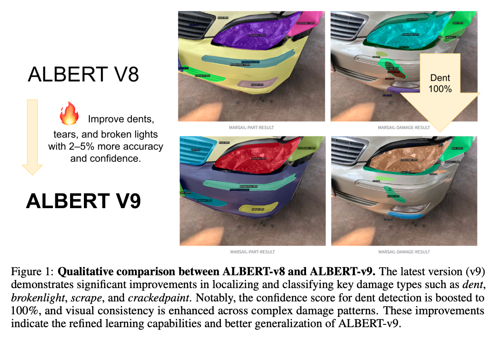
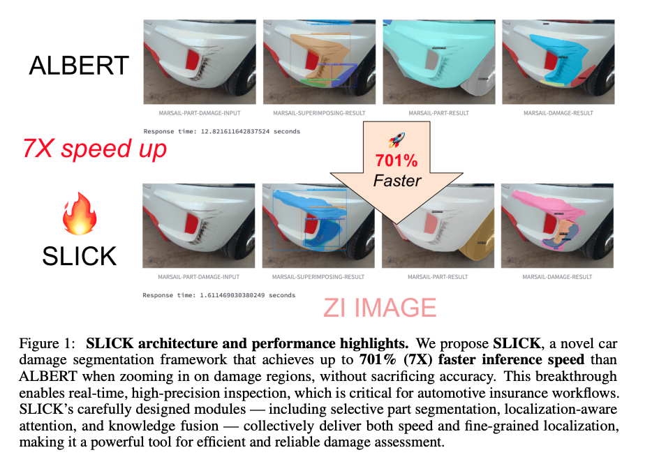
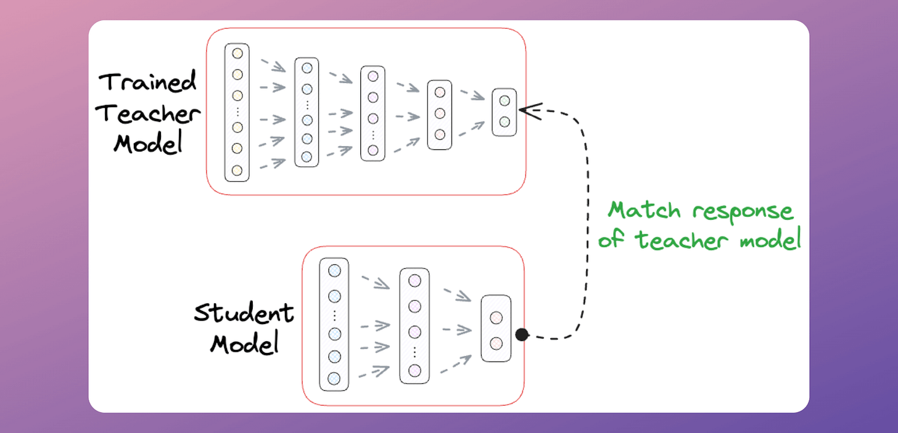
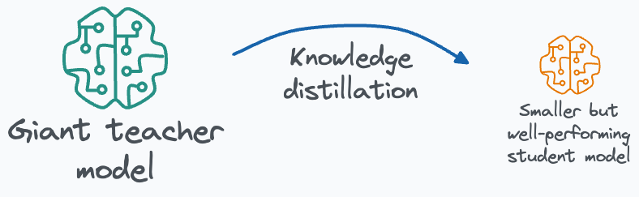
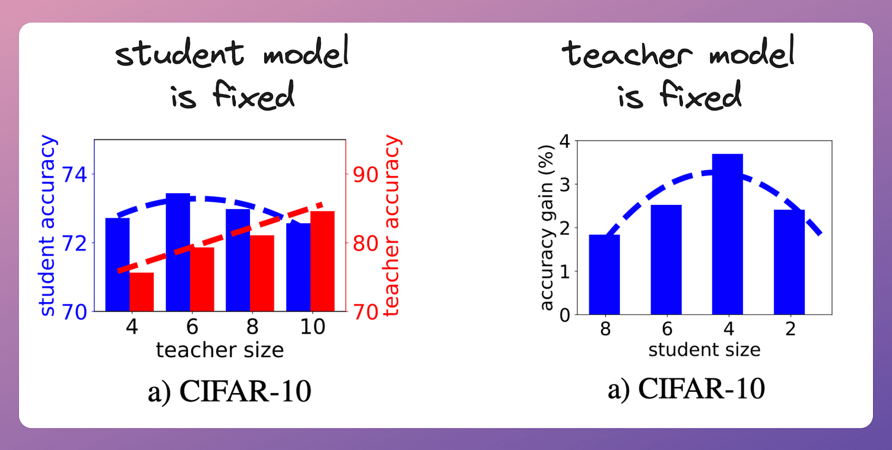
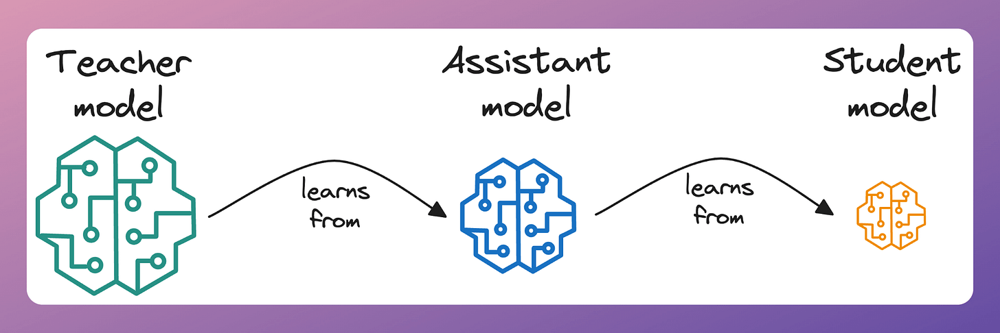
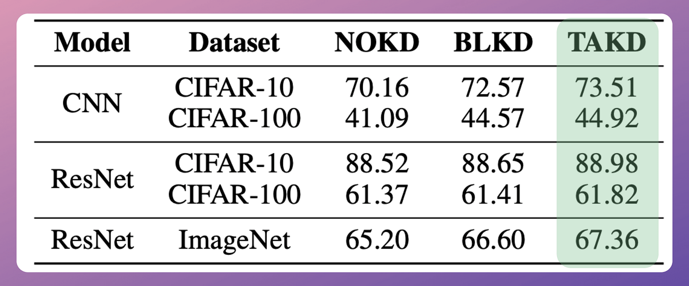
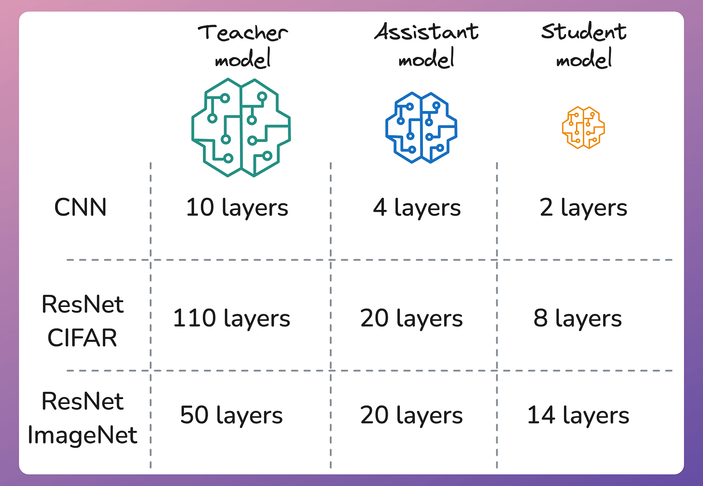

---

title: 'ALBERT vs SLICK: MARSAIL’s New AI Fashion for Real-Time Car Insurance'  
subtitle: ''  
summary: Discover how MARSAIL’s teacher–student model duo ALBERT and SLICK revolutionizes car damage detection with unmatched precision and blazing speed.  
authors:  
- admin  
tags:  
- automotive-ai  
- computer-vision  
- deep-learning  
- marsail  
- insurance-tech  
- transformers  
image:  
  caption: 'MARSAIL’s dual models ALBERT and SLICK showcase the future of automotive AI.'  
categories:  
- computer-vision  
- deep-learning  
- automotive-ai  
- marsail  
date: "2025-07-02T00:00:00Z"  
lastmod: "2025-07-02T00:00:00Z"  
featured: true  
draft: false  
math: true  

# Featured image  
image:  
  caption: "MARSAIL’s ALBERT and SLICK models demonstrate the perfect balance of accuracy and speed, redefining car insurance AI."  
  placement: 2  
  focal_point: "Smart"  
  preview_only: false  

# Projects (optional).  
projects: [] 

---


{}  
You can explore our GitHub project page 📦 [here](https://kaopanboonyuen.github.io/MARS/).  
{}

<!--  -->

---

## ALBERT vs SLICK: The New AI Fashion at MARSAIL

---


In the fast-evolving world of automotive insurance, precision and speed are absolutely critical. Enter **MARSAIL** (Motor AI Recognition Solution Artificial Intelligence Laboratory), Thailand’s pioneering hub of automotive AI innovation. In 2025, MARSAIL proudly unveils two revolutionary models that are reshaping how car damage is detected, analyzed, and processed for insurance claims — **ALBERT** and **SLICK**.

These models represent more than just technological progress; they embody a new philosophy in AI-powered insurance: a seamless synergy between **uncompromising accuracy** and **lightning-fast efficiency**, inspired by the teacher-student paradigm.

At the core of this paradigm lies **ALBERT**, the “teacher” — a powerhouse model meticulously engineered for razor-sharp precision. ALBERT dives deep into images, discerning the finest scratches, dents, and cracks with near-human expertise. It’s a master of detail, leaving no nuance unseen, perfect for complex offline investigations and comprehensive damage evaluations where absolute accuracy is essential.

> In today’s fast-paced insurance ecosystem, speed is just as crucial as accuracy, particularly when it comes to frontline claim processing and on-the-spot damage assessments. This is where SLICK, the "student" model, truly shines. Guided by the advanced expertise of ALBERT, SLICK is engineered for agility and lightning-fast performance, delivering precise damage detection results in real-time. Whether running on edge devices or mobile phones, its optimized architecture allows insurance agents and repair shops to streamline their operations, making decisions faster without ever sacrificing quality.

---

### SLICK: Revolutionizing Car Damage Segmentation with Knowledge-Enhanced AI at MARSAIL

---

The recent Google AI video on Knowledge Distillation: A Good Teacher is Patient and Consistent offers valuable insights into how AI models can be trained efficiently by leveraging a "teacher-student" framework. The key takeaway from this approach is that a well-trained teacher model can pass down its knowledge to a student model, significantly improving performance and generalization. This technique has sparked new ideas for MARSAIL and our work on SLICK (Selective Localization and Instance Calibration for Knowledge-Enhanced Car Damage Segmentation).





In the same spirit of knowledge transfer, SLICK takes inspiration from the concept of "distilling" knowledge from large, complex models to create an AI system capable of precise, real-world car damage segmentation. Through components like Selective Part Segmentation, Localization-Aware Attention, and Knowledge Fusion, SLICK enhances the ability of AI models to focus on and accurately segment vehicle parts—even under challenging conditions like occlusions and deformations. Much like the patient and consistent teacher-student relationship in knowledge distillation, SLICK learns from vast datasets (including synthetic crash data and real-world insurance records) to ensure robustness and adaptability across a variety of damage scenarios.

At MARSAIL, inspired by Google AI's knowledge distillation, we’re applying these principles to create an AI system that not only improves segmentation accuracy but also optimizes the entire automotive insurance and repair workflow. With SLICK, we are ready to bring this advanced AI to Thailand, enhancing efficiency, reducing fraud, and setting new standards for the industry.

---

### Inspiration from Andrej Karpathy: Embracing the New Era of AI Innovation at MARSAIL

---

In the video "Andrej Karpathy: Software Is Changing (Again)", Karpathy discusses how artificial intelligence and deep learning are driving a new wave of transformation across industries. At MARSAIL, we deeply resonate with his perspective that AI is not just evolving—it’s fundamentally reshaping how we approach problem-solving and automation. Inspired by Karpathy’s vision, we’re applying the latest in AI research to redefine the way car damage estimation, insurance claims, and repair workflows are handled. Just as Karpathy highlights the importance of AI in software development, MARSAIL is leveraging cutting-edge AI models like SLICK to bring accuracy, speed, and efficiency to the automotive sector, helping to transform the Thai automotive insurance ecosystem into a more intelligent and scalable system.






By aligning our research with the principles Karpathy discusses, MARSAIL is at the forefront of AI-driven innovation in the automotive space, bringing faster, more reliable, and trustworthy solutions to insurers, garages, and customers alike.

Together, **ALBERT** and **SLICK** form a powerful duo that bridges the traditional divide between accuracy and efficiency — offering the best of both worlds to revolutionize car insurance workflows across Thailand and beyond.

---

### ALBERT: The Teacher Model — Precision at a Cost

---

ALBERT stands for *Advanced Localization and Bidirectional Encoder Representations from Transformers*. This model is designed to be highly accurate and detailed in detecting subtle damages such as small scratches, dents, and cracks on vehicles. It leverages a vision transformer architecture enhanced with localized deformable tokens and parameter sharing to precisely focus on critical damage regions.

However, this precision comes with a computational cost. ALBERT requires powerful CUDA-enabled GPUs and is relatively slow, making it ideal for offline batch processing or scenarios where accuracy takes precedence over speed.

<div style="text-align: center;">
  
  <p style="font-style: italic; margin-top: 0px;">Figure 1: MARSAIL-ALBERT model showcasing detailed and precise damage segmentation results.</p>
</div>

---

### SLICK: The Student Model — Lightning Speed Meets Smart Knowledge

---

To address real-time insurance needs, MARSAIL developed **SLICK** — *Selective Localization and Instance Calibration with Knowledge*. This model distills knowledge from ALBERT and integrates domain-specific insurance metadata like bumper zones and vehicle model weak points. 

SLICK boosts processing speed by over **700%** compared to ALBERT, enabling instant damage assessments on edge devices or mobile apps without sacrificing much accuracy. Its adaptive attention mechanism dynamically calibrates segmentation proposals using contextual knowledge graphs, making it robust under varying light, weather, and occlusion conditions.

<div style="text-align: center;">
  
  <p style="font-style: italic; margin-top: 0px;">Figure 2: MARSAIL-SLICK model delivering rapid, knowledge-enhanced damage segmentation optimized for real-time insurance workflows.</p>
</div>

---

### 🚘 Teaching machines to see smarter and faster: the MARSAIL teacher-student model

---

In the race to deliver the best car damage detection for insurance claims, MARSAIL takes a cutting-edge approach inspired by how humans learn: through mentorship. Our **teacher-student model** architecture pairs a high-capacity “teacher” network with a lean, speedy “student” model, capturing the best of both worlds — precision and efficiency.

<div style="text-align: center;">
  
  <p style="font-style: italic; margin-top: 0px;">Figure 3: Conceptual architecture of the MARSAIL teacher-student model (Image source: <a href="https://www.dailydoseofds.com/p/knowledge-distillation-with-teacher-assistant-for-model-compression/" target="_blank">Daily Dose of Data Science</a>).</p>
</div>

---

### What is the teacher-student model?

---

Think of the **teacher** as a seasoned expert with a deep understanding of vehicle damage nuances — it’s large, powerful, and painstakingly precise. The **student**, meanwhile, is like an apprentice: smaller, faster, and designed to perform well in real-world settings with limited resources.

The magic happens when the student **learns to mimic** the teacher's insights without needing to replicate its full complexity. This process is known as **knowledge distillation** — where the teacher’s “soft” predictions guide the student’s training, helping it grasp subtle visual patterns that would be hard to learn from raw data alone.

<div style="text-align: center;">
  
  <p style="font-style: italic; margin-top: 0px;">Figure 4: Simplified overview of the teacher-student learning framework (Image source: <a href="https://www.dailydoseofds.com/p/knowledge-distillation-with-teacher-assistant-for-model-compression/" target="_blank">Daily Dose of Data Science</a>).</p>
</div>

---

### Measuring size and efficiency: teacher vs. student

---

To illustrate the trade-off, here’s a glimpse of the teacher and student model sizes trained on the CIFAR-10 dataset. The teacher is notably larger but more precise, while the student’s compact size enables rapid inference — crucial for insurance agents working on the go.

<div style="text-align: center;">
  
  <p style="font-style: italic; margin-top: 0px;">Figure 5: Visual comparison of teacher (left) and student (right) model sizes (Image source: <a href="https://www.dailydoseofds.com/p/knowledge-distillation-with-teacher-assistant-for-model-compression/" target="_blank">Daily Dose of Data Science</a>).</p>
</div>

---

### How does the student learn from the teacher?

---

The training process involves the student observing both the teacher’s output and the ground truth, gradually adjusting itself to replicate the teacher’s nuanced judgments. This dual supervision accelerates the student’s learning curve, enabling it to deliver near-teacher accuracy with significantly fewer parameters.

<div style="text-align: center;">
  
  <p style="font-style: italic; margin-top: 0px;">Figure 6: Diagram showing how the student model learns from the teacher model (Image source: <a href="https://www.dailydoseofds.com/p/knowledge-distillation-with-teacher-assistant-for-model-compression/" target="_blank">Daily Dose of Data Science</a>).</p>
</div>

---

### Results that speak volumes

---

On multiple datasets and architectures (including CNN and ResNet), MARSAIL’s teacher-student training methods consistently improved student model accuracy across the board — sometimes by over 3% compared to training without guidance.

| Model   | Dataset  | No KD (%) | BLKD (%) | TAKD (%) |
|---------|----------|-----------|----------|----------|
| CNN     | CIFAR-10 | 70.16     | 72.57    | **73.51**|
| CNN     | CIFAR-100| 41.09     | 44.57    | **44.92**|
| ResNet  | CIFAR-10 | 88.52     | 88.65    | **88.98**|
| ResNet  | CIFAR-100| 61.37     | 61.41    | **61.82**|
| ResNet  | ImageNet | 65.20     | 66.60    | **67.36**|

<div style="text-align: center;">
  
  <p style="font-style: italic; margin-top: 0px;">Figure 7: Model accuracy comparison showing improvement using knowledge distillation techniques (Image source: <a href="https://www.dailydoseofds.com/p/knowledge-distillation-with-teacher-assistant-for-model-compression/" target="_blank">Daily Dose of Data Science</a>).</p>
</div>

---

### Final layer feature summaries

---

This image visualizes how different layers in each model contribute to the final representation, highlighting the efficiency gains from knowledge distillation that help the student model stay compact yet powerful.

<div style="text-align: center;">
  
  <p style="font-style: italic; margin-top: 0px;">Figure 8: Summary of final layer features in teacher and student models (Image source: <a href="https://www.dailydoseofds.com/p/knowledge-distillation-with-teacher-assistant-for-model-compression/" target="_blank">Daily Dose of Data Science</a>).</p>
</div>

---

## why does this matter for car insurance?

---

- **Speed without compromise:** Insurance agents and garages need fast, reliable damage detection on smartphones or edge devices. The student model delivers rapid results, trained under the teacher’s expert supervision.

- **Resource efficiency:** Smaller models reduce computational costs and power consumption, enabling scalable deployment across Thailand’s wide insurance ecosystem.

- **Robust accuracy:** Guided by the teacher, the student avoids common pitfalls of lightweight models, maintaining high performance even in challenging real-world conditions.

---

### Why This Matters for Car Insurance

---

- **Accuracy vs. Speed:** ALBERT excels in detailed offline analysis, perfect for complex claim investigations. SLICK offers instant, reliable damage detection to accelerate frontline claim approvals and garage estimates.

- **Hardware Flexibility:** ALBERT demands high-end GPUs; SLICK can run efficiently on more modest, real-world devices — a game changer for field agents and repair shops.

- **Knowledge Integration:** SLICK’s use of insurance-specific metadata bridges the gap between raw image analysis and domain expertise, improving real-world applicability.

---

## Mathematical Insight (Simplified)

---

At the heart of our system lies a sophisticated process that refines how the model understands and represents visual data at every step. Imagine ALBERT as a multi-layered brain that carefully adjusts its internal view of an image piece by piece. At each layer, it uses two powerful tools: one that lets it look broadly across different parts of the image to understand overall patterns (multi-scale self-attention), and another that processes these insights through focused, step-by-step reasoning (a multilayer perceptron).

$$
z^{(l+1)} = z^{(l)} + \text{MSA}(\text{LN}(z^{(l)})) + \text{MLP}(\text{LN}(z^{(l)}))
$$

This dynamic combination helps ALBERT balance the big picture with fine details, ensuring that the model not only recognizes individual features but also how they relate to each other in context. To keep this learning smooth and stable, it applies a normalization step—similar to tuning an instrument—to make sure each layer’s output remains consistent and meaningful.

Parallel to this, SLICK operates like an intelligent curator, enhancing the model’s confidence in its predictions. It does this by merging two streams of knowledge: the direct visual cues from the image itself and additional information pulled from a structured knowledge graph—think of this as a database of domain-specific facts and relationships.

$$
s_{mask} = \sigma(W_q [f_{img} \| f_{kg}]) + b
$$


To blend these inputs effectively, SLICK employs a gating mechanism that acts like a smart filter or valve. This gate carefully weighs how much influence the visual data and the knowledge graph should each have in shaping the final mask quality scores. By doing so, the model doesn’t just rely on what it sees but also on what it knows about the world, leading to sharper, more reliable segmentation.

In essence, this combination of refined visual understanding and context-aware knowledge integration lets our system adapt its focus dynamically—prioritizing regions and details that matter most for accurate damage assessment and claim processing.

---

## Published Research

---

- ALBERT: [https://arxiv.org/abs/2506.10524](https://arxiv.org/abs/2506.10524)  
- SLICK: [https://arxiv.org/abs/2506.10528](https://arxiv.org/abs/2506.10528)  

---

## Looking Ahead

---

MARSAIL continues to innovate by balancing AI model accuracy and deployment efficiency. ALBERT and SLICK represent the cutting edge of automotive AI, ready to transform insurance claim processes in Thailand and beyond — enabling smarter, faster, and fairer car insurance.

## Citation

> Panboonyuen, Teerapong. (Jul 2025). *ALBERT vs SLICK: MARSAIL’s New AI Fashion for Car Insurance*. Blog post on Kao Panboonyuen. [https://kaopanboonyuen.github.io/blog/2025-07-02-albert-vs-slick-marsail-new-ai-fashion/](https://kaopanboonyuen.github.io/blog/2025-07-02-albert-vs-slick-marsail-new-ai-fashion/)

Or

```bibtex
@article{panboonyuen2025albert_slick,
  title={ALBERT: Advanced Localization and Bidirectional Encoder Representations from Transformers for Automotive Damage Evaluation},
  author={Panboonyuen, Teerapong},
  journal={arXiv preprint arXiv:2506.10524},
  year={2025},
  url={https://arxiv.org/abs/2506.10524}
}

@article{panboonyuen2025slick,
  title={SLICK: Selective Localization and Instance Calibration for Knowledge-Enhanced Car Damage Segmentation in Automotive Insurance},
  author={Panboonyuen, Teerapong},
  journal={arXiv preprint arXiv:2506.10528},
  year={2025},
  url={https://arxiv.org/abs/2506.10528}
}
```

{}
Found this blog insightful? Consider sharing it with friends or researchers in the automotive or insurance tech industry. 🚗
{}

## References

1. Panboonyuen, Teerapong.  "ALBERT: Advanced Localization and Bidirectional Encoder Representations from Transformers for Automotive Damage Evaluation." arXiv preprint arXiv:2506.10524 (2025). [https://arxiv.org/abs/2506.10524](https://arxiv.org/abs/2506.10524)

2. Panboonyuen, Teerapong.  "SLICK: Selective Localization and Instance Calibration for Knowledge-Enhanced Car Damage Segmentation in Automotive Insurance." arXiv preprint arXiv:2506.10528 (2025). [https://arxiv.org/abs/2506.10528](https://arxiv.org/abs/2506.10528)

3. Knowledge Distillation with Teacher Assistant for Model Compression: https://www.dailydoseofds.com/p/knowledge-distillation-with-teacher-assistant-for-model-compression/