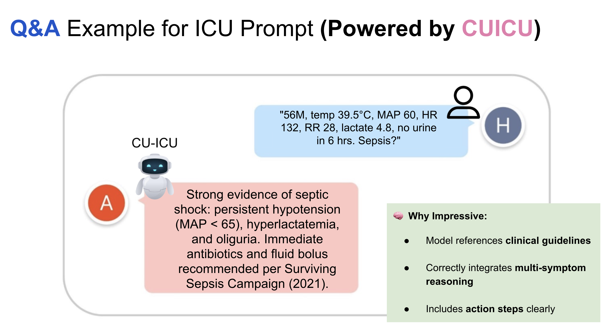

---

title: "CU-ICU: Customizing Instruction-Tuned Language Models for Critical Care"  
subtitle: ""  
summary: Fine-tuning FLAN-T5 with parameter-efficient methods to adapt LLMs for high-stakes ICU tasks like sepsis detection, mortality prediction, and clinical note generation.  
authors:  
- admin  
tags:  
- clinical-llms  
- parameter-efficient-finetuning  
- peft  
- medical-ai  
- prompt-learning  
- flan-t5  
- healthcare-innovation  
- sepsis-detection  
- icu-mortality-prediction  
categories:  
- medical-language-models  
- peft-for-healthcare  
- ai-in-critical-care  
date: "2025-07-17T00:00:00Z"  
lastmod: "2025-07-17T00:00:00Z"  
featured: true  
draft: false

# Featured image
image:  
  caption: "Scientist: Dr. Teerapong Panboonyuen (ดร.ธีรพงศ์ ปานบุญยืน) – presenting his latest work on CU-ICU, a customized instruction-finetuned language model for critical care."  
  placement: 2  
  focal_point: "Smart"  
  preview_only: false

# Projects (optional).
projects: []

---


> _“My passion is dedicated to supporting ICU healthcare professionals in Thailand by building accessible AI tools—this is an independent project with no external funding.”_

---

## 🚨 The ICU Challenge

---

Large Language Models (LLMs) like ChatGPT and Google Gemini have taken the world by storm—but adapting them to **real-world ICU settings** is another story.

In the ICU, time is critical. Clinical staff need:
- Fast predictions (like early **sepsis detection**),
- Accurate **mortality risk estimation**, and
- Understandable, **clinically relevant explanations**.

But here's the catch: hospitals—especially in countries like Thailand—often lack large labeled datasets or GPU-rich infrastructure.



---

## 💡 Introducing CU-ICU

---

**CU-ICU** is my proposed framework that adapts large instruction-finetuned LLMs like T5 for ICU tasks, using **sparse parameter-efficient fine-tuning (PEFT)** techniques. It balances **accuracy**, **interpretability**, and **efficiency**.

I evaluated it on:
- **Sepsis Detection**
- **Mortality Prediction**
- **Clinical Note Generation**

With three leading PEFT strategies:
- 🧩 **LoRA**
- 📉 **AdaLoRA**
- 🧠 **(IA)$^3$**

<div style="text-align: center;">
  
  <p style="font-style: italic; margin-top: 0px;">Figure 1: The moment I stepped onto the stage at TSCCM 2025 to present my research on CU-ICU—my heart was racing, but my passion was louder. This was not just any room; it was Conference Room 1 on the 12th floor of Bhumisiri Mangkhalanusorn Building at King Chulalongkorn Memorial Hospital, filled with top clinicians and medical experts. It felt deeply meaningful to return to a place that shaped my academic path, this time to introduce an AI model designed not for global trends, but for Thai hospitals, Thai doctors, and Thai patients. CU-ICU was built from the heart—with no big budget, no flashy grants—just the desire to make something useful and real.</p>
</div>

<div style="text-align: center;">
  
  <p style="font-style: italic; margin-top: 0px;">Figure 2: Out of all the names listed for oral presentations, mine came first—talk about pressure! As I scanned the schedule, I realized something fascinating: I was the only one presenting on AI, LLMs, and NLP. The rest were brilliant case studies and clinical research from doctors around Thailand and Asia. It was humbling to stand out not because of prestige, but because I represented a new kind of voice—a bridge between AI and healthcare, speaking to an audience of physicians about how ML might ease their daily workload and complement their medical judgment.</p>
</div>

<div style="text-align: center;">
  
  <p style="font-style: italic; margin-top: 0px;">Figure 3: The poster session lineup at TSCCM 2025 read like a roadmap of cutting-edge clinical practice. Most submissions came from hospitals across Japan, rich in medical case studies, practical findings, and cross-hospital comparisons. While CU-ICU wasn’t in this section, it made me realize the breadth of collaboration and knowledge-sharing that exists across borders in the healthcare research community. The energy was global, but the mission was deeply human: to make care better.</p>
</div>

<div style="text-align: center;">
  
  <p style="font-style: italic; margin-top: 0px;">Figure 4: Why build CU-ICU? The answer is simple: passion. It wasn’t born from a funded research project or a corporate mandate. It came from listening to doctors—hearing how repetitive and time-consuming many of their information-related tasks can be. CU-ICU is a Thai-built large language model (LLM) designed specifically to support local medical professionals. Its goal is not to replace anyone, but to serve as an AI assistant that understands the rhythm of a Thai ICU. By answering common clinical questions, it gives doctors more time to focus on the patient—the human behind the data. This moment of sharing that ‘why’ with a room full of doctors was the most meaningful part of the talk for me.</p>
</div>

<div style="text-align: center;">
  
  <p style="font-style: italic; margin-top: 0px;">Figure 5: CU-ICU is built on the FLAN-T5 architecture and fine-tuned using lightweight adaptation techniques like LoRA, AdaLoRA, and IA3. Coming from a computer vision background, diving into language models was a leap—but a thrilling one. The idea of building an AI model that could "speak medicine" in Thai was both technically challenging and emotionally rewarding. I even asked the audience—doctors from various hospitals—how many had used tools like ChatGPT, Gemini, or DeepSeek. Almost every hand went up. That moment confirmed: the future of medicine and LLMs are already intersecting. CU-ICU wants to be part of that conversation, in my own language.</p>
</div>

---

## 🧪 Results Snapshot

---

I fine-tuned FLAN-T5 on ICU datasets using 16-shot prompts. Here’s what CU-ICU achieved:

---

### 🔍 Prediction Tasks

---

| Method | Config | Params (%) | Sepsis Acc. | Mortality Acc. |
|--------|--------|------------|-------------|----------------|
| **(IA)$^3$ (All Layers)** | N/A | 0.9% | **85.6%** | 80.2% |
| AdaLoRA | 1.0 Budget, Rank=8 | 2.9% | 83.5% | **80.9%** |
| LoRA | Rank=16 | 6.2% | 83.1% | 79.6% |

> ✅ CU-ICU achieves up to **85.6% accuracy in sepsis detection**—with less than **1%** of model weights updated!

---

### 📝 Clinical Note Quality

---

| Method | Config | nBERTScore | Avg Score |
|--------|--------|------------|-----------|
| **(IA)$^3$ (All Layers)** | N/A  | 32.1 | **66.0** |
| AdaLoRA | Rank=16 | 30.6 | 65.0 |
| LoRA | Rank=16 | 28.3 | 63.7 |

> 🧠 CU-ICU’s best configuration **generated the most clinically relevant explanations**, evaluated via nBERTScore.

<div style="text-align: center;">
  
  <p style="font-style: italic; margin-top: 0px;">Figure 6: CU-ICU currently achieves about 66% accuracy on my curated ICU question dataset. It's not perfect, but it's a beginning. With more collaboration—especially from Thai doctors who can contribute anonymized data or clinical QA patterns—I believe CU-ICU can evolve into something truly impactful. But I also emphasized that the model must remain ethical, inclusive, and safe. Biases must be addressed. Feedback must be welcomed. This is not just an AI system; it’s a co-created medical assistant, shaped by the people it aims to help.</p>
</div>

<div style="text-align: center;">
  
  <p style="font-style: italic; margin-top: 0px;">
    Figure 7: A powerful moment from CU-ICU in action. The model receives a real-world ICU prompt: <em>"56M, temp 39.5°C, MAP 60, HR 132, 20, lactate 4.0, no urine in 6 hrs. Sepsis?"</em> Its response? Not just accurate—but clinically impressive: <em>"Strong evidence of septic shock: persistent hypotension (MAP &lt; 65), hyperlactatemia, and oliguria. Immediate antibiotics and fluid bolus recommended per Surviving Sepsis Campaign (2021)."</em> What makes this remarkable isn’t just the correctness, but the way CU-ICU integrates multi-symptom reasoning, adheres to formal clinical guidelines, and even offers actionable next steps. In this moment, it felt like CU-ICU wasn't just a research model—it was a prototype for the kind of AI assistant Thai doctors could one day rely on in the most critical of decisions.
  </p>
</div>

---

## 🤖 Why It Works

---

CU-ICU leverages:
- **Instruction tuning** (T5 + FLAN-like prompts)
- **Few-shot learning** (16-shot prompts)
- **Sparse fine-tuning** using LoRA, AdaLoRA, and (IA)$^3$

This makes the model:
- **Lightweight** 🪶
- **Accurate** 📈
- **Interpretable** 🔍

All without expensive GPU clusters.

---

## 🌏 A Step Toward Thai Hospital AI

---

Most Thai hospitals operate under **resource constraints**. My goal with CU-ICU is to show:
- You can still deploy **LLM-based clinical AI**,
- With just **a few labels**, **smart tuning**, and **open-source models**.

I'm excited about bringing this into Thai ICU workflows to help overworked clinicians with decision support tools that actually make sense in practice.

<div style="text-align: center;">
  
  <p style="font-style: italic; margin-top: 0px;">Figure 8: My certificate for the oral session—a proud reminder that I was one of just eight selected presenters. The other seven? All medical doctors. That made it even more special. Being the only AI researcher talking about LLMs in a sea of clinicians reminded me that technology must meet people where they are. One of the most heartwarming moments came afterward, when a senior doctor complimented the work. And perhaps even more emotional—this was my return to Chulalongkorn University, my Ph.D. alma mater, after nearly five years. Walking the familiar halls again, this time as a speaker, I felt immense gratitude. Chula gave me the roots, and CU-ICU is one of the branches I’ve grown.</p>
</div>

---

{}
🎤 You can download the full presentation slides from my CU-ICU oral talk at TSCCM 2025 [here](https://kaopanboonyuen.github.io/files/slides/Panboonyuen_CUICU_TSCCM2025_Slide.pdf).

📄 Curious to dive deeper into the research? You can also read the full CU-ICU paper on arXiv [here](http://arxiv.org/abs/2507.13655).
{}

---

## 📚 References (selected)

---

- [LoRA (Hu et al., 2021)](https://arxiv.org/abs/2106.09685)
- [FLAN-T5 (Chung et al., 2022)](https://arxiv.org/abs/2210.11416)
- [PaLM (Chowdhery et al., 2022)](https://arxiv.org/abs/2204.02311)
- [MedPaLM (Singhal et al., 2023)](https://arxiv.org/abs/2305.09617)
- [ChatGPT (OpenAI, 2023)](https://openai.com/research/gpt-4)
- [Gemini (Google DeepMind, 2024)](https://deepmind.google/discover/blog/google-gemini-ai/)

---

## Citation

> Panboonyuen, Teerapong. (July 2025). *CU-ICU: Customizing Instruction-Tuned Language Models for Critical Care*. Blog post on Kao Panboonyuen. [https://kaopanboonyuen.github.io/blog/2025-07-17-cuicu-customizing-unsupervised-instruction-finetuned-language-models/](https://kaopanboonyuen.github.io/blog/2025-07-17-cuicu-customizing-unsupervised-instruction-finetuned-language-models/)

**For a BibTeX citation:**

```bibtex
@article{panboonyuen2025cuicu,
  title   = "CU-ICU: Customizing Instruction-Tuned Language Models for Critical Care",
  author  = "Panboonyuen, Teerapong",
  journal = "kaopanboonyuen.github.io/",
  year    = "2025",
  month   = "Jul",
  url     = "https://kaopanboonyuen.github.io/blog/2025-07-17-cuicu-customizing-unsupervised-instruction-finetuned-language-models/"
}
```

{}
Did you find this page helpful? Consider sharing it 🙌
{}

# References

1. Raffel, Colin, et al. "Exploring the Limits of Transfer Learning with a Unified Text-to-Text Transformer." *Journal of Machine Learning Research* 21.140 (2020): 1-67.

2. Hu, Edward J., et al. "LoRA: Low-Rank Adaptation of Large Language Models." *arXiv preprint* arXiv:2106.09685 (2021).

3. Wang, Shao, et al. "AdaLoRA: Adaptive Low-Rank Adaptation for Efficient Fine-tuning." *arXiv preprint* arXiv:2208.07339 (2022).

4. Guo, Ruiyi, et al. "(IA)³: Trainable Multiplicative Masks for Parameter-Efficient Fine-Tuning." *arXiv preprint* arXiv:2206.10169 (2022).

5. Lee, Jinhyuk, et al. "BioBERT: a pre-trained biomedical language representation model for biomedical text mining." *Bioinformatics* 36.4 (2020): 1234-1240.

6. Huang, Kexin, et al. "ClinicalBERT: Modeling Clinical Notes and Predicting Hospital Readmission." *arXiv preprint* arXiv:1904.05342 (2019).

7. Singhal, Karan, et al. "Large Language Models Encode Clinical Knowledge." *arXiv preprint* arXiv:2212.13138 (2022).

8. Jin, Dongmin, et al. "MedAlpaca: A Medical Instruction-Finetuned Large Language Model." *arXiv preprint* arXiv:2304.12140 (2023).

9. Lester, Brian, et al. "Powerful few-shot learning with frozen language models and pattern-tuning." *arXiv preprint* arXiv:2107.13586 (2021).

10. Brown, Tom B., et al. "Language models are few-shot learners." *Advances in Neural Information Processing Systems* 33 (2020): 1877-1901.