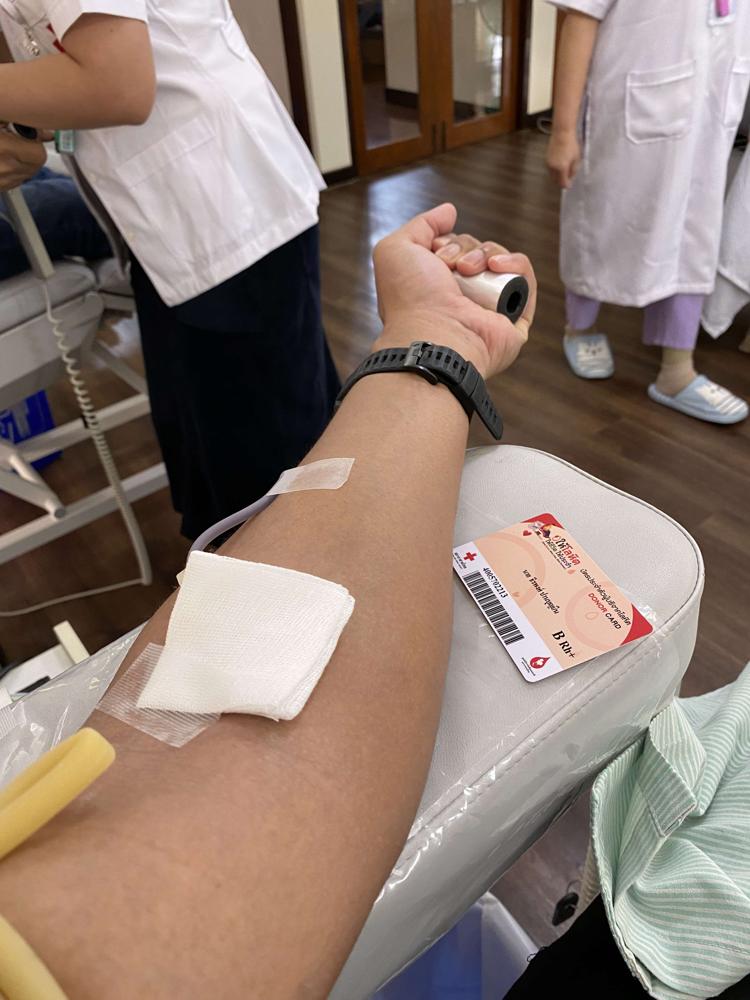
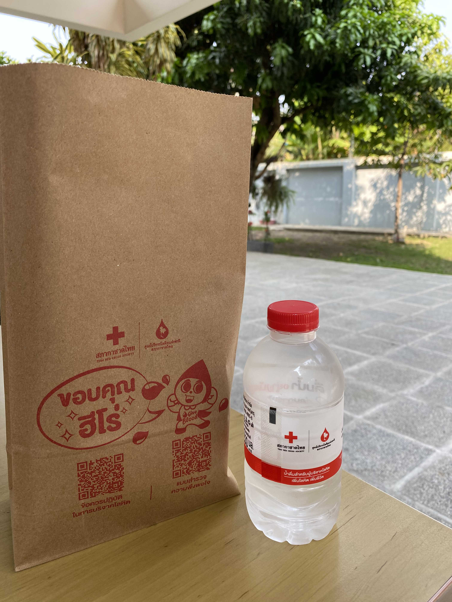
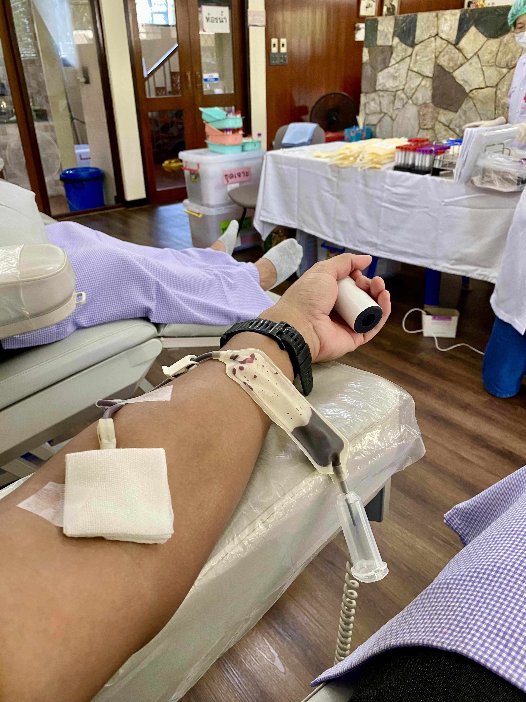
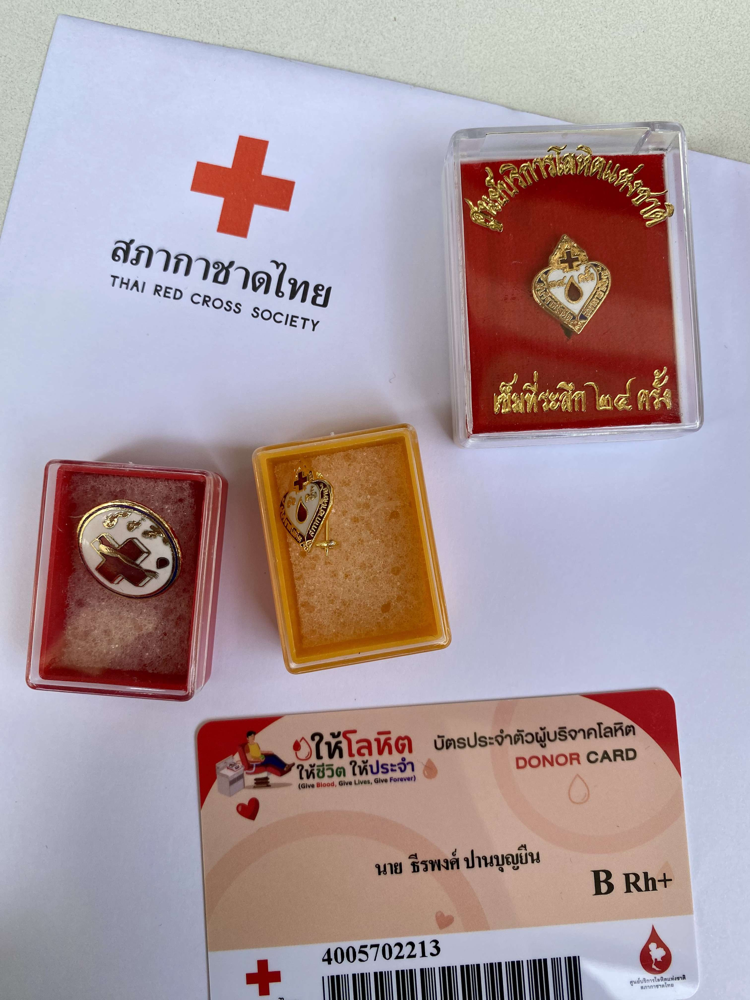
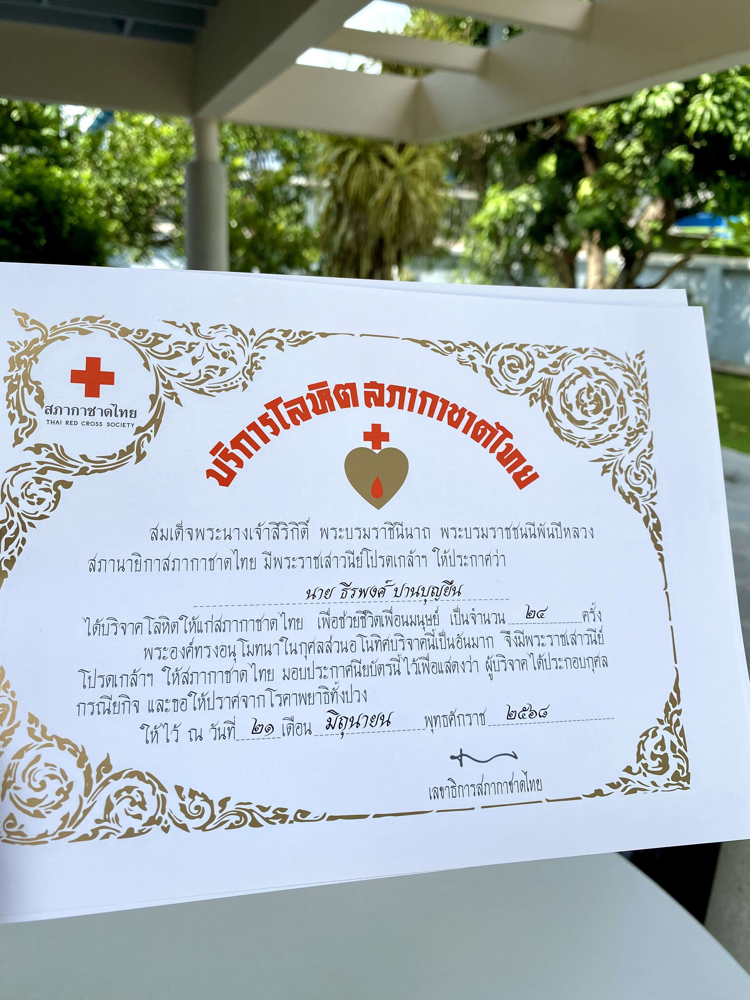
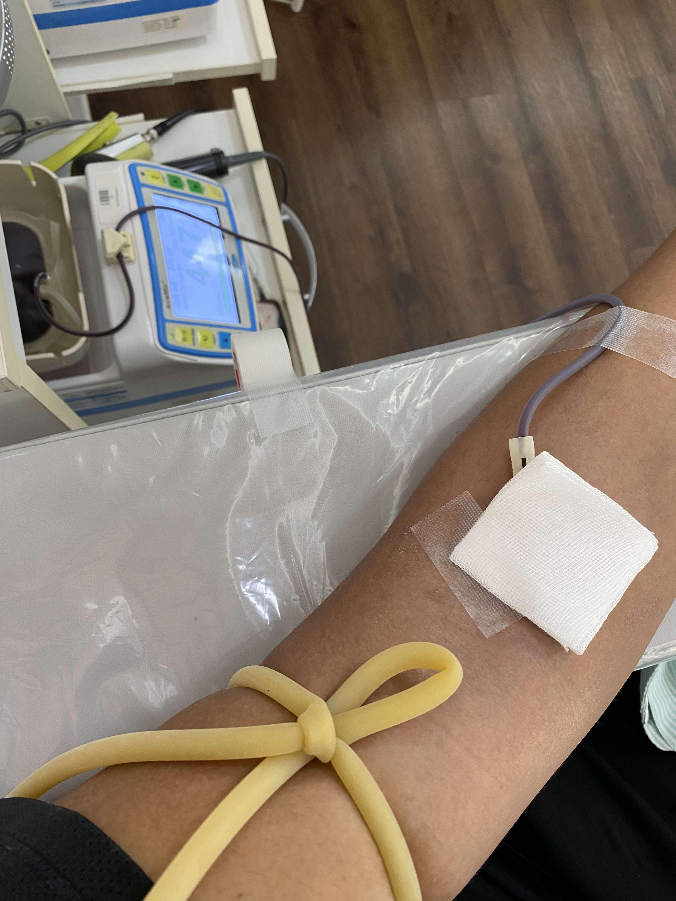
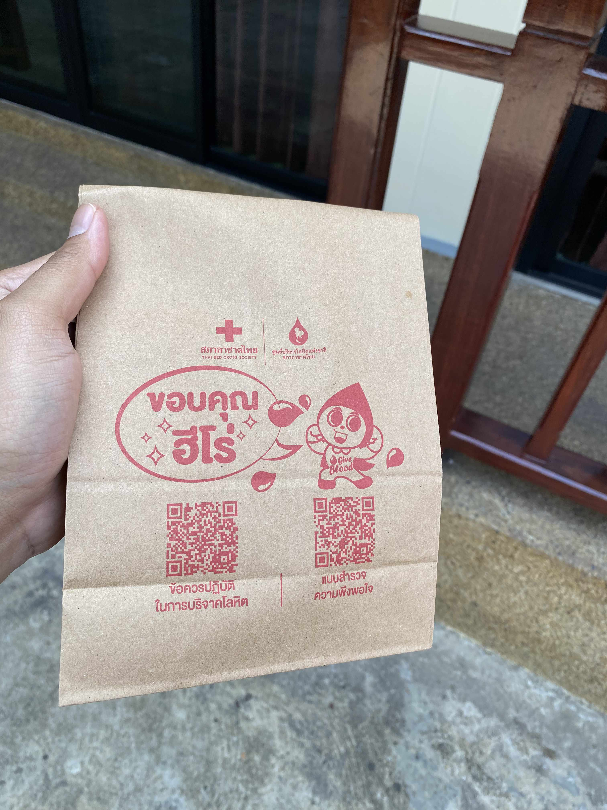
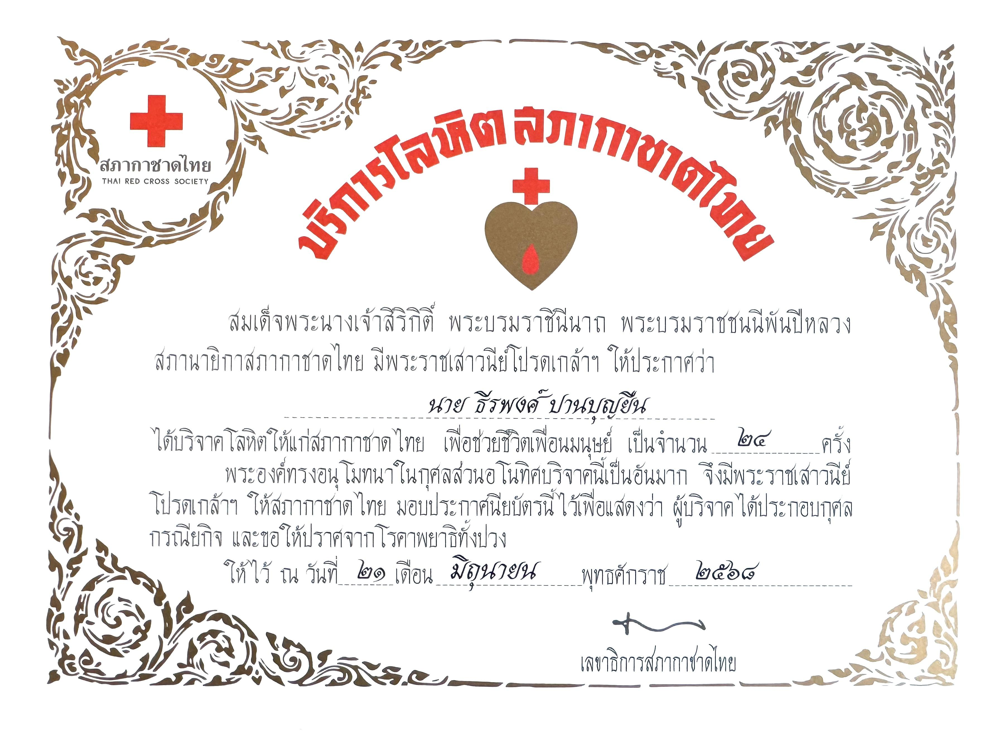
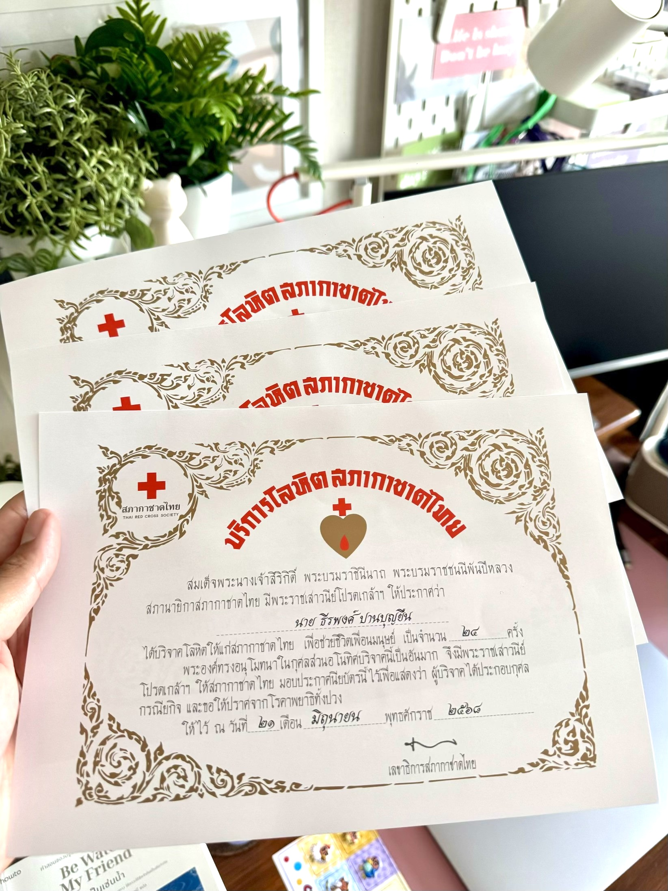

---

title: "My 25th Blood Donation — Celebrating the Quiet Joy and Lifelong Gift of Giving"  
subtitle: "A lifetime journey of kindness, gratitude, and silent heroism"  
summary: A heartfelt reflection on reaching my 25th blood donation milestone — a story of gratitude, discipline, and the quiet joy of giving, inspired by my mother and dedicated to His Majesty King Bhumibol Adulyadej.  
authors:  
- admin  
tags:  
- blood-donation  
- kindness  
- life-reflection  
- gratitude  
- health  
- humanity  
categories:  
- personal  
- inspiration  
- giving-back  
date: "2025-10-13T00:00:00Z"  
lastmod: "2025-10-13T00:00:00Z"  
featured: true  
draft: false  

image:  
  caption: "Kao completing his 25th blood donation at the Thai Red Cross Society, Bangkok — October 2025."  
  placement: 2  
  focal_point: "Center"  
  preview_only: false  

projects: []  

---

> _“If you’re lucky enough to live the rest of your life, make it meaningful.”_

---

## 🩸 A Milestone from the Heart

There are so many moments in life that make me smile — moments that remind me that I’m proud to be who I am, to be alive, and to have lived this far.  
If the average lifespan is between 70 and 90 years, I’ve probably walked through a third of my journey already. That realization doesn’t scare me. It centers me. It whispers:  
> “Do something that matters.”

<div style="text-align: center;">
  
  <p style="font-style: italic; margin-top: 0px;">
    Figure 1: Settled into the donation chair, the needle in place — and once again, the blood flows strong.  
    The nurse, warm and kind as always, smiles and says, “Your blood looks especially rich today.”  
    I dedicate the merit from this donation to all of humanity. May everyone be safe, healthy, and well.
  </p>
</div>

For me, meaning often comes through **giving** — especially in small, quiet ways that ripple far beyond what we see.  
And one of those ways has been *blood donation*.  

---

## 🌿 Where It All Began

If I trace back where this habit began, it leads straight to **my mother**.  
When I was a child, she took me along to the **Thai Red Cross Center in Ratchaburi**, beside the calm **Mae Klong River**. I remember the soft hum of ceiling fans, the cool tiles under my shoes, and the quiet pride on her face.

She never lectured about kindness. She simply lived it.  
Giving blood wasn’t something she bragged about — it was something she did because she could.

<div style="text-align: center;">
  
  <p style="font-style: italic; margin-top: 0px;">
    Figure 2: After the donation, I received a small snack pack and a bottle of water — a simple gesture that always feels thoughtful.  
    On the back of the snack bag, it said: “Thank you to all our heroes.”  
    It made me smile. I truly hope this blood helps keep someone’s life going, somewhere out there.
  </p>
</div>

Back then, I didn’t understand.  
But now, every time I roll up my sleeve, I hear her voice again:  
> “Be kind. Give when you can.”

---

## 🏙️ From Ratchaburi to Bangkok

Years later, my life moved to **Bangkok**. The donation center changed, but the ritual stayed.  
The staff at the Thai Red Cross Society now recognize me. We share jokes before each session — the kind of light humor that makes courage easy.

Each donation follows a rhythm: health check, warm greeting, the quick sting of the needle, and then the slow, reassuring flow of life leaving one body to help another.

<div style="text-align: center;">
  
  <p style="font-style: italic; margin-top: 0px;">
    Figure 3: Lying back in the donation room, I watched the deep crimson line slowly fill the bag — a quiet, powerful connection between two strangers who may never meet.  
    The nurse laughed when she saw the color: “No need for iron supplements today — your blood's already super rich!”  
    (To be fair, I had just swum a full kilometer before coming in — didn’t want to miss my workout after donating!)
  </p>
</div>

This time was special.  
Because this was **my 25th blood donation**.  

The nurse handed me a certificate and a small commemorative pin.  
For a moment, I felt both humbled and proud — of the discipline it took, of the years that passed, and of the promise that began decades ago beside that river.

---

## 💯 The Goal: 100 Donations

My personal goal is to reach **100 blood donations** in my lifetime.  
It’s not just a number — it’s a symbol of continuity, of living healthily, and of refusing to forget what empathy means.

<div style="text-align: center;">
  
  <p style="font-style: italic; margin-top: 0px;">
    Figure 4: My collection of blood donation pins — each one marking a checkpoint along the way.  
    They feel a bit like Garmin badges to me — small but meaningful rewards for showing up again and again. 😄  
    A reminder that kindness, like fitness, adds up over time.
  </p>
</div>

Each bag donated equals a chance for another heart to keep beating.  
Twenty-five down. Seventy-five to go.  

The nurse laughed as she said, *“Your blood is strong today — no iron pills needed!”*  
And I smiled, quietly grateful that I could still give.

---

## 👑 In Memory of His Majesty King Bhumibol Adulyadej

October 13 is a day of remembrance in Thailand — a day to honor **His Majesty King Bhumibol Adulyadej (Rama IX)**.  

He remains one of my greatest inspirations: a monarch of intellect, humility, and compassion.  
He devoted his life to helping others — with sincerity, with science, with heart.  

So today, I dedicated my 25th donation to him.  
May this merit reach him in heaven.  
May his light continue to inspire us to serve with kindness and purpose.

<div style="text-align: center;">
  
  <p style="font-style: italic; margin-top: 0px;">Figure 5: The 25th-donation certificate placed beside the portrait of His Majesty King Bhumibol Adulyadej — my quiet dedication to the King who taught Thailand the meaning of compassion.</p>
</div>

---

## 📸 Scenes from the Day

<div style="text-align: center;">
  
  <p style="font-style: italic; margin-top: 0px;">Figure 6: “You again!” the nurse joked. I laughed. Some routines become friendships.</p>
</div>

<div style="text-align: center;">
  
  <p style="font-style: italic; margin-top: 0px;">Figure 7: After every donation, a snack and a small thank-you bag. On the back it read: “Thank you, hero.” I smiled — not because I felt like one, but because so many unseen heroes pass through this place daily.</p>
</div>

<div style="text-align: center;">
  
  <p style="font-style: italic; margin-top: 0px;">
    Figure 8: Today, I received an official certificate from the Thai Red Cross confirming that I’ve completed 24 blood donations.  
    (Though today was actually my 25th — the staff kindly issued the certificate retroactively.)  
    The 24th donation is a major milestone recognized by the Red Cross, and the next one will be at 36.  
    Honestly, receiving the certificate made me happy — but I’ve felt joy from the very first time I donated.  
    If my blood can help someone continue living — and living happily — that’s all I’ve ever wished for.  
    May everyone be safe and healthy. I’m aiming to reach 100 donations in this lifetime.
  </p>
</div>

<!-- <div style="text-align: center;">
  
  <p style="font-style: italic; margin-top: 0px;">Figure 9: Later that night, I placed the certificate on my desk. It glowed softly under the lamp — a reminder to keep going, to keep giving.</p>
</div> -->

---

## 🌈 Reflections on Giving

Some people ask, “Why do you keep doing it?”  
The truth is simple — **because I can**.  

There are many who wish to donate but can’t.  
So as long as I’m healthy, I’ll keep showing up.  

Blood donation isn’t just a medical act.  
It’s an act of empathy — of human connection.  
It reminds me that no matter how modern our world becomes, the purest form of kindness still comes from the oldest instinct of all — to share life.

> “You can’t give life to everyone, but you can give a part of yours to someone who needs it most.”

---

## 🩸 A Drop That Shapes Tomorrow

Every donation begins the same way — a quiet morning, a waiting chair, a gentle prick on the arm. But behind that simplicity lies something far greater: a human connection written in red. As I watched the crimson thread flow through the clear tube, I realized how small acts often carry the deepest meaning. That single moment — fleeting, almost invisible — might one day be the difference between despair and another chance at life for someone I’ll never meet.

Each time I donate, I’m reminded that science and compassion are not opposites; they are partners. The same precision that defines my work in AI and research also lives in this act of giving — a balance of knowledge and empathy, of the measurable and the immeasurable. We measure oxygen levels, iron counts, and hemoglobin rates, but not the hope that flows quietly from donor to recipient. And yet, that unseen data — the humanity between numbers — is what keeps our world alive.

In that room, surrounded by nurses, patients, and volunteers, I saw no difference in background, belief, or language. There was only one truth that united us all: we share the same blood, the same fragile yet resilient essence that binds every life on this planet. To give blood is to acknowledge that we are all connected by something deeper than science — by empathy, courage, and the quiet wish to make tomorrow a little brighter for someone else.

> I often think about where my donation goes — perhaps to a child fighting illness, a mother in surgery, or a stranger recovering from an accident. I’ll never know their names, but I carry their stories with me. Because every time I give, I don’t just donate blood; I donate possibility, a continuation of life’s narrative.

So here’s to every heartbeat that continues because of another’s kindness, to every life that goes on because someone chose to care. The world doesn’t need heroes in capes — it needs humans with open hearts and rolled-up sleeves. And if one drop of blood can ripple outward to save a life, then maybe, just maybe, that’s how we heal this world — one act of quiet generosity at a time. 🌍❤️

---

## ❤️ Grateful, Always

I’m grateful — for my health, for my body that allows me to help, for my mother’s lessons, and for the chance to live a life that still has room for giving.  

Here’s to the next 75 donations, to every person I may unknowingly help, and to a lifetime of quiet, meaningful kindness.

**— Teerapong Panboonyuen (Kao)**  
*October 2025, Thai Red Cross Society, Bangkok*

---

## Citation

> Panboonyuen, Teerapong. (October 2025). *My 25th Blood Donation: A Journey of Kindness, Gratitude, and Life*. Blog post on Kao Panboonyuen. [https://kaopanboonyuen.github.io/blog/2025-10-13-my25th-blood-donation/](https://kaopanboonyuen.github.io/blog/2025-10-13-my25th-blood-donation/)

**For a BibTeX citation:**

```bibtex
@article{panboonyuen2025blood25,
  title   = "My 25th Blood Donation: A Journey of Kindness, Gratitude, and Life",
  author  = "Panboonyuen, Teerapong",
  journal = "kaopanboonyuen.github.io/",
  year    = "2025",
  month   = "Oct",
  url     = "https://kaopanboonyuen.github.io/blog/2025-10-13-my25th-blood-donation/"
}
```

{}
Did you enjoy reading this story? ❤️
If yes, please consider sharing it — kindness multiplies when shared. 🙌
{}