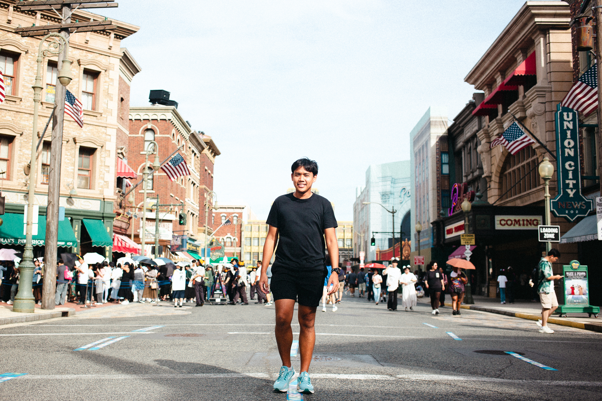
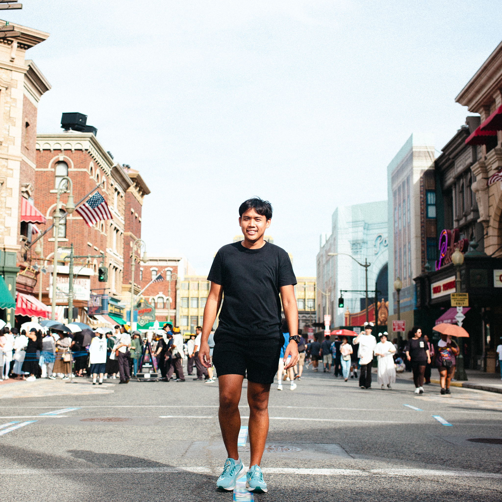

<!--  -->

Alright, let’s break the ice! Beyond the research papers and tech jargon, here’s the real scoop about me:

I’m a tech enthusiast with a serious passion for using technology to make the world a better place. When I’m not buried in code or geeking out over the latest tech, you might find me lacing up my running shoes or gearing up for a triathlon. Yep, marathons and triathlons are my thing—they keep me fit and remind me that anything’s possible with a little grit and a lot of sweat.

I’m a lifelong learner at heart. Whether it’s catching the latest tech trends, diving into new research, or just chatting with fellow nerds, I’m always on the lookout for the next big thing in technology.

But it’s not all work and no play. I love giving back to the community and am always up for volunteering at events that spark my interest. Connecting with people and making a difference is what keeps me motivated.

So, if you want to swap stories about the newest gadgets, discuss the latest research, or just chat about anything under the sun, hit me up at [panboonyuen.kao@gmail.com](mailto:panboonyuen.kao@gmail.com)!

<!-- 

 -->

**Kao Panboonyuen**