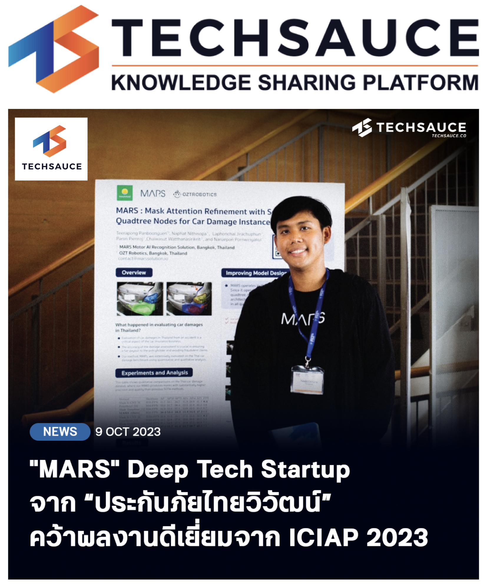

## AI Research Featured in Techsauce News

Honored to have my AI research featured in [Techsauce](https://techsauce.co/news/mars-deep-tech-startup-thaivivat-ai), Thailand’s leading tech media platform. The article showcases my work in advancing AI technologies, emphasizing innovation and impact in the field.

This recognition underscores the significance of AI research in driving technological progress and its application in real-world scenarios. I'm grateful for the opportunity to contribute to the evolving landscape of AI and look forward to future endeavors in this exciting field.

## 🚗 MARS: Revolutionizing Car Damage Segmentation

Proud to have our flagship model, MARS (Mask Attention Refinement with Sequential Quadtree Nodes), featured in [Techsauce News](https://techsauce.co/news/mars-deep-tech-startup-thaivivat-ai). This recognition underscores our commitment to advancing AI in the automotive insurance sector.

### 🔍 What is MARS?

MARS is a state-of-the-art deep learning model designed for precise car damage instance segmentation. By leveraging sequential quadtree attention, it surpasses existing methods like Mask R-CNN and PointRend, achieving notable improvements in segmentation accuracy.

### 🧠 MARSAIL: Driving Innovation

MARSAIL (Motor AI Recognition Solution Artificial Intelligence Laboratory) is dedicated to pioneering research at the intersection of computer vision, transformers, and automotive AI. Our mission is to revolutionize the automotive insurance and repair industries through AI-driven automation, delivering breakthroughs in segmentation, localization, and decision intelligence.

### 📈 Impact and Recognition

The feature in Techsauce News highlights the significance of our work in transforming the automotive insurance landscape. By integrating advanced AI models like MARS, we aim to enhance the accuracy and efficiency of car damage evaluation, paving the way for smarter, more automated insurance processes.

Explore more about MARS and MARSAIL's innovative solutions at [kaopanboonyuen.github.io/MARS/](https://kaopanboonyuen.github.io/MARS/).