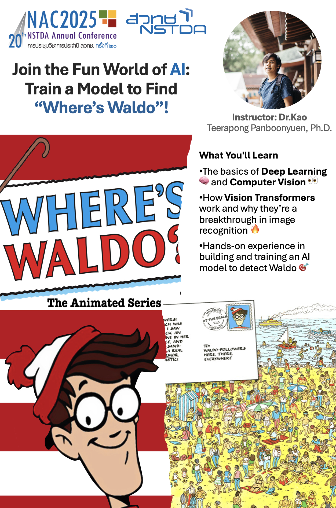
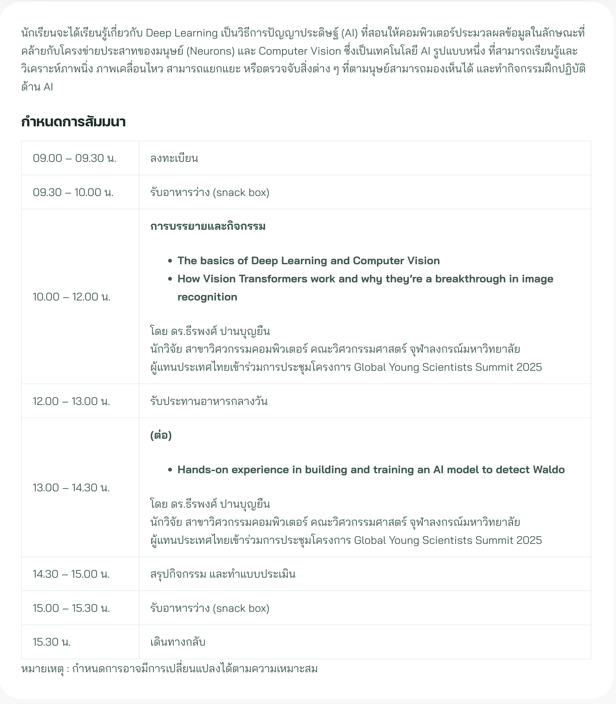

<!--  -->

## **Join the Fun World of AI: Train a Model to Find “Where’s Waldo”!**

Hey there, AI enthusiasts and curious minds! Are you ready to take a deep dive into the fascinating world of artificial intelligence? Get ready for a fun and hands-on experience where we’ll unravel the mysteries of **Deep Learning** 🧠, **Computer Vision** 👀, and **Vision Transformers**—the game-changing technology behind image recognition. But here’s the twist: we’re going to train an AI to solve the ultimate challenge—finding **Where’s Waldo**!

Yep, you heard it right. We’ll be combining cutting-edge AI techniques with a classic puzzle, and by the end of the session, you’ll be equipped to build and train an AI model that can spot Waldo in a sea of distractions. Ready to unlock the magic? Let’s go!



---

If this sounds exciting to you, don’t miss out on the chance to be part of this hands-on AI experience at **[NAC2025](https://www.nstda.or.th/nac/2025/)**. Whether you’re just starting to explore the world of artificial intelligence or looking to enhance your skills, this session is your perfect opportunity to learn, build, and innovate.

> Join me and other AI enthusiasts on **March 26th**, and together we’ll dive into this challenge while discovering the potential of AI in real-world applications. **Click [here](https://www.nstda.or.th/nac/2025/youth-activities/youth-activity-2/)** to secure your spot and be part of the future of AI-driven innovation at NAC2025. Let’s train some AI and find Waldo—together!

---

### **What You’ll Learn**

If you’ve ever wondered how self-driving cars “see” the world, or how facial recognition software works, you’re in for a treat. In this session, we’ll break down the essentials of **Deep Learning** and **Computer Vision**—two critical components that enable machines to understand and interpret the visual world, just like humans do.

1. **The Basics of Deep Learning**  
   At the core of modern AI, **Deep Learning** involves training algorithms to recognize patterns and make decisions based on data. We’ll start by exploring how these algorithms learn from massive datasets, allowing them to "see" and make sense of images, sounds, and even text.

2. **Understanding Computer Vision**  
   **Computer Vision** is a field within AI that teaches computers to interpret and analyze visual information from the world. It's the backbone behind everything from image classification to object detection, and it's what powers applications like Google Images, Snapchat filters, and even medical imaging. We’ll cover how vision systems break down images into recognizable patterns, enabling the AI to understand what it’s looking at.

3. **The Rise of Vision Transformers**  
   Here’s where it gets really cool. **Vision Transformers** (ViTs) have emerged as a breakthrough in image recognition. Unlike traditional Convolutional Neural Networks (CNNs), which process images in a grid-like manner, Vision Transformers work by treating images as sequences, similar to how we process language. These models capture global relationships within an image, allowing them to recognize complex patterns with remarkable accuracy. We’ll explore how ViTs work, and why they’re the future of computer vision.

4. **Building an AI Model to Find Waldo**  
   This is where you roll up your sleeves! In this hands-on segment, we’ll show you how to train an AI model to identify Waldo in various images. We’ll walk through the entire process—preparing the data, building the model, training it, and evaluating its performance. Along the way, we’ll use the power of **Vision Transformers** to detect Waldo, just like how cutting-edge AI models are trained to spot objects, faces, or animals in any image. It's going to be a blast as you watch your AI model get better and better at solving the “Where’s Waldo” puzzle!

### **Why Vision Transformers?**

So, why are we focusing on **Vision Transformers**? It all comes down to performance. Traditional CNNs have been the go-to for image recognition for years, but ViTs are changing the game. Here’s why they’re so exciting:

1. **Global Context Understanding**  
   Vision Transformers are great at understanding the entire image as a whole. Instead of focusing on small patches, like CNNs, ViTs look at the global context, allowing them to capture relationships between distant parts of an image. This makes them excellent for complex recognition tasks, like identifying Waldo in a crowded scene where he could be hiding behind multiple objects.

2. **Scalability**  
   Vision Transformers scale well with large datasets, which is essential for training models on more complex images. They can process thousands of images simultaneously, learning from a massive variety of examples to improve their performance. So, whether you’re training a model to find Waldo or doing more advanced tasks like facial recognition, ViTs can handle it.

3. **Adaptability**  
   ViTs are highly adaptable to various image types and problems. Whether you’re working with low-resolution images or high-quality satellite photos, Vision Transformers can be fine-tuned to deliver impressive results across different domains.

### **Hands-on: Training Your Own “Where’s Waldo” Model**

Now that we’ve got the basics covered, it’s time to get your hands dirty! During this interactive session, you’ll have the chance to train your very own AI model. Here’s a sneak peek at the process:

1. **Preparing the Data**  
   Before we can train our AI, we need to prepare a dataset of images featuring Waldo. You’ll learn how to curate and preprocess images for training—an essential skill for any AI project. You’ll also get hands-on experience labeling images to help your model recognize Waldo in the wild.

2. **Building the Model**  
   Once we have the data, we’ll build our **Vision Transformer** model from scratch. You’ll learn the key concepts behind Vision Transformers—how they work, what makes them different from traditional CNNs, and why they’re so powerful for image recognition.

3. **Training the Model**  
   This is where the magic happens. We’ll train our model using the images and labels you’ve prepared. You’ll see how the model starts to “learn” and get better at recognizing Waldo over time. We’ll guide you through each step, from selecting the right optimizer to tuning the model’s hyperparameters for maximum performance.

4. **Evaluating the Results**  
   After training your model, it’s time to evaluate how well it does at finding Waldo in new, unseen images. We’ll show you how to measure accuracy and fine-tune the model to improve its performance. You’ll walk away with a trained model that can spot Waldo with impressive accuracy.

### **What’s the Big Deal About “Where’s Waldo”?**

You might be wondering, why use a “Where’s Waldo” puzzle to teach AI? The answer is simple: it’s a fun, relatable challenge that’s perfect for learning the basics of image recognition. But it’s also a great example of real-world AI applications, where the task is to identify a specific object (Waldo) in a noisy environment (a crowded scene). By building this model, you’re learning the same techniques that power cutting-edge AI applications used by companies like Google, Facebook, and even self-driving car manufacturers!

### **Why You Should Join Us**

This isn’t just another dry lecture on AI. This is your chance to:

- **Learn in a fun, hands-on environment** with practical examples you can apply to your own projects.
- **Master the basics of deep learning and computer vision** while exploring one of the most exciting advancements in AI.
- **Get a taste of the future** by learning about Vision Transformers, a breakthrough technology that’s revolutionizing image recognition.
- **Walk away with a trained AI model** you can proudly say you built yourself!

Whether you're a beginner eager to learn about AI or someone looking to deepen your understanding of computer vision, this session is for you. So, come join the fun, unleash your creativity, and let’s train a model that finds Waldo in no time! 🚀

---

Looking forward to seeing you at NAC2025, where AI meets fun! Let’s make the world of AI an adventure, one Waldo at a time! 🎯

---

### **Meet Me at NAC2025: Where's Waldo AI Challenge on March 26th!**

Get ready for a one-of-a-kind experience at **NAC2025**—the 20th NSTDA Annual Conference! While the conference runs from **March 26-28, 2025**, **I’m inviting you to join me on March 26th** for an exclusive, hands-on session where we’ll dive deep into the world of **AI and computer vision** with the ultimate challenge: **Finding Where’s Waldo!** 🎯

At **NAC2025**, we’re exploring how AI is transforming industries and driving a more sustainable future for Thailand. But on **March 26th**, I’m turning the spotlight on a super fun and interactive topic—teaching AI to spot **Waldo** in a crowd! With **Vision Transformers** and **Deep Learning**, we’ll break down how AI can “see” the world just like humans and even find that elusive red-and-white-striped figure hiding among distractions.

So, if you’re ready to learn the basics of AI, dive into **computer vision**, and have a blast solving the “Where’s Waldo?” puzzle, don’t miss this exclusive event on March 26th! The rest of the **NAC2025** conference is packed with innovation, but this hands-on workshop is your chance to get involved, ask questions, and **train your very own AI model**. Trust me, it’s going to be a lot of fun! 

See you there on March 26th—let's crack the code and find Waldo together! 🔍

---

## **References**

- **Where's Waldo Dataset**: [Kaggle - Where's Waldo](https://www.kaggle.com/datasets/residentmario/wheres-waldo)
- **Finding Waldo - A Primer**: [Kaggle - Finding Waldo](https://www.kaggle.com/code/residentmario/finding-waldo-a-primer)

### **Image Credits**
- [IMDB - Where's Waldo (1992 TV series)](https://www.imdb.com/title/tt0213376/)
- [Where's Waldo - Book on Amazon](https://www.amazon.in/Wheres-Waldo-Martin-Handford/dp/153621065X)

---