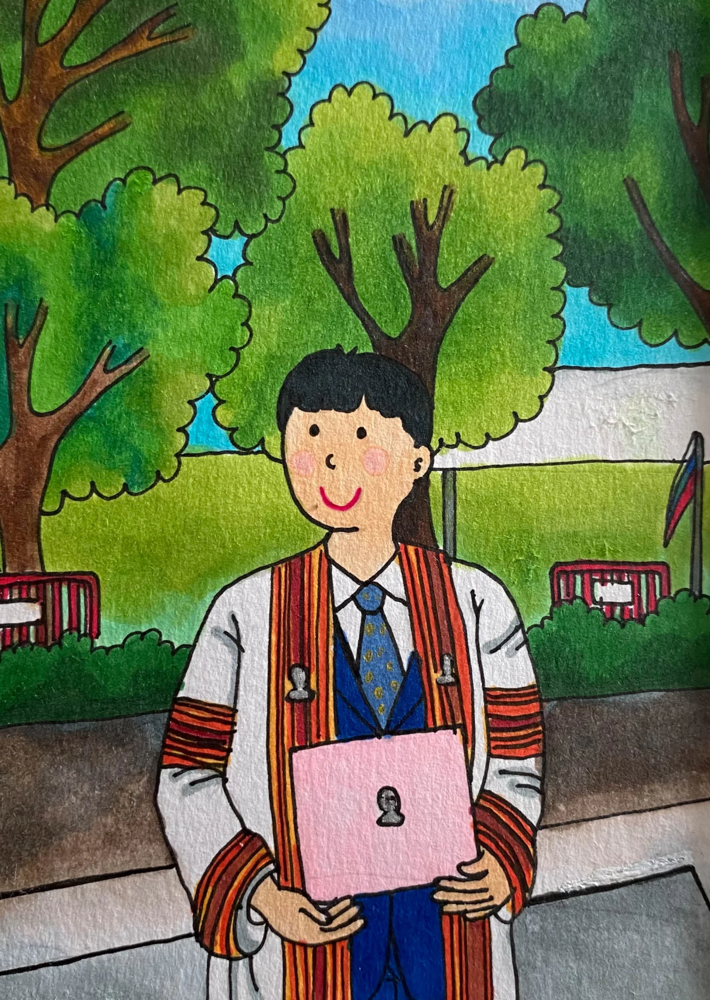

## 🎓 Ph.D. Dissertation Defense – Triumphant

On **July 9, 2020**, I successfully defended my Ph.D. dissertation titled *"Semantic Segmentation on Remotely Sensed Images Using Deep Convolutional Encoder-Decoder Neural Network"* before a distinguished committee of Thai professors, each of whom earned their doctoral degrees from world-renowned international universities.

🔗 **Check out my full presentation slides here:**
👉 [Ph.D. Defense Slides](https://kaopanboonyuen.github.io/files/panboonyuen_phd_defense_2020.pdf)

> This moment was a culmination of years of hard work and dedication, made even more meaningful by the opportunity to present my research to such respected scholars. Their insightful feedback and support reinforced the importance of collaboration and intellectual exchange in pushing the boundaries of knowledge and technology.

The list below shows the names of those who submitted their final Ph.D. dissertations, and as part of the class of 2017 (student ID: 6071467821), I am proud to highlight that I completed my Ph.D. in Artificial Intelligence in just two and a half years, graduating in 2019. 

This achievement is a testament to my dedication, relentless work ethic, and passion for the field. It was a journey that demanded focus, time management, and the ability to push the boundaries of what was possible within an accelerated timeline.

> I am immensely proud of the way I tackled this challenge, which not only sharpened my technical skills but also refined my communication and problem-solving abilities.

Reflecting on this journey, I am deeply grateful for the unwavering commitment I gave to my work. Completing my Ph.D. in such a short time was no easy feat, but it taught me invaluable lessons in resilience, focus, and perseverance. This experience has prepared me to take on complex challenges and contribute meaningfully to the ever-evolving field of AI.

🧠 The research focused on applying deep learning techniques—specifically convolutional encoder-decoder architectures—for high-accuracy semantic segmentation in remotely sensed imagery, pushing the boundaries of geospatial AI.

🔗 **Explore the full dissertation, source code, and project resources here:**  
👉 [https://kaopanboonyuen.github.io/FusionNetGeoLabel/](https://kaopanboonyuen.github.io/FusionNetGeoLabel/)

🔗 **Interested in the full presentation slides? You can view them here:**  
👉 [Ph.D. Defense Slides](https://kaopanboonyuen.github.io/files/panboonyuen_phd_defense_2020.pdf)

---

After successfully defending my Ph.D. in Artificial Intelligence, I gained a deep and comprehensive understanding of advanced AI methodologies, particularly in the areas of computer vision, deep learning, and semantic segmentation.

 My research on "Semantic Segmentation on Remotely Sensed Images Using Deep Convolutional Encoder-Decoder Neural Networks" has not only enhanced my technical expertise but also refined my ability to tackle complex, real-world problems with innovative solutions. 

> The experience of defending my dissertation to a panel of esteemed experts further strengthened my communication and collaboration skills, allowing me to explain intricate concepts clearly while receiving valuable feedback. 

This journey has instilled in me a strong analytical mindset and a relentless drive for excellence, preparing me to contribute meaningfully to cutting-edge AI projects and teams.

---

### PhD Journey: A Milestone Achieved

On May 19, 2022, I proudly completed my PhD at Chulalongkorn University, closing a remarkable chapter in my academic journey. This milestone was not just a moment of personal triumph, but also a time of reflection and deep gratitude. 

> Graduating with a doctoral degree was a dream realized, filled with emotions that I will carry with me forever.

Throughout this journey, I was fortunate to have the unwavering support of incredible mentors, advisors, colleagues, and friends. Their guidance and encouragement were instrumental in my success, and having them by my side on this special day was a poignant reminder of the profound impact they've had on both my academic and personal development.

<!--  -->

> Completing a PhD is more than just an academic achievement; it's a journey of personal growth. It demands perseverance, resilience, and the ability to navigate and overcome numerous challenges. 

My passion for machine learning and my commitment to research were the driving forces that kept me moving forward, enabling me to make meaningful contributions to the field.

### PhD Thesis Highlights

## Introduction

Semantic segmentation in remote sensing images plays a crucial role in applications such as land use classification, urban planning, and environmental monitoring. Remote sensing images often come from diverse sources, ranging from medium-resolution satellite imagery (such as Landsat-8) to high-resolution aerial images (such as those from the ISPRS Vaihingen Challenge). However, the task of semantic segmentation remains challenging due to the variety of image scales, the scarcity of labeled data, and the need for models capable of extracting both high-level and low-level features effectively.

> In my PhD research, I propose a series of advancements in convolutional neural network (CNN)-based approaches to enhance the accuracy of semantic segmentation on remotely sensed data. Building upon the state-of-the-art methods, I introduce several innovations, including an enhanced **Global Convolutional Network (GCN)** with channel attention, **domain-specific transfer learning**, and the integration of **feature fusion** and **depthwise atrous convolutions**. 

These innovations aim to address the unique challenges of remote sensing datasets and push the boundaries of semantic segmentation performance.

## The Challenge: Limitations of Traditional Approaches

Semantic segmentation models, particularly Deep Convolutional Encoder-Decoder (DCED) networks, have shown promise in image segmentation tasks. However, when applied to remote sensing imagery, these models face key limitations:

1. **Resolution Differences**: Remote sensing images span a wide range of resolutions, from very high-resolution (VHR) aerial images to medium-resolution satellite images. Traditional models, designed for single-resolution tasks, struggle to generalize across these diverse scales.
   
2. **Data Scarcity**: Annotated datasets for training deep models are scarce, particularly for high-resolution satellite or aerial imagery. This leads to overfitting and poor generalization.

3. **Inability to Capture Global Context**: Traditional CNN models focus on local features, which are insufficient for understanding global context in satellite images, such as large rivers, forests, or urban areas.

## Methodology

### Global Convolutional Network (GCN) with Enhanced Backbone

The **Global Convolutional Network (GCN)** is a modern CNN architecture that addresses the limitations of traditional models. GCN overcomes the challenge of capturing both local and global features by using a multi-level architecture. Each level in the GCN extracts features at different resolutions, ensuring that both fine-grained and broad contextual information are captured.

This can be written as:

$$
\mathbf{F}_{\text{GCN}} = \sum \mathbf{W}_l \cdot \mathbf{X}_l
$$

Building on this architecture, I proposed an enhancement to the GCN backbone by modifying its structure and increasing the number of layers, making it more suitable for medium-resolution remote sensing imagery. Specifically, I employed the **ResNet** architecture with varying depths—ResNet50, ResNet101, and ResNet152—to adapt the model to different datasets and resolutions.

#### Key Contributions:
- **Multi-resolution Feature Extraction**: By stacking multiple convolutional layers at different stages, the GCN captures features across multiple resolutions.
- **Boundary Refinement**: A boundary refinement module is introduced to improve the precision of segmentation boundaries, crucial for tasks like building or road detection.

### Channel Attention Mechanism

One of the most significant advancements in my work is the introduction of the **Channel Attention Block**. Attention mechanisms, inspired by the human visual system, allow the model to focus on the most important features in the image. In the case of remote sensing images, this means highlighting key features such as roads, rivers, or vegetation, while suppressing irrelevant background information.

The attention mechanism is mathematically modeled as:

$$
\mathbf{z}_c = \sigma\left( W_c \cdot \text{AvgPool}(\mathbf{x}_c) + b_c \right)
$$

The **channel attention block** modifies the network's weights to prioritize the most discriminative channels during feature extraction, improving the network’s ability to differentiate between different land cover types. This is crucial in remote sensing, where the subtle difference between similar features (e.g., different vegetation types) can significantly impact segmentation accuracy.

#### Key Contributions:
- **Adaptive Feature Selection**: The network dynamically adjusts the importance of features, focusing on those most relevant to the task at hand.
- **Improved Discriminative Power**: By emphasizing discriminative features, the model is able to achieve higher classification accuracy, particularly for challenging classes in remote sensing datasets.

### Domain-Specific Transfer Learning

One of the challenges in training deep learning models for remote sensing is the scarcity of annotated data, particularly for high-resolution images. To address this, I introduced **Domain-Specific Transfer Learning**. This technique involves leveraging pre-trained models from different but related datasets to transfer knowledge across domains.

By utilizing pre-trained models from one dataset (e.g., ISPRS Vaihingen) and applying them to another (e.g., Landsat-8), I was able to mitigate the data scarcity issue and improve the performance of my models. This approach ensures that knowledge gained from one domain can benefit another, allowing the model to generalize better with limited annotated data.

#### Key Contributions:
- **Cross-Domain Knowledge Transfer**: Knowledge learned from high-resolution datasets is transferred to medium-resolution tasks, significantly improving segmentation accuracy with minimal labeled data.
- **Pre-Trained Weights Utilization**: The use of pre-trained weights from different datasets enables the model to learn features that are generalizable across various remote sensing tasks.

### Feature Fusion and Depthwise Atrous Convolution

To further refine feature extraction and improve segmentation performance, I introduced **Feature Fusion** and **Depthwise Atrous Convolution (DA)**. These techniques work synergistically to enhance the model's ability to capture multi-scale information while maintaining high resolution.

- **Feature Fusion**: This technique fuses low-level features, such as edges and textures, from the backbone network with high-level features from the segmentation model. This fusion ensures that fine-grained details are preserved while providing the model with a richer set of features for segmentation.

$$
\mathbf{F}_{\text{fused}} = \mathbf{F}_L + \alpha \cdot \mathbf{F}_H
$$
  
- **Depthwise Atrous Convolution**: The DA module applies dilated convolutions at multiple scales, enabling the network to capture contextual information over larger areas without losing spatial resolution. This is particularly important for remote sensing tasks where object boundaries (e.g., between forest and water) need to be sharply delineated.

The Depthwise Atrous Convolution is mathematically expressed as:

$$
y_d = \sum_{k} w_k \cdot x_{i + r \cdot k}
$$

#### Key Contributions:
- **Improved Feature Representation**: By integrating low-level features with deep model representations, the model gains a more comprehensive understanding of the image.
- **Enhanced Contextual Understanding**: The DA module allows the network to consider broader context in each layer, improving segmentation accuracy, especially for large objects and distant features.

## Experiments and Results

### Datasets

I conducted experiments on three benchmark datasets:
1. **ISPRS Vaihingen Challenge Dataset** (Very High Resolution)
2. **Landsat-8 Satellite Imagery** (Medium Resolution)
3. **Private Datasets** from GISTDA (Geo-Informatics and Space Technology Development Agency)

These datasets represent a mix of very high-resolution and medium-resolution imagery, which provided a comprehensive testbed for evaluating the effectiveness of my proposed methods.

### Performance Metrics

The model was evaluated using standard segmentation metrics:

#### 1. **F1 Score**:
The F1 Score measures the balance between **Precision** and **Recall**, and is calculated as:

$$
F1 = 2 \cdot \frac{\text{Precision} \cdot \text{Recall}}{\text{Precision} + \text{Recall}}
$$

Where:
- **Precision** is the fraction of relevant instances among the retrieved instances:
  
$$
\text{Precision} = \frac{TP}{TP + FP}
$$

- **Recall** is the fraction of relevant instances that have been retrieved over the total amount of relevant instances:
  
$$
\text{Recall} = \frac{TP}{TP + FN}
$$

##### Example: **Pineapple Class**
For the **pineapple** class:
- \( TP = 50 \)
- \( FP = 10 \)
- \( FN = 15 \)

We calculate **Precision**:

$$
\text{Precision} = \frac{50}{50 + 10} = 0.8333
$$

And **Recall**:

$$
\text{Recall} = \frac{50}{50 + 15} = 0.7692
$$

Now calculate the **F1 Score**:

$$
F1 = 2 \cdot \frac{0.8333 \cdot 0.7692}{0.8333 + 0.7692} = 0.799
$$

Thus, the **F1 Score** for the pineapple class is **0.799**.

---

#### 2. **Mean IoU (Intersection over Union)**:
The **IoU** quantifies the overlap between the predicted and true segmentation maps:

$$
IoU = \frac{TP}{TP + FP + FN}
$$

##### Example: **Corn Class**
For the **corn** class:
- \( TP = 80 \)
- \( FP = 5 \)
- \( FN = 20 \)

We calculate the **IoU**:

$$
IoU = \frac{80}{80 + 5 + 20} = 0.7619
$$

Thus, the **IoU** for the corn class is **0.7619**.

---

#### 3. **Mean IoU for Multiple Classes**:
For evaluating the **Mean IoU** over multiple classes (e.g., pineapple, corn, pararubber), we compute the average IoU:

$$
\text{Mean IoU} = \frac{IoU_{\text{pineapple}} + IoU_{\text{corn}} + IoU_{\text{pararubber}}}{3}
$$

Using the IoUs for each class:
- IoU for pineapple = 0.799
- IoU for corn = 0.7619
- IoU for pararubber = 0.85

We get the **Mean IoU**:

$$
\text{Mean IoU} = \frac{0.799 + 0.7619 + 0.85}{3} = 0.8036
$$

Thus, the **Mean IoU** across all classes is **0.8036**.

---

### Results

The proposed model significantly outperformed baseline models, including traditional Deep Convolutional Encoder-Decoder (DCED) networks, across all datasets:
- **ISPRS Vaihingen Dataset**: F1 Score of **0.9362**
- **Landsat-8 Dataset**: F1 Score of **0.9114**

The proposed model consistently exceeded the **90% F1 score** threshold across all classes, demonstrating its robustness and adaptability to different image resolutions and domains.

## Conclusion

> This research introduces several key advancements in deep learning for remote sensing semantic segmentation. By incorporating multi-resolution feature extraction, channel attention, domain-specific transfer learning, feature fusion, and depthwise atrous convolutions, my approach addresses the unique challenges posed by remote sensing data. 

The experimental results validate the effectiveness of these techniques, providing a solid foundation for further improvements in remote sensing applications.

With the successful application of these methods, I am confident that these innovations will contribute significantly to the field of remote sensing and provide new avenues for improving the accuracy and generalization of deep learning models in this domain.

> Explore more about my PhD story [here](https://kaopanboonyuen.wordpress.com/2022/05/23/the-phd-journey/).

**Kao Panboonyuen**