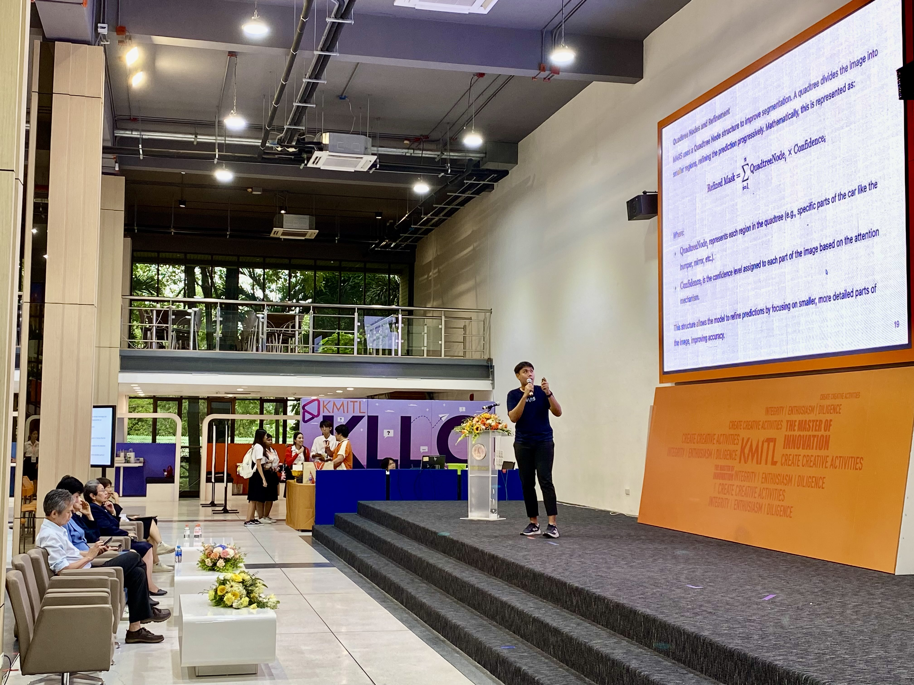

## Introduction

🚗💡 This Sunday (March 30, 2025), if you're around Ladkrabang, come join us for a math talk! 📚💬 We’ll dive deep into the fascinating world of Vision Transformers (ViTs) and their applications in car insurance AI. It's an exciting opportunity to explore how advanced mathematical techniques are driving the future of AI in the insurance industry. Don’t miss out—join us for this insightful session!

Topic: Mathematical Foundations of Vision Transformers in Car Insurance AI  
🕐 Time: 1:00 PM  

📍 Location: [Event Location](https://www.facebook.com/photo?fbid=1192313742905954&set=a.490286653108670)

---

In recent years, Vision Transformers (ViTs) have emerged as one of the most powerful models in the field of deep learning, particularly in tasks involving image recognition. This blog post explores the mathematical foundations of ViTs and their application in car insurance AI, with a focus on improving accuracy in claims prediction. We will cover key concepts such as the self-attention mechanism, custom loss functions, and how large language models (LLMs) could further enhance these AI systems. By the end of this article, you’ll have a deeper understanding of how cutting-edge AI technologies are reshaping the insurance industry.

## Vision Transformers: A Mathematical Overview

### The Transformer Architecture

At the heart of Vision Transformers lies the Transformer architecture, which was originally designed for natural language processing tasks. Unlike traditional convolutional neural networks (CNNs), which rely on convolutional layers to process spatial data, ViTs treat an image as a sequence of patches and apply self-attention to learn relationships between these patches.

The image is divided into non-overlapping patches, each of which is flattened into a vector. These patch vectors are then embedded into a higher-dimensional space. The idea is that these embedded patches will be processed as a sequence, similar to how words in a sentence are processed in NLP tasks. This sequence is passed through layers of self-attention, where the model learns how to focus on different parts of the image depending on their relevance.

### Self-Attention Mechanism

The self-attention mechanism is what allows Vision Transformers to capture complex relationships between distant regions of the image. In a standard convolutional network, filters are used to detect local patterns in the image. However, in ViTs, the self-attention mechanism dynamically determines the importance of each patch relative to others. This makes it possible for the model to capture long-range dependencies and subtle patterns across the entire image, rather than focusing only on local features.

By applying this mechanism, Vision Transformers can give more weight to certain parts of the image that are more relevant for the task at hand, whether it’s identifying damage in a vehicle or classifying certain types of claims.

## Custom Loss Functions for Car Insurance AI

### The Need for Custom Loss Functions

In the context of car insurance, traditional loss functions like cross-entropy are not always ideal. For instance, car insurance claims often involve rare and highly specific damage types that are underrepresented in training datasets. This creates a class imbalance issue, where the model may not perform well on minority classes, such as rare types of damage or low-frequency events.

To address this, custom loss functions are developed to weight certain classes higher than others, ensuring that the model focuses on less frequent but equally important classes. This type of custom loss function helps improve prediction accuracy, particularly in a domain like insurance, where predicting the likelihood of rare events is just as crucial as predicting common ones.

### Mean Squared Error for Regression Tasks

In some cases, car insurance AI needs to predict continuous values, such as the cost of repair. For such tasks, a loss function like Mean Squared Error (MSE) is commonly used. This loss function measures the difference between the predicted and true values, with the aim of minimizing this error. Using MSE ensures that the model’s predictions are as close as possible to the actual values, which is critical when estimating damage repair costs.

## Integrating Large Language Models (LLMs) for Enhanced AI

The integration of Large Language Models (LLMs) like GPT-4 with Vision Transformers can open up new possibilities for multi-modal AI systems. In car insurance, LLMs can process textual data—such as customer reports, claim descriptions, and policy documents—while ViTs handle visual data like images of the damaged vehicle.

By combining these two modalities, we can create a system that not only understands visual information but also the context behind it. For example, an LLM could help interpret the description of an accident or read through a claim submission and make sense of the visual evidence provided by the ViT. This multi-modal approach enhances decision-making, enabling more accurate claim assessments and better customer experiences.

## Conclusion

Vision Transformers are revolutionizing AI in the car insurance industry by enabling the accurate and efficient processing of complex visual data. By leveraging advanced mathematical concepts like self-attention and custom loss functions, we can build AI models that are more accurate and robust, even when dealing with rare and highly variable data. The potential for combining ViTs with LLMs represents the next frontier in AI, making it possible to create systems that understand both images and text, paving the way for more intelligent, automated solutions in car insurance.

---

## References

1. Vaswani, A., Shazeer, N., Parmar, N., Uszkoreit, J., Jones, L., Gomez, A. N., Kaiser, Ł., & Polosukhin, I. (2017). *Attention is All You Need*. In Advances in Neural Information Processing Systems (NeurIPS 2017). [Link to Paper](https://arxiv.org/abs/1706.03762)

2. Dosovitskiy, A., Berman, M., & Hinton, G. E. (2020). *An Image is Worth 16x16 Words: Transformers for Image Recognition at Scale*. In Proceedings of the International Conference on Machine Learning (ICML 2020). [Link to Paper](https://arxiv.org/abs/2010.11929)

3. Brown, T. B., Mann, B., Ryder, N., Subbiah, M., Kaplan, J., Dhariwal, P., Neelakantan, A., Shinn, N., & others. (2020). *Language Models are Few-Shot Learners*. In Proceedings of NeurIPS 2020. [Link to Paper](https://arxiv.org/abs/2005.14165)

4. OpenAI. (2023). *GPT-4 Technical Report*. [Link to Paper](https://arxiv.org/abs/2303.08774)

---