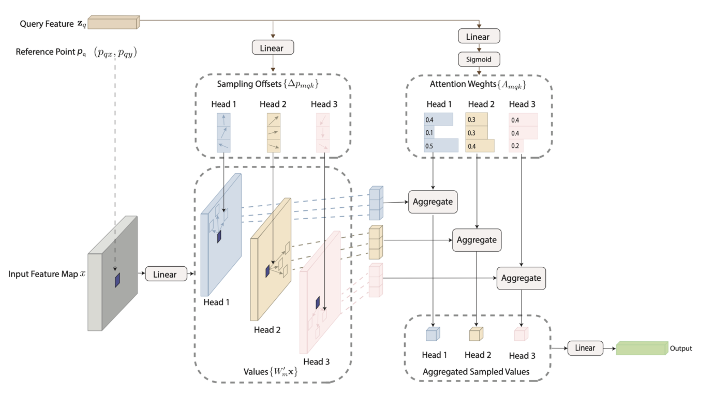

### **DOTA: Deformable Optimized Transformer Architecture for End-to-End Text Recognition with Retrieval-Augmented Generation**

#### **Abstract**

Text recognition in natural images remains one of the most challenging yet essential tasks within the fields of computer vision and natural language processing. With applications ranging from document digitization to autonomous navigation, effective text recognition is more critical than ever before. In this paper, we introduce **DOTA**, a novel end-to-end framework that combines ResNet and Vision Transformer (ViT) backbones with advanced methodologies such as **Deformable Convolutions**, **Retrieval-Augmented Generation**, and **Conditional Random Fields (CRF)** to significantly enhance Optical Character Recognition (OCR) performance.

At the heart of DOTA is a revolutionary approach where traditional convolution layers in the third and fourth blocks of the network are replaced with **Deformable Convolutions**—a technique that offers adaptive and robust feature extraction, making it ideal for recognizing text in complex and irregular layouts. Furthermore, **adaptive dropout** is integrated to ensure regularization, helping to prevent overfitting and boosting generalization. To refine the sequential modeling of text, we leverage **CRFs**, which excel in capturing intricate dependencies inherent in text recognition tasks.

We conducted extensive experiments on six benchmark OCR datasets—IC13, IC15, SVT, IIIT5K, SVTP, and CUTE80. Our results demonstrate the exceptional performance of DOTA, achieving remarkable accuracies:  
- **IC13**: 97.32%  
- **IC15**: 58.26%  
- **SVT**: 88.10%  
- **IIIT5K**: 74.13%  
- **SVTP**: 82.17%  
- **CUTE80**: 66.67%

This gives us an **average accuracy of 77.77%**, setting a new state-of-the-art in the field of text recognition. The results clearly highlight the robustness of DOTA across a variety of challenging datasets.

#### **Introduction**

Text recognition from images has long been a challenging problem, with significant implications for applications in document processing, automated data entry, and even autonomous systems. With traditional **Optical Character Recognition (OCR)** systems heavily relying on **Convolutional Neural Networks (CNNs)**, we’ve seen progress in extracting features from images. However, as text layouts become more complex—such as when dealing with varying fonts, orientations, and complex backgrounds—CNNs often fall short. Enter the **Transformer architectures**: these models have revolutionized many areas in computer vision, particularly in handling long-range dependencies through their self-attention mechanisms, offering significant improvements for text recognition tasks.

While Transformer-based models have pushed the boundaries of OCR performance, there is still a need for further improvements, especially in the area of feature extraction and sequence modeling. That's where **DOTA** comes in. By combining the strengths of **ResNet** and **Vision Transformer (ViT)** backbones, this novel approach leverages **Deformable Convolutions**, **Retrieval-Augmented Generation**, and **Conditional Random Fields (CRF)** to achieve new levels of OCR accuracy.

#### **The DOTA Framework**

The architecture of DOTA is designed to enhance both feature extraction and sequence modeling, key areas in text recognition:

1. **Deformable Convolutions**: By replacing standard convolutions in the network’s third and fourth blocks with **Deformable Convolutions**, we allow for more flexible and adaptive feature extraction. This helps capture irregular text patterns and varying layouts more effectively.
   
2. **Retrieval-Augmented Generation**: The integration of this approach provides context-aware enhancements, further refining the recognition process.

3. **Conditional Random Fields (CRFs)**: CRFs have been incorporated into the framework to better model the sequential nature of text, providing the necessary context to improve recognition accuracy, especially for more complex sequences of characters.

Together, these components form the backbone of **DOTA**, providing a more robust, adaptable, and precise model for OCR tasks. The effectiveness of DOTA is clearly demonstrated in its impressive performance across several standard OCR benchmark datasets.

#### **Experimental Results**

We evaluated DOTA using six widely-used OCR benchmark datasets:
- **IC13**: 97.32%
- **IC15**: 58.26%
- **SVT**: 88.10%
- **IIIT5K**: 74.13%
- **SVTP**: 82.17%
- **CUTE80**: 66.67%

With an average accuracy of 77.77%, DOTA has set a new state-of-the-art in OCR performance. The results show that the combination of Deformable Convolutions, Vision Transformers, and CRFs significantly improves recognition, even in challenging conditions where traditional methods struggle.

#### **Conclusion**

The DOTA framework represents a major leap forward in the field of text recognition. By effectively combining ResNet and Vision Transformer backbones with advanced techniques like **Deformable Convolutions**, **Retrieval-Augmented Generation**, and **Conditional Random Fields**, it achieves impressive accuracy across a variety of challenging datasets. This work sets a new benchmark for OCR performance, providing a powerful tool for tackling the complexities of text recognition in real-world scenarios. 

With this new approach, we’ve laid the foundation for even more accurate and robust text recognition systems, paving the way for smarter applications in everything from document processing to autonomous navigation.

---