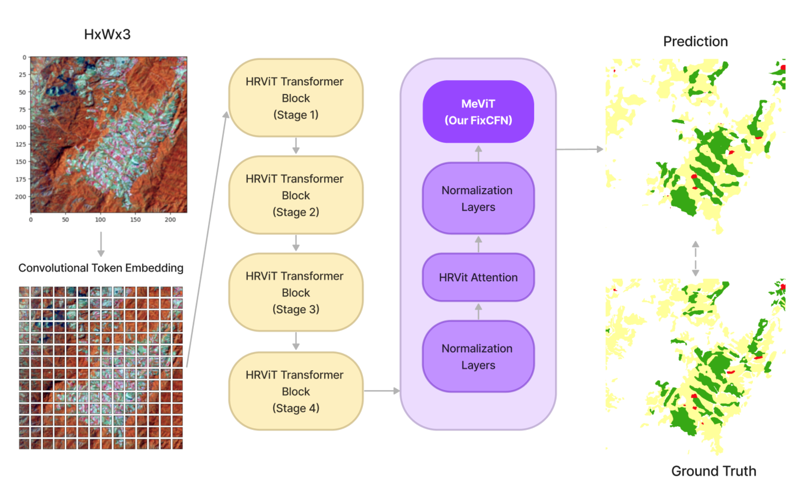
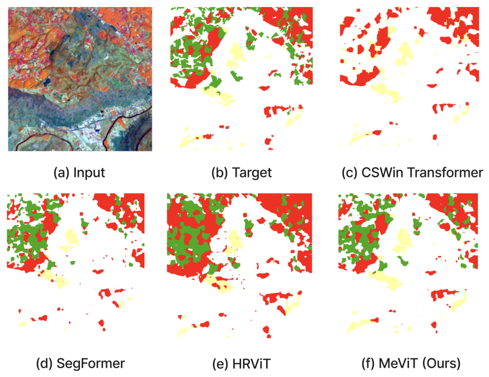



## Introduction

Semantic segmentation is vital in remote sensing, particularly for identifying and categorizing different land use and land cover types. In regions like Thailand, where agriculture is central to the economy, precise segmentation of satellite imagery can enhance our ability to track crop health, predict yields, and improve resource management. Our model, *MeViT* (Medium-Resolution Vision Transformer), is specifically designed to classify agricultural crops like para rubber, corn, and pineapple across Thailand’s varied landscapes.

## Background on Vision Transformers

Unlike traditional convolutional neural networks (CNNs), which are excellent at capturing local spatial hierarchies, Vision Transformers excel at modeling long-range dependencies through self-attention mechanisms. This unique structure allows *MeViT* to interpret both local and global features, enhancing its effectiveness in agricultural land segmentation tasks where accuracy and detail are paramount.

## MeViT Architecture

*MeViT* leverages a multi-branch architecture tailored for medium-resolution images, balancing computational efficiency with high-quality feature extraction. This design approach enables the model to capture details across multiple spatial scales, which is crucial for segmenting complex land use patterns in agricultural imagery.

In particular, the revised mixed-scale convolutional feedforward network (MixCFN) in *MeViT* incorporates multiple depth-wise convolution paths, further refining feature extraction by allowing the model to focus on different spatial scales. This enhanced architecture achieves an efficient trade-off between model complexity and performance, making it well-suited for large-scale image analysis tasks.

## Experimental Results and Evaluation

We extensively tested *MeViT* on Thailand’s Landsat-8 dataset, focusing on para rubber, corn, and pineapple classifications. Compared to other models, including state-of-the-art architectures like HRViT and SegFormer, *MeViT* demonstrated notable improvements in precision and segmentation accuracy, proving its efficacy in challenging, real-world datasets. This establishes *MeViT* as a leading tool in medium-resolution satellite imagery analysis, surpassing previous Vision Transformer models and CNN-based methods in delivering high-quality semantic segmentation.

## Conclusion

*MeViT* presents a significant advancement in Vision Transformer applications, setting a new standard for semantic segmentation in remote sensing. By combining multi-branch ViT architectures with optimized convolutional modules, *MeViT* delivers efficient, accurate LULC classification on satellite imagery, supporting agricultural insights and sustainable resource management across Thailand. This work contributes to the broader field of environmental monitoring and opens up new possibilities for enhanced remote sensing techniques globally.