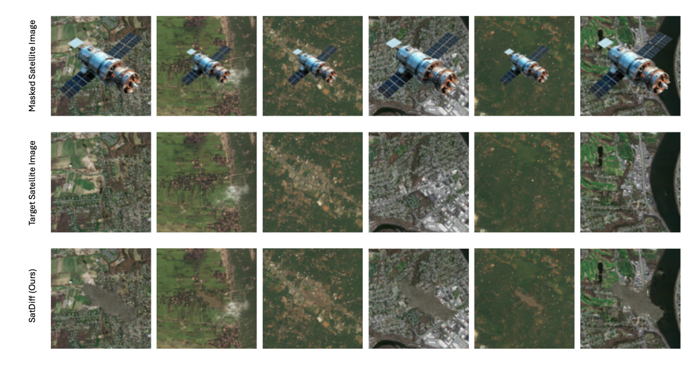
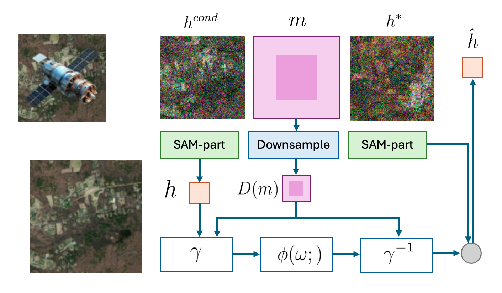
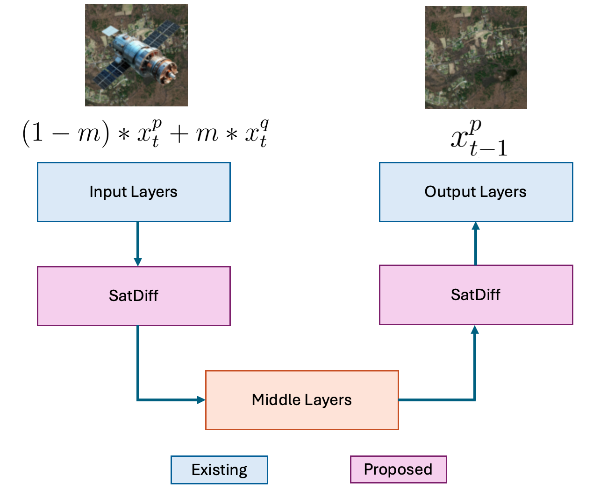
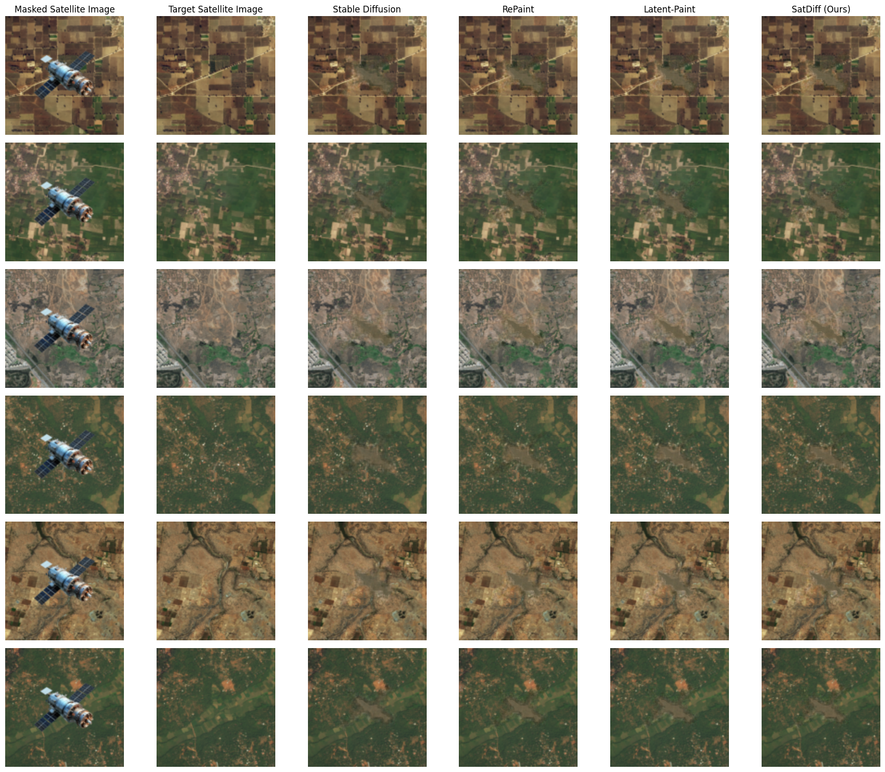
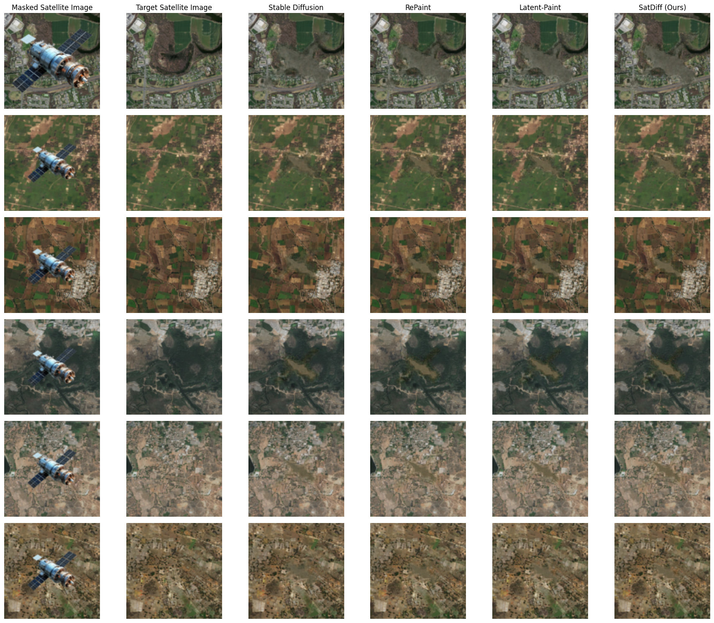
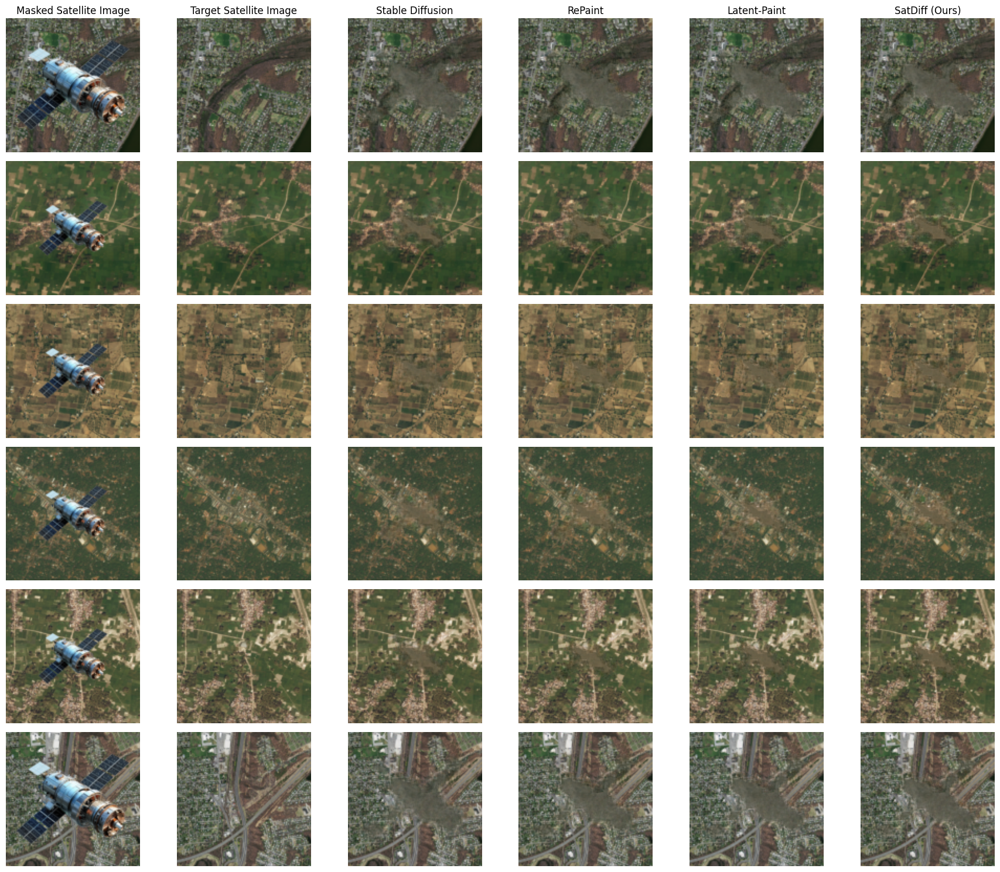

## Keywords

- Diffusion Models
- High-Resolution Satellite Imagery
- Inpainting
- Latent Space Conditioning
- Remote Sensing
- Stable Diffusion
- Satellite Image Restoration
- Very High-Resolution Images

## Introduction

Satellite image inpainting is a crucial process in remote sensing, aimed at recovering missing or damaged areas to ensure precise data analysis. Satellite images are often affected by occlusions from factors like clouds, atmospheric disturbances, or physical obstructions, making it challenging to obtain fully clear and complete data. To overcome these challenges, especially in high-resolution satellite imagery, effective inpainting methods are required that can reconstruct the missing portions while maintaining the overall structural coherence of the image.

Diffusion models have emerged as powerful tools in image inpainting, representing a significant advancement in the field. They have been applied to a wide array of tasks, such as object removal, generative inpainting with contextual attention, and addressing semantic differences between masked and unmasked regions. These models excel in maintaining structural consistency while producing high-quality restorations, making them effective for complex tasks, such as video inpainting, text-based object removal, and sketch-based inpainting.

In recent years, diffusion models have become prominent for image inpainting due to their ability to generate high-fidelity results. Traditionally, inpainting with diffusion models has been approached through either preconditioned or postconditioned techniques. Preconditioned models are designed explicitly for inpainting tasks, enabling efficient inference but requiring extensive domain-specific training. In contrast, postconditioned models do not necessitate retraining but involve slower inference, as they rely on multiple forward-backward iterations to achieve optimal solutions.

The two primary strategies—preconditioning and postconditioning—differ in how they incorporate inpainting into diffusion models. Preconditioning integrates inpainting into the training phase, where a conditional model predicts missing regions based on the masked input. While effective for specific domains, this approach requires retraining for new applications. Postconditioning, on the other hand, employs an unconditioned generative model, applying forward diffusion to unmasked pixels and reverse diffusion to fill in masked areas. Although this eliminates the need for retraining, it is computationally intensive, requiring numerous diffusion passes to refine the final image.

Achieving effective image inpainting requires seamless propagation of information from unmasked to masked regions to ensure semantic consistency and a coherent final image. Inspired by our previous work, SatInPaint, we introduce **SatDiff**, a novel diffusion-based framework that builds on this foundation to achieve improved recall and overall performance. SatDiff employs a **Latent Space Conditioning** approach to facilitate inpainting within the latent space, rather than the image space, enabling efficient and precise reconstruction. Additionally, we integrate a forward-backward fusion mechanism within the latent space, enhancing stability and accuracy. SatDiff further incorporates the **Segment Anything Model (SAM)** to refine the propagation process, boosting reconstruction quality and preserving semantic coherence.

Through extensive experimentation on very high-resolution (VHR) satellite datasets, including DeepGlobe and the Massachusetts Roads Dataset, we validate the contributions of each component in our proposed method. Our results demonstrate that SatDiff not only surpasses state-of-the-art methods in inpainting accuracy and runtime efficiency but also excels in reconstructing realistic satellite images that closely resemble the ground truth. Building on the strengths of SatInPaint, SatDiff sets a new benchmark for high-quality and scalable satellite image restoration solutions.

## Results and Examples

### Satellite Image Inpainting Results

We present examples of satellite image inpainting results across different object sizes. The comparison showcases the input images (with occlusions), the ground truth targets (without occlusions), and the outputs generated by our method, SatDiff. These results highlight SatDiff's capability to address real-world challenges, such as reconstructing satellite imagery obscured by clouds or other obstacles, with high accuracy.

## Conclusion

In this work, we introduced **SatDiff**, a novel framework for satellite image inpainting based on diffusion models. By incorporating Latent Space Conditioning and Explicit Propagation, SatDiff achieves improved accuracy and efficiency for high-resolution satellite datasets. The results demonstrate the effectiveness of the proposed method in addressing real-world satellite inpainting challenges.

For more details, visit the official [SatDiff GitHub repository](https://github.com/kaopanboonyuen/SatDiff).